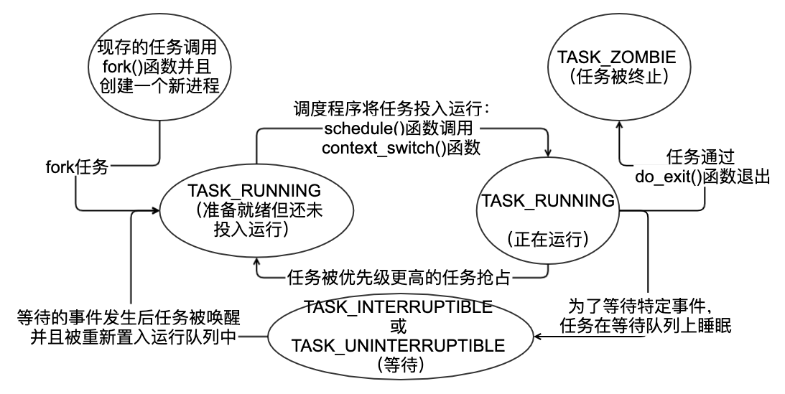
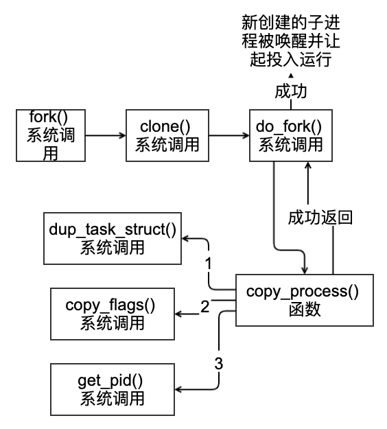
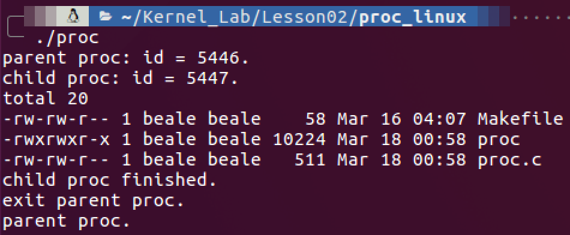
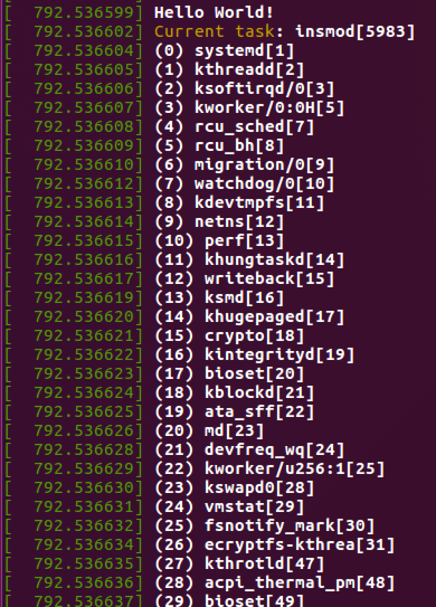
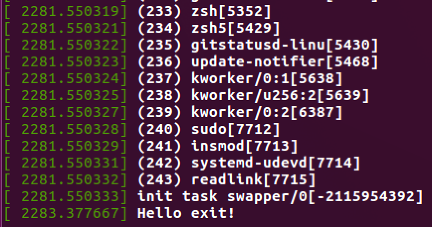

# 进程管理

执行线程，简称线程，是在进程中活动的对象。每个线程都拥有一个独立的程序计数器、进程栈和一组进程寄存器。内核调度的对象是线程，而不是进程。

线程模型：

Linux：线程 == 进程
Windows：线程 != 进程

进程虚拟机制：

- 两种虚拟机制
  - 虚拟处理器
  - 虚拟内存
- 虚拟处理器
  - 给进程一种假象，让进程觉得自己在独享处理器。
- 虚拟内存
  - 让进程在获取和使用内存时觉得自己拥有整个系统的所有内存资源。
- 线程之间（在同一个进程中的线程）可以共享虚拟内存，但拥有各自的虚拟处理器。

查看进程信息：

```bash
$ ps –a
   PID TTY          TIME CMD
  5301 pts/17   00:00:00 zsh5
  5302 pts/17   00:00:00 gitstatusd-linu
  5693 pts/17   00:00:00 ps
```

杀死进程：

```bash
kill -9 PID
```

在 `/proc` 文件系统中的 `proc/PID` 目录下：

- `comm`：存储进程名
- ...

在 Linux 系统中，通常调用 `fork()` 系统调用创建进程：

- 该系统调用通过复制一个现有进程来创建一个全新的进程；
- 通常创建新的进程都是为了执行新的、不同的程序，而接着调用 `exec()` 这族函数创建新的地址空间，并把新的程序载入；
- 最终程序通过 `exit()` 系统调用退出执行。这个函数会终结进程并将其占用的资源释放掉。

## 进程描述符及任务列表

- 内核把进程存放在叫做任务队列（Task List）的双向循环链表中；
- 链表中的每一项都是类型为 `task_struct`，称为进程描述符（Process Description）的结构，该结构定义在 [`include/linux/sched.h`](https://elixir.bootlin.com/linux/v4.4.31/source/include/linux/sched.h) 文件中；
- 进程描述符中包含一个具体进程的所有信息。

### 分配进程描述符

- **Linux 通过 Slab 分配器分配 `task_struct` 结构**，这样能达到对象复用和缓存着色的目的。（通过预先分配和重复使用 `task_struct`，可以避免动态分配和释放所带来的资源消耗）
- **各个进程的 `task_struct` 存放在它们内核栈的尾端**。从而避免使用额外的寄存器专门记录。所以只需在栈底（对于向下增长的栈）或栈顶（对于向上增长的栈）创建一个新的结构 `struct thread_info`（定义在 [`arch/x86/include/asm/thread_info.h`](https://elixir.bootlin.com/linux/v4.4.31/source/arch/x86/include/asm/thread_info.h) 中）。

```cpp
struct thread_info {
	struct task_struct	*task;		/* main task structure */
	__u32			flags;		/* low level flags */
	__u32			status;		/* thread synchronous flags */
	__u32			cpu;		/* current CPU */
	mm_segment_t		addr_limit;
	unsigned int		sig_on_uaccess_error:1;
	unsigned int		uaccess_err:1;	/* uaccess failed */
};
```

> 每个任务的 `thread_info` 结构在它的内核栈的尾端分配。结构中 `task` 域中存放的是指向该任务实际 `task_struct` 的指针。

### 进程描述符的存放

- 内核通过一个唯一的进程标识值（Process Identification Value）或 PID 来标识每个进程；
- PID 是一个数，**最大值默认设置为 32767（短整型的最大值）**。它存放在每个进程的进程描述符中。它实际上就是系统中同时存在的进程的最大数目。也可由系统管理员通过修改 `/proc/sys/kernel/pid_max` 来提高上限；
- 在内核中，访问任务通常需要获取指向其 `task_struct` 指针。通过 `current` 宏查找当前正在运行进程的进程描述符的速度就显得尤其重要。它是随着硬件体系结构不同从而它的实现也不同。

```cpp
#define current get_current()
```

在 x86 系统上，`current` 把栈指针的后 13 个有效位屏蔽掉，用来计算出 `thread_info` 的偏移，该操作通过 `current_thread_info()` 函数完成。汇编代码如下：

```nasm
movl $-8192, %eax
andl %esp, %eax
```

最后，`current` 在从 `thread_info` 的 `task` 域中提取并返回 `task_struct` 的地址：

```cpp
static __always_inline struct task_struct *get_current(void)
{
	return this_cpu_read_stable(current_task);
}
```

### 进程状态

进程描述符中的 `state` 域描述了进程的当前状态。系统中的每个进程都必然处于五种进程状态中的一种。



### 设置当前进程状态

内核经常需要调整某个进程的状态。这时最好使用 `set_task_state(task, state)` 函数，该函数将指定的进程设置为指定的状态。必要时，它会设置内存屏障来强制其他处理器作重新排序。（一般只有在 SMP 系统中有此必要）否则，它等价于：`task－>state = state;`。`set_current_state(state)` 和 `set_task_state(current, state)` 含义是等同的。

```cpp
/*
 * set_current_state() includes a barrier so that the write of current->state
 * is correctly serialised wrt the caller's subsequent test of whether to
 * actually sleep:
 *
 *	set_current_state(TASK_UNINTERRUPTIBLE);
 *	if (do_i_need_to_sleep())
 *		schedule();
 *
 * If the caller does not need such serialisation then use __set_current_state()
 */
#define __set_current_state(state_value)			\
	do {							\
		current->task_state_change = _THIS_IP_;		\
		current->state = (state_value);			\
	} while (0)
#define set_current_state(state_value)				\
	do {							\
		current->task_state_change = _THIS_IP_;		\
		smp_store_mb(current->state, (state_value));		\
	} while (0)
```

### 进程上下文

- 可执行程序代码是进程的重要组成部分。这些代码从可执行文件载入到进程的地址空间执行；
- 一般程序在用户空间执行。当一个程序执行了系统调用或触发了某个异常，它就陷入了内核空间。称内核“代表进程执行”并处于进程上下文中；
- 系统调用和异常处理是对内核明确定义的接口。进程只有通过这些接口才能陷入内核执行（对内核的所有访问都必须通过这些接口）。

### 进程树

- Linux 进程之间存在一个明显的继承关系。所有的进程都是 PID 为 1 的 `init` 进程的后代。内核在系统启动的最后阶段启动 `init` 进程。该进程读取系统的初始化脚本（`initscripts`）并执行其他的相关程序，最终完成系统启动的整个过程；
- 系统中的每个进程必有一个父进程。每个进程也可以有一个或多个子进程。拥有同一个父进程的所有进程被称为兄弟。进程间的关系存放在进程描述符中。

获取父进程的进程描述符：

```cpp
struct task_struct *task = current->parent;
```

依次访问子进程：

```cpp
struct task_struct *task;
struct list_head *list;
list_for_each(list, &current->children) {
    task = list_entry(list, struct task_struct, sibling);
}
```

进程的进程描述符是作为 `init_task` 静态分配的：

```cpp
struct task_struct *task;
for (task = current, task != &init_task; task = task->parrent);
```

对于给定的进程，获取链表中的下一个进程：

```cpp
list_entry(task->tasks.next, struct task_struct, tasks)
```

对于给定的进程，获取链表中的前一个进程：

```cpp
list_entry(task->tasks.pre, struct task_struct, tasks)
```

依次访问整个任务队列，并输出相关内容：

```cpp
for_each_process(task) {
    printk("%s[%d]\n", task->comm, task->pid);
}
```

## 进程创建

- 其他操作系统都提供了产生进程的机制。首先在新的地址空间里创建进程，读入可执行文件，最后开始执行。
- Unix 把上述步骤分解到两个单独的函数中去执行：`fork()` 和 `exec()`。
- 首先 `fork()` 通过拷贝当前进程创建一个子进程。子进程与父进程的区别仅在于 PID（每个进程唯一）、PPID（父进程的进程号，子进程将其设置为被拷贝进程的 PID）和某些资源和统计量（例如挂起的信号，它没有必要被继承）。
- `exec()` 函数负责读取可执行文件并将其载入地址空间开始运行。

### 写时拷贝

- 传统的 `fork()`系统调用直接把所有的资源复制给新创建的进程。实现简单但效率低。
- Linux 的 `fork()` 使用写时拷贝（copy-on-write）页实现。写时拷贝是一种可以推迟甚至免除拷贝数据的技术。内核此时并不复制整个进程地址空间，而是让父进程和子进程共享同一个拷贝。只有在需要写入的时候，数据才会被复制，从而使各个进程拥有各自的拷贝。也就是资源的复制只有在需要写入的时候才进行，在此之前，只是以只读方式共享。这种技术使地址空间上的页的拷贝被推迟到实际发生写入的时候。

> `fork()` 后立即调用 `exec()`，这时它们就无需复制了。`fork()`的实际开销就是复制父进程的页表以及给子进程创建唯一的进程描述符。

### `fork()`

Linux 通过 `clone()` 系统调用实现 `fork()`。这个调用通过一系列的参数标志来指明父、子进程需要共享的资源。



`copy_process()` 函数完成的功能：

- `dup_task_struct()` 系统调用为新进程创建一个内核栈、`threa_info` 结构和 `task_struct`，这些值与当前进程相同。然后检查新创建的子进程的当前用户所拥有的进程数目如果没有超出给它分配的资源的限制，则现在子进程就要与父进程相区别开来。（通过进程描述符中许多成员都要被清 0 或设为初始值），同时子进程的状态被设置为 `TASK_UNINTERRUPTIBLE` 以保证它不会投入运行。
- `copy_flags()` 以更新 `task_struct` 的 `flags` 成员。表明进程是否拥有超级用户权限的 `PF_SUPERPRIV` 标志被清 0。表明进程还没有调用 `exec()` 函数的 `PF_FORKNOEXEC` 标志被设置。
- 调用 `get_pid()` 为新进程获取一个有效的 PID。
- 根据传递给 `clone()` 的参数标志，拷贝或共享打开的文件、文件系统信息、信号处理函数、进程地址空间和命名空间等。
- 让父进程和子进程平分剩余的时间片。
- 最后，作扫尾工作并返回一个指向子进程的指针。再回到 `do_fork()` 函数。

> 内核有意选择子进程首先执行。因为一般子进程都会马上调用 `exec()` 函数，这样可以避免写时拷贝的额外开销。

### `vfork()`

`vfork()` 系统调用和 `fork()` 的功能相同，除了不拷贝父进程的页表项。子进程作为父进程的一个单独的线程在它的地址空间里运行，父进程被阻塞，直到子进程退出或执行 `exec()`。子进程不能向地址空间写入。现以彻底没多大用了。

## 线程在 Linux 中的实现

- 线程机制是现代编程技术中常用的一种抽象。
- 线程机制提供了在同一程序内共享内存地址空间运行的一组线程。这些线程还可以共享打开的文件和其他资源。
- 线程机制支持并发程序设计技术（Concurrent Programming），在多处理器系统上，它也能保证真正的并行处理。
- Linux 实现线程的机制非常独特。从内核的角度来说，它并没有线程这个概念。Linux 把所有的线程都当作进程来实现。线程仅仅被视为一个使用某些共享资源的进程。每个线程都拥有唯一隶属于自己的 `task_struct`，所以在内核中，它看起来就像是一个普通的进程（只是该进程和其他一些进程共享某些资源，如地址空间）。对于 Linux 来说，它只是一种进程间共享资源的手段。

> 线程的创建和普通进程的创建类似，只不过在调用 `clone()` 的时候需要传递一些参数标志来指明需要共享的资源：`clone(CLONE_VM|CLONE_FS|CLONE_FILES|CLONE_SIGHAND, 0);` 传递给 `clone()` 的参数标志决定了新创建进程的行为方式和父子进程之间共享的资源种类。

`clone()` 参数标志：

|     参数标志     |                        含义                         |
| :--------------: | :-------------------------------------------------: |
| `CLONE_CLEARTID` |                      清除 TID                       |
| `CLONE_DETACHED` |        父进程不需要子进程退出时发送 SIGCHLD         |
|  `CLONE_FILES`   |               父子进程共享打开的文件                |
|    `CLONE_FS`    |              父子进程共享文件系统信息               |
| `CLONE_IDLETASK` |        将 PID 设置为 0（只供 Idle 进程使用）        |
|  `CLONE_NEWNS`   |              为子进程创建新的命名空间               |
|  `CLONE_PARENT`  |         指定子进程与父进程拥有同一个父进程          |
|  `CLONE_PTRACE`  |                   继续调试子进程                    |
|  `CLONE_SETTID`  |                将 TID 回写至用户空间                |
|  `CLONE_SETTLS`  |                为子进程创建新的 TLS                 |
| `CLONE_SIGHAND`  |              父子进程共享信号处理函数               |
| `CLONE_SYSVSEM`  |         父子进程共享 System VSEM_UNDO 语义          |
|  `CLONE_THREAD`  |              父子进程放入相同的线程组               |
|  `CLONE_VFORK`   | 调用 `vfork()`,所以父进程准备睡眠等待子进程将其唤醒 |
|    `CLONE_VM`    |                父子进程共享地址空间                 |

内核线程：

- 内核经常需要在后台执行一些操作，这种任务可以通过内核线程（Kernel Thread）完成，这个内核线程就是独立运行在内核空间的标准进程。
- 内核线程和普通的进程间的区别在于内核线程没有独立的地址空间。它们只在内核空间运行，从来不切换到用户空间去。内核进程和普通进程一样，可以被调度，也可以被抢占。
- 内核线程只能由其他内核线程创建。在现有内核线程中创建一个新的内核线程的方法如下：

```cpp
/*
 * Create a kernel thread.
 */
pid_t kernel_thread(int (*fn)(void *), void *arg, unsigned long flags)
{
	return _do_fork(flags|CLONE_VM|CLONE_UNTRACED, (unsigned long)fn,
		(unsigned long)arg, NULL, NULL, 0);
}
```

- 该函数返回后父线程退出，并返回一个指向子线程 `task_struct` 指针。子线程开始运行 `fn` 指向的函数。
- 一个特殊的标志 `CLONE_KERNEL` 定义了内核线程常用到的参数标志：`CLONE_FS`、`CLONE_FILES`、`CLONE_SIGHAND`。大部分的内核线程把这个标志传递给它们的 `flags` 参数。一般内核线程会将它创建时得到的函数永远执行下去。

## 进程终结

- 当一个进程终结时，内核必须释放它所占有的资源并告知父进程。
- 一般进程的析构发生在它调用 `exit()` 之后，既可能显示的调用这个系统调用，也可能隐式地从某个程序的主函数返回（如 C 语言编译器会在 `main()` 函数的返回点后面放置调用 `exit()` 的代码）。
- 当进程接受到它既不能处理也不能忽略的信号或异常时，它还可能被动的终结。不管进程怎么终结的，该任务大部分都要靠 `do_exit()` 来完成。

[`do_exit()` 完成的工作](https://elixir.bootlin.com/linux/v4.4.31/source/kernel/exit.c#L653)：

- 将 `task_struct` 中的标志成员设置为 `PF_EXITING`；
- 如果 BSD 的进程计帐功能是开启的，要调用 `acct_process()` 来输出计帐信息；
- 调用 `__exit_mm()` 函数释放进程占用的 `mm_struct`，如果没有别的进程使用它们，就彻底释放它们；
- 调用 `sem__exit()` 函数。如果进程排队等候 IPC 信号，它则离开队列；
- 调用 `__exit_files()`、`__exit_fs()`、`exit_namespace()` 和 `exit_sighand()`，用分别递减文件描述符、文件系统数据，进程名字空间和信号处理函数的引用计数。如果其中某些引用计数的数值将为 0，那么就代表没有进程在使用相应的资源，此时可以释放；
- 把存放在 `task_struct` 的 `exit_code` 成员中的任务退出代码置为 `exit()` 提供的代码中，或者去完成任何其他由内核机制规定的退出动作；
- 调用 `exit_notify()` 向父进程发送信号，将子进程的父进程重新设置为线程组中的其他线程或 `init` 进程，并把进程状态设置成 `TASK_ZOMBIE`；
- 最后调用 `schedule()` 切换到其他进程。因为处于 `TASK_ZOMBIE` 状态的进程不会再被调度，所有以这是进程所执行的最后一段代码；
- 至此，与进程相关的所有资源都被释放掉了。进程不可运行并处于 `TASK_ZOMBIE`状态。它所占有的所有资源就是保存 `thread_info` 的内核栈和保存 `task_struct` 结构的那一小片内存。这时进程存在的唯一目的就是向它的父进程提供信息。

### 删除进程描述符

> 在调用了 `do_exit()` 之后，尽管线程已经僵死不能再运行了，但是系统还保留了它的进程描述符。这样做可以让系统有办法在子进程终结后仍能获得它的信息。因此，进程终结时所需的清理工作和进程描述符的删除被分开执行。在父进程获得已终结的子进程的信息后，子进程的 `task_struct` 结构才能被释放。

`wait()` 这一族函数都是通过唯一的一个系统调用 `wait4()` 实现的。它的标准动作是挂起调用它的进程，直到其中的一个子进程退出，此时函数会返回该子进程的 PID。此外，调用该函数时提供的指针会包含子函数退出时的退出代码。当最终需要释放进程描述符时，`release_task()` 会被调用，用以完成以下工作：

- 调用 `free_uid()` 来减少该进程拥有者的进程使用计数。Linux 用一个单用户高速缓存统计和记录每个用户占用的进程数目、文件数目。如果这些数目都将为 0，表明这个用户没有使用任何进程和文件，那么这块缓存就可以销毁了；
- 调用 `unhash_process()` 从 PID 映射上删除该进程，同时也要从任务列表中删除该进程；
- 如果这个进程正在被 `ptrace` 跟踪，将跟踪进程的父进程重设为其最初的父进程并将它从跟踪列表上删除；
- 最后，调用 `put_task_struct` 释放进程内核栈和 `thread_info` 结构所占的页，并释放 `task_struct` 所占的高速缓存；
- 至此，进程描述符和所有进程独享的资源就被释放掉了。

### 孤儿进程造成的进退维谷

> 如果父进程在子进程之前退出，必须有一种机制来保证子进程能找到一个新的父亲，否则这些成为孤儿的进程就会在退出时永远处于僵死状态，白白消耗内存。

解决的方法就是给子进程在当前线程组内找一个线程作为父亲，如果不行，就让 `init` 做它们的父进程。在 `do_exit()` 中会调用 `notify_present()`，该函数会通过 `forget_original_parent()` 来执行寻父过程：

```cpp
/*
 * This does two things:
 *
 * A.  Make init inherit all the child processes
 * B.  Check to see if any process groups have become orphaned
 *	as a result of our exiting, and if they have any stopped
 *	jobs, send them a SIGHUP and then a SIGCONT.  (POSIX 3.2.2.2)
 */
static void forget_original_parent(struct task_struct *father,
					struct list_head *dead)
{
	struct task_struct *p, *t, *reaper;

	if (unlikely(!list_empty(&father->ptraced)))
		exit_ptrace(father, dead);

	/* Can drop and reacquire tasklist_lock */
	reaper = find_child_reaper(father);
	if (list_empty(&father->children))
		return;

	reaper = find_new_reaper(father, reaper);
	list_for_each_entry(p, &father->children, sibling) {
		for_each_thread(p, t) {
			t->real_parent = reaper;
			BUG_ON((!t->ptrace) != (t->parent == father));
			if (likely(!t->ptrace))
				t->parent = t->real_parent;
			if (t->pdeath_signal)
				group_send_sig_info(t->pdeath_signal,
						    SEND_SIG_NOINFO, t);
		}
		/*
		 * If this is a threaded reparent there is no need to
		 * notify anyone anything has happened.
		 */
		if (!same_thread_group(reaper, father))
			reparent_leader(father, p, dead);
	}
	list_splice_tail_init(&father->children, &reaper->children);
}
```

将 `reaper` 设置为该进程所在的线程组内的其他进程。如果线程组内没有其他的进程，它就将 `reaper` 设置为 `child_reaper`，也就是 `init` 进程：

```cpp
struct task_struct *p, *reaper = father;
struct list_head *list;
if (father->exit_signal != -1)
    reaper = prev_thread(reaper);
else
    reaper = child_reaper;
if (reaper == father)
    reaper = child_reaper ;
```

找到合适的父进程后，遍历所有子进程并为它们设置新的父进程：

```cpp
list_for_each(list, &father->children) {
    p = list_entry(list, struct task_struct, sibling);
    reparent_thread(p, reaper, child_reaper);
}

list_for_each(list, &father->ptrace_children) {
    p = list_entry(list, struct task_struct, ptrace_list);	reparent_thread(p, reaper, child_reaper);
}
```

- 一旦系统给进程成功的找到和设置了新的父进程，就不会再出现驻留僵死进程的危险了；
- `init` 进程会例行调用 `wait()` 来等待其子进程，清除所有与其相关的僵死进程。

# 实验部分

## 使用进程相关的系统调用

使用 `fork()` 创建子进程，其中 `execl` 执行后会创建一个新的进程，所以最后不会输出 `"exit child proc.\n"`：

```cpp
#include <stdio.h>
#include <stdlib.h>
#include <unistd.h>
#include <sys/types.h>
#include <sys/wait.h>

int main() {
	pid_t pid;
	int ret;
	pid = fork(); // 创建新进程
	if (pid == 0) {
		printf("child proc: id = %d.\n", getpid()); // 输出子进程pid
		execl("/bin/ls", "ls", "-l", NULL); // 执行ls -l命令
        printf("exit child proc.\n");
	} else if (pid > 0) {
		printf("parent proc: id = %d.\n", getpid()); // 输出父进程pid
		waitpid(pid, &ret, 0); // 等待子进程结束
		printf("child proc finished.\n");
		printf("exit parent proc.\n");
	} else {
		printf("fork error.\n");
	}
	printf("parent proc.\n");
	return 0;
}
```

运行效果：



## 编写内核模块遍历父进程

使用宏 `for_each_process()` 对父进程遍历，使用宏 `current` 获取当前进程，使用宏 `init_task` 获取 init_task：

```cpp
#include <linux/module.h>
#include <linux/init.h>
#include <linux/kernel.h>
#include <linux/sched.h>
#include <linux/init_task.h>

MODULE_LICENSE("GPL");
MODULE_AUTHOR("assassinq");
MODULE_DESCRIPTION("hello world module");

static int __init hello_init(void) {
    struct task_struct *me = current; // 获取当前进程
    struct task_struct *task;
    int i = 0;

    printk("Hello World!\n");
    printk("Current task: %s[%d].\n", me->comm, me->pid); // 输出当前进程
    for_each_process(task) { // 遍历进程
        printk("(%d) %s[%d].\n", i++, task->comm, task->pid);
    }
    printk("init_task: %s[%d].\n", init_task.comm, init_task.pid); // 输出init_task
    return 0;
}

static void __exit hello_exit(void) {
    printk("Hello exit!\n");
}

module_init(hello_init);
module_exit(hello_exit);
```

运行效果：





## 编写内核模块创建内核线程

```cpp
#include <linux/module.h>
#include <linux/init.h>
#include <linux/kernel.h>
#include <linux/thread_info.h>
#include <linux/kthread.h>
#include <linux/delay.h>

MODULE_LICENSE("GPL");
MODULE_AUTHOR("assassinq");
MODULE_DESCRIPTION("hello world module");

struct task_struct *thread = NULL;

int func(void *data) {
    int i = 0;
    while (!kthread_should_stop()) {
        printk("Kernel Thread wakes up: %d\n", i++);
        ssleep(1);
    }
    return 0;
}

static int __init hello_init(void) {
    printk("Hello World!\n");
    thread = kthread_run(func, 0, "kernel_thread");
    return 0;
}

static void __exit hello_exit(void) {
    printk("Hello exit!\n");
    kthread_stop(thread);
}

module_init(hello_init);
module_exit(hello_exit);
```

运行效果：


# 参考网站

https://elixir.bootlin.com/linux/v4.4.31/source/include/linux/sched.h
https://elixir.bootlin.com/linux/v4.4.31/source/arch/x86/include/asm/thread_info.h
https://elixir.bootlin.com/linux/v4.4.31/source/arch/x86/include/asm/current.h
https://elixir.bootlin.com/linux/v4.4.31/source/kernel/fork.c
https://elixir.bootlin.com/linux/v4.4.31/source/kernel/exit.c
https://elixir.bootlin.com/linux/v4.4.31/source/include/linux/init_task.h
https://elixir.bootlin.com/linux/v4.4.31/source/init/init_task.c
