# 进程调度

- 目标
  - 提高 CPU 利用率（吞吐量）
- 进程分类
  - 实时型任务
  - I/O 密集型
  - 计算密集型

## 多任务

- 非抢占式多任务
  - 通过进程之间的协作
  - 让步（Yielding）
- 抢占式多任务
  - 调度程序分配 CPU 资源
  - 时间片（Time Slice）、Quota

## 不同内核版本下 Linux 进程调度算法

- 2.4 内核及以前
  - 时间片
- 2.5 内核-2.6 内核
  - $O(1)$ 调度
- 2.6.23
  - CFS：完全公平调度

## 调度策略

- I/O 密集型进程
  - 交互性——响应性能
  - 已有算法
    - 通过占有 CPU 实现
    - 带来频繁切换
- 计算密集型
  - 尽快能获得处理器

## 进程优先级

- Nice
  - Unix
  - 普通进程
  - Nice 值越高，优先级越低
  - `-20` 到 `+19`
- 实时优先级
  - `0` 到 `99`
  - 高于普通进程

## 时间片

- 时间片
  - 进程在被抢占前能持续运行的时间
- 如何选择时间片的大小
  - 太大：响应性能下降
  - 太小：切换开销大

## Unix 中的系统调度

- 时间片方式
  - Nice 决定时间片的大小
- Nice 带来的问题
  - 如何将 Nice 映射为时间片，并且保证公平
  - 相对 nice 值
    - `0-5` 和 `10-15` 获得的时间片比例不一致（非线性）
- 原因
  - 时间片
- 解决方法
  - 不采用时间片，而用比例来分配 CPU

## 公平调度

### CFS（Complete Fair Schedule）

- 理想系统
  - 无限多处理器
- 在任意时刻，每个进程获得 $\frac{1}{n}$ 的处理器时间
- 实际系统
  - 处理器数 < 进程数
  - 无法达到平均占有处理器时间目标
  - 可以用切换方式，在一定时间间隔内，平均获得 $\frac{1}{n}$ 的处理器时间（统计意义上）
- CFS 与 Nice
  - Nice 低，优先级高，占有处理器比例高
  - Nice 高，优先级低，占有处理器比例低
- 调度周期
- 调度最小粒度（进程拥有的最小时间片）
  - 太小，切换开销大
- CFS 近似完美

## Linux 中的调度算法

### 调度器类

- 每一进程属于一个调度器类
- 每一调度器拥有不同的优先级
- 每一调度器拥有自己的调度队列
- Linux 的 CFS（完全公平调度）
  - 普通进程
  - `SCHED_NORMAL`

#### 调度器的主要任务

- 时间（计时）
- 进程选择
- 调度器入口
- sleep 和 wakeup 两个方法

查看调度器：

```bash
$ chrt -p 5627
pid 5627's current scheduling policy: SCHED_OTHER
pid 5627's current scheduling priority: 0
```

六种调度策略：

|       字段       |                                                                                                                                                          描述                                                                                                                                                           | 所在调度器类 |
| :--------------: | :---------------------------------------------------------------------------------------------------------------------------------------------------------------------------------------------------------------------------------------------------------------------------------------------------------------------: | :----------: |
|  `SCHED_NORMAL`  |                                                                                         （也叫 `SCHED_OTHER`）用于普通进程，通过 CFS `调度器实现。SCHED_BATCH` 用于非交互的处理器消耗型进程。SCHED_IDLE 是在系统负载很低时使用                                                                                          |     CFS      |
|  `SCHED_BATCH`   | `SCHED_NORMAL` 普通进程策略的分化版本。采用分时策略，根据动态优先级(可用 `nice()` API 设置），分配 CPU 运算资源。注意：这类进程比上述两类实时进程优先级低，换言之，在有实时进程存在时，实时进程优先调度。但针对吞吐量优化, 除了不能抢占外与常规任务一样，允许任务运行更长时间，更好地使用高速缓存，适合于成批处理的工作 |     CFS      |
|   `SCHED_IDLE`   |                                                                                                  优先级最低，在系统空闲时才跑这类进程(如利用闲散计算机资源跑地外文明搜索，蛋白质结构分析等任务，是此调度策略的适用者）                                                                                                  |   CFS-IDLE   |
|   `SCHED_FIFO`   |                                                                                                           先入先出调度算法（实时调度策略），相同优先级的任务先到先服务，高优先级的任务可以抢占低优先级的任务                                                                                                            |      RT      |
|    `SCHED_RR`    |                                   轮流调度算法（实时调度策略），后者提供 Roound-Robin 语义，采用时间片，相同优先级的任务当用完时间片会被放到队列尾部，以保证公平性，同样，高优先级的任务可以抢占低优先级的任务。不同要求的实时任务可以根据需要用 `sched_setscheduler()` API 设置策略                                    |      RT      |
| `SCHED_DEADLINE` |                                                                                               新支持的实时进程调度策略，针对突发型计算，且对延迟和完成时间高度敏感的任务适用。基于 Earliest Deadline First (EDF) 调度算法                                                                                               |      DL      |

### 相关结构体

#### 时间记账（`sched_entity`）

- 虚拟计时
  - `vruntime`
  - 单位：`ns`
  - 加权后的虚拟运行时间
  - 函数
    - `Update_curr()`
    - `_Update_curr()`
  - `Update_curr()` 由系统定时器周期性调用

CFS 调度算法核心：

- 选择具有最小 `vruntime` 的进程
- 使各进程之间的 `vruntime` 均衡

#### 进程选择

- 进程队列
  - 红黑树，二叉平衡数
  - 节点键值为 `vruntime`
- 挑选下一任务
  - 最左边的节点为 `vruntime` 最小的进程
  - Leftmost

#### 进程加入

- 向树中加入进程
  - 什么时候加入
    - fork 创建时
    - Wakeup
  - 函数
    - `Enqueue_entity`
    - `_Enqueue_entity`

#### 进程删除

- 从树中删除进程
  - 什么时候加入
    - 进程阻塞 wait
    - 进程结束
  - 函数
    - `dequeue_entity`
    - `_dequeue_entity`

#### 调度器入口

- 函数 `schedule()`
  - 定时器调用
  - 进程阻塞时
  - 中断或异常时
- `pick_next_task()`
  - 如果所有进程属于 CFS 调度器类，则直接调用 CFS 的 `pick_next_task()`；
  - 否则，按调度器类的优先级次序，调用每个调度器类的 `pick_next_task()`，知道找到一个进程

#### 睡眠和唤醒

- 睡眠
  - 为什么会睡眠
    - 等待一些事件
    - 如调用 `read()` 读取磁盘文件或等待用户键盘输入
  - 如何休眠
    - 标记为睡眠状态
    - 从运行队列（红黑树）中移除
    - 加入到等待事件的等待队列中

等待队列：

```cpp
DEFINE_WAIT(wait);

add_wait_queue(q, &wait);

while(!condition){
      prepare_to_wait(&q, &wait, TASK_INTERRUPTIBLE);
      if (signal_pending(current)) {} // 处理
      schedule();
}

finish_wait(&q, &wait);
```

休眠和唤醒：

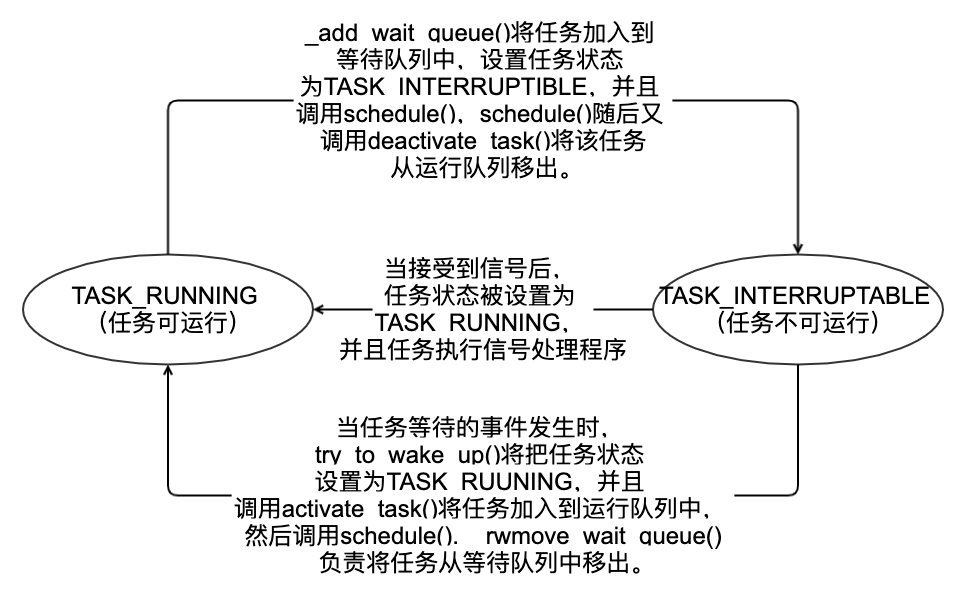

##### 唤醒

- 谁来唤醒
  - 等待事件的处理器者
  - 如磁盘数据到来时，VFS 唤醒等待该事件
- `wake_up()`

### 抢占和上下文切换

- 要做的事情
  - `switch_mm()`
    - 虚拟内存切换
  - `swtich_to()`
    - 处理器状态切换
- `schedule()` 什么时候调用
- `need_scheded` 标志
- 被抢占时设置
  - `try_to_wake_up()` 设置
- 用户抢占
  - 系统调用返回用户空间
  - 中断处理程序返回
- 内核抢占
  - 内核抢占要确保安全

```cpp
/*
 * context_switch - switch to the new MM and the new thread's register state.
 */
static inline struct rq *
context_switch(struct rq *rq, struct task_struct *prev,
	       struct task_struct *next)
{
	struct mm_struct *mm, *oldmm;

	prepare_task_switch(rq, prev, next);

	mm = next->mm;
	oldmm = prev->active_mm;
	/*
	 * For paravirt, this is coupled with an exit in switch_to to
	 * combine the page table reload and the switch backend into
	 * one hypercall.
	 */
	arch_start_context_switch(prev);

	if (!mm) {
		next->active_mm = oldmm;
		atomic_inc(&oldmm->mm_count);
		enter_lazy_tlb(oldmm, next);
	} else
		switch_mm(oldmm, mm, next);

	if (!prev->mm) {
		prev->active_mm = NULL;
		rq->prev_mm = oldmm;
	}
	/*
	 * Since the runqueue lock will be released by the next
	 * task (which is an invalid locking op but in the case
	 * of the scheduler it's an obvious special-case), so we
	 * do an early lockdep release here:
	 */
	lockdep_unpin_lock(&rq->lock);
	spin_release(&rq->lock.dep_map, 1, _THIS_IP_);

	/* Here we just switch the register state and the stack. */
	switch_to(prev, next, prev);
	barrier();

	return finish_task_switch(prev);
}
```

#### 用户抢占

- 内核即将返回时，如果 `need_resched` 标志被设置，会导致 `schedule()` 被调用，此时就会发生用户抢占。
- 内核无论是再从中断处理程序还是在系统调用后返回，都会检查 `need_resched` 标志。如果它被设置了，那么，内核会选择一个其他更适合的进程投入运行。（这时，就会发生用户抢占的情况）

#### 内核抢占

- Linux 完整的支持抢占，在不支持抢占的操作系统中，内核中的个任务是协作方式调度的，调度程序没有办法在一个内核级的任务正在执行的时候重新调度。内核不具备抢占性。内核代码一直要执行到完成（返回用户空间）或明显的阻塞为止。
- 在支持抢占的内核中，只要重新调度是安全的，内核就可以在任何时候抢占正在执行的任务。

> 那么什么时候重新调度才是安全的呢？
>
> - 只有没有持有锁，内核就可以进行抢占。锁是非抢占区域的标志。
> - 为了支持内核抢占为每个进程的 `thread_info` 引入了 `preempt_count` 计数器。该计数器初始值是 0。每当使用锁的时候数值就加 1，释放锁的时候数值就减 1。当数值为 0 的时候，内核就可执行抢占。例：从中断返回内核空间的时候，内核所作的操作。
> - 如果内核中的进程被阻塞了，或它显式地调用了 `schedule()`，内核抢占也会发生。

内核抢占时会发生在以下情况：

- 当从中断处理程序返回内核空间地时候。
- 当内核代码再一次具有可抢占性的时候。
- 如果内核中的任务显式的调用 `schedule()`。
- 如果内核中的任务阻塞（同样也会导致调用 `schedule()`）。

### 实时调度策略

Linux 提供了两种实时调度策略：`SCHED_FIFO` 和 `SCHED_RR`。而普通的、非实时调度策略是 `SCHED_OTHER`。

`SCHED_FIFO`、`SCHED_RR` 以及 `SCHED_OTHER` 三者的区别和联系：

- `SCHED_FIFO` 实现了一种简单的、先入先出的调度算法。它不使用时间片。一旦一个 `SCHED_FIFO` 级进程处于可执行状态，就会一直执行，直到它自己阻塞或显式地释放处理器为止。如果多个 `SCHED_FIFO` 级进程，它们会轮流执行。
- `SCHED_FIFO` 级进程比任何 `SCHED_OTHER` 级的进程都先得到调度。
- `SCHED_RR` 与 `SCHED_FIFO` 大体相同，只是 `SCHED_RR` 级进程再耗尽事先分配给它的时间后就不能再接着执行了。也就是 `SCHED_RR` 是带有时间片的 `SCHED_FIFO`，这是一种实时轮流调度算法。
- `SCHED_RR` 和 `SCHED_FIFO` 这两种实时算法实现的都是静态优先级。内核不为实时进程计算动态优先级。

> - Linux 的实时调度算法提供了一种软实时工作方式。
> - 软实时的含有就是：内核调度进程，尽力使进程在它的限定时间到来前运行，但内核不保证总能满足这些进程的要求。
> - 硬实时系统保证在一定条件下，可以满足任何调度的要求。
> - Linux 不保证硬实时工作方式。
> - 实时优先级范围从 0 到 `MAX_RT_PRIO` 减 1。默认情况下， `MAX_RT_PRIO` 为 100。所以实时优先级范围从 0 到 99。
> - `SCHED_OTHER` 级进程的 nice 值共享了这个取值空间。它的取值范围是从 `MAX_RT_PRIO` 到（`MAX_RT_PRIO+40`）。也就是，在默认情况下，nice 值从 `-20` 到 `+19` 直接对应的是从 `100` 到 `140` 的实时优先级。

### 与调度相关的系统调用

Linux 提供了一族系统调用，用于管理与调度程序相关的参数。这些系统调用可以用来操作和处理进程优先级、调度策略以及处理器，同时还提供了显式的将处理器交给其他进程的机制。

|          系统调用          |           描述           |
| :------------------------: | :----------------------: |
|          `nice()`          |    设置进程的 nice 值    |
|   `sched_setscheduler()`   |    设置进程的调度策略    |
|   `sched_getscheduler()`   |    获取进程的调度策略    |
|     `sched_setparam()`     |   设置进程的实时优先级   |
|     `sched_getparam()`     |   获取进程的实时优先级   |
| `sched_get_priority_max()` |  获取实时优先级的最大值  |
| `sched_get_priority_min()` |  获取实时优先级的最小值  |
| `sched_rr_get_interval()`  |    获取进程的时间片值    |
|   `sched_setaffinity()`    | 设置进程的处理器的亲和力 |
|   `sched_getaffinity()`    | 获取进程的处理器的亲和力 |
|      `sched_yield()`       |      暂时让出处理器      |

- `sched_setscheduler()` 和 `sched_getscheduler()` 分别用于设置和获取进程的调度策略和实时优先级。它们的实现由许多参数检查、初始化和清理构成的。最重要的工作在于读取或改写进程 `task_struct` 的 `policy` 和 `rt_priority` 的值。
- `sched_setparam()` 和 `sched_getparam()` 分别用于设置和获取进程的实时优先级。`rt_priority` 通过封装在 `sched_param` 结构体中返回。
- `sched_get_priority_max()` 和 `sched_get_priority_min()` 分别用于返回实时优先级的最大和最小值。实时调度策略的最大优先级是 `MAX_USER_RT_PRIO` 减 1，最小优先级是 1。

> 对于一个普通的进程，`nice()` 函数可以将给定进程的静态优先级增加一个给定的量。只有超级用户才能调用它时使用负值，从而提高进程的优先级。`nice()` 函数会调用内核的 `set_user_nice()` 函数，这个函数会设置进程的 `task_struct` 的 `static_prio` 和 `prio` 值。

### 与处理器绑定有关的系统调用

- Linux 调度程序提供强制的处理器（`processor_affinity`）绑定机制。这种强制的亲和力保存在进程 `task_struct` 的 `cpus_allowed` 这个位掩码标志中。该掩码标志的每一位对应一个系统可用的处理器。默认情况下，所有的位都被设置，进程可在系统中的所有可用的处理器上执行。
- 用户可以通过 `sched_setaffinity()` 设置一个不同的一个或几个位组合的位掩码。而通过 `sched_getaffinity()` 则返回当前的 `cpus_allowed` 位掩码。

> 内核提供的强制处理器绑定的方法很简单：
>
> - 首先：当处理进行第一次创建，它继承了其父进程的相关掩码。由于父进程运行在指定处理器上，子进程也运行在相应处理器上。
> - 其次：当处理器绑定关系改变时，内核会采用“移植线程”把任务推到合法的处理器上。
> - 最后：加载平衡器把任务拉到允许的处理上。因此，进程只运行在指定处理器上，对处理器的指定是由该进程描述符的 `cpus_allowed` 域设置的。

### 放弃处理器时间

- Linux 中的 `sched_yield()` 系统调用，提供了一种让进程显式地将处理器时间让给其他等待执行进程地机制。
- 它是通过将进程从活动队列中移到过期队列中实现地。由此不仅抢占了该进程并将其放到优先级最后面，还将其放入到过期队列中。这样能确保在一段时间内它都不会再被执行。
- 实时进程不会过期，它们只被移动到其优先级队列地最后面（不会放到过期队列中）。
- 内核为了方便，可以直接调用 `yield()`，它先确定给定进程确实处于可执行状态，然后调用 `sched_yield()`。
- 而用户空间地应用程序直接使用 `sched_yield()` 系统调用就可以了。

# 实验部分

## 使用 fork 创建几个子进程并调用 set_scheduler 设置不同的调度器类，比较这几种调度器对进程运行的影响

用户使用进程调度：

```cpp
#include <stdio.h>
#include <stdlib.h>
#include <unistd.h>
#include <sys/types.h>
#include <sys/wait.h>
#include <sched.h>

int main() {
    pid_t p;
    int i, count;
    int status;
    struct sched_param param;

    for (i = 0; i < 3; i++) {
        p = fork();
        if (p == 0) {
            // Priority
            param.sched_priority = 3 + i;
            // SCHED_RR, SCHED_OTHER, SCHED_FIFO
            sched_setscheduler(getpid(), SCHED_RR, &param);
            count = 0;
            while (count < 3) {
                printf("i = %d, count = %d.\n", i, count++);
                sleep(1);
            }
            exit(i);
        }
    }

    while (1) {
        p = wait(&status);
        if (p <= 0) {
            break;
        }
        printf("Child process %d exited.\n", p);
    }
}
```

运行效果（使用 `SCHED_RR`）：

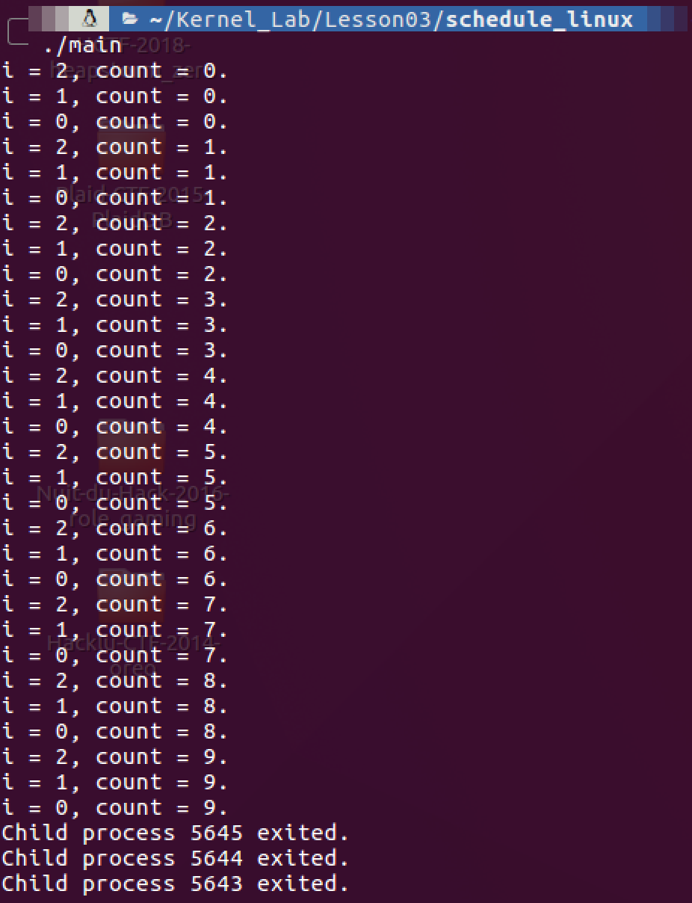

运行效果（使用 `SCHED_OTHER`）：

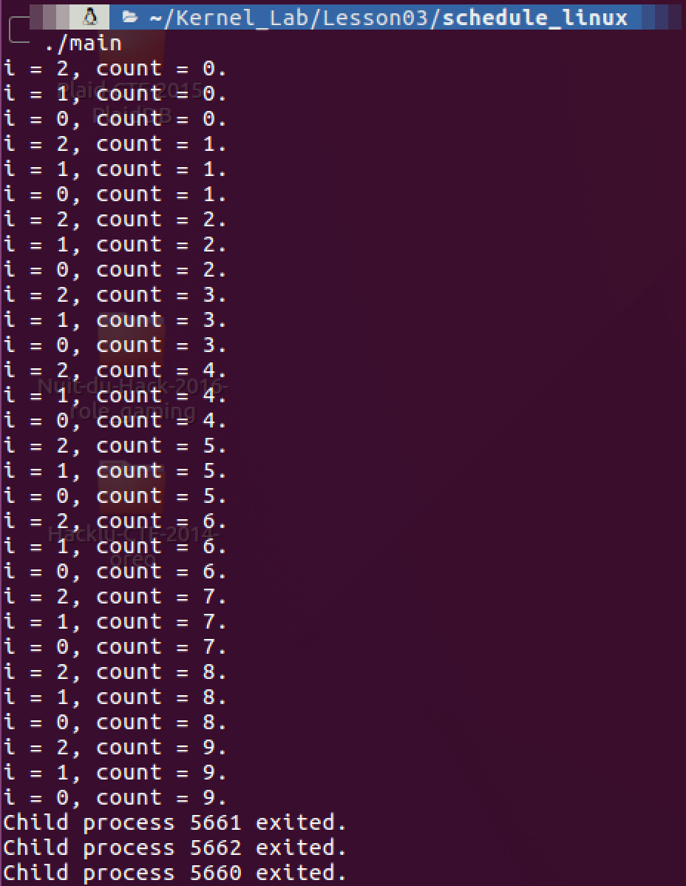

运行效果（使用 `SCHED_FIFO`）：

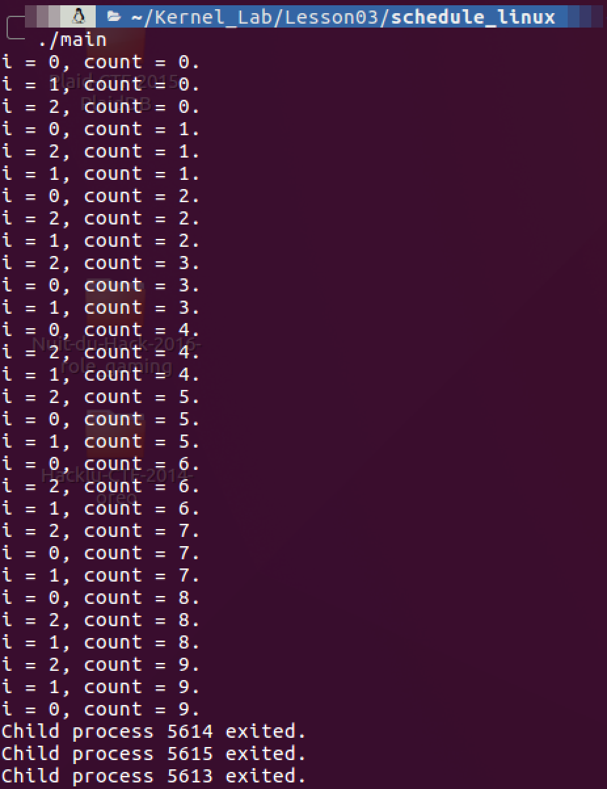

## 结合源码，查找文献，了解 Linux 进程调度的设计

CFS 调度的实现中，主要分为 4 个部分：时间记账、进程选择、调度器入口、睡眠和唤醒。涉及到的数据结构如下：

- `task_struct`：为进程任务基础数据结构，存储着进程相关信息。内存中保存了对每个进程的唯一描述（进程描述符，即 `task_struct`），并通过若干结构与其他进程连接起来。调度器的任务是在程序之间共享 CPU 时间，创造并行执行的错觉，该任务分为两个不同的部分，其中一个涉及**调度策略**，另外一个涉及**上下文切换**。
- `sched_entity`：存储着进程调度相关的信息，其中 `run_node` 为可执行红黑树的节点
- `cfs_rq`：存储着 `rb_root`，红黑树的根节点 `task_timeline`：

```cpp
/* CFS-related fields in a runqueue */
struct cfs_rq {
	struct load_weight load;
	unsigned int nr_running, h_nr_running; // 运行进程数量

	u64 exec_clock;
	u64 min_vruntime;
#ifndef CONFIG_64BIT
	u64 min_vruntime_copy;
#endif

	struct rb_root tasks_timeline; // 红黑树根节点
	struct rb_node *rb_leftmost;

	/*
	 * 'curr' points to currently running entity on this cfs_rq.
	 * It is set to NULL otherwise (i.e when none are currently running).
	 */
	struct sched_entity *curr, *next, *last, *skip;

#ifdef	CONFIG_SCHED_DEBUG
	unsigned int nr_spread_over;
#endif

#ifdef CONFIG_SMP
	/*
	 * CFS load tracking
	 */
	struct sched_avg avg;
	u64 runnable_load_sum;
	unsigned long runnable_load_avg;
#ifdef CONFIG_FAIR_GROUP_SCHED
	unsigned long tg_load_avg_contrib;
#endif
	atomic_long_t removed_load_avg, removed_util_avg;
#ifndef CONFIG_64BIT
	u64 load_last_update_time_copy;
#endif

#ifdef CONFIG_FAIR_GROUP_SCHED
	/*
	 *   h_load = weight * f(tg)
	 *
	 * Where f(tg) is the recursive weight fraction assigned to
	 * this group.
	 */
	unsigned long h_load;
	u64 last_h_load_update;
	struct sched_entity *h_load_next;
#endif /* CONFIG_FAIR_GROUP_SCHED */
#endif /* CONFIG_SMP */

#ifdef CONFIG_FAIR_GROUP_SCHED
	struct rq *rq;	/* cpu runqueue to which this cfs_rq is attached */

	/*
	 * leaf cfs_rqs are those that hold tasks (lowest schedulable entity in
	 * a hierarchy). Non-leaf lrqs hold other higher schedulable entities
	 * (like users, containers etc.)
	 *
	 * leaf_cfs_rq_list ties together list of leaf cfs_rq's in a cpu. This
	 * list is used during load balance.
	 */
	int on_list;
	struct list_head leaf_cfs_rq_list;
	struct task_group *tg;	/* group that "owns" this runqueue */

#ifdef CONFIG_CFS_BANDWIDTH
	int runtime_enabled;
	u64 runtime_expires;
	s64 runtime_remaining;

	u64 throttled_clock, throttled_clock_task;
	u64 throttled_clock_task_time;
	int throttled, throttle_count;
	struct list_head throttled_list;
#endif /* CONFIG_CFS_BANDWIDTH */
#endif /* CONFIG_FAIR_GROUP_SCHED */
};
```

- `slab`：Linux 内核对于对象内存的一种高效的管理机制, 可以有效的降低内存碎片。`task_struct` 由 `slab` 分配并管理

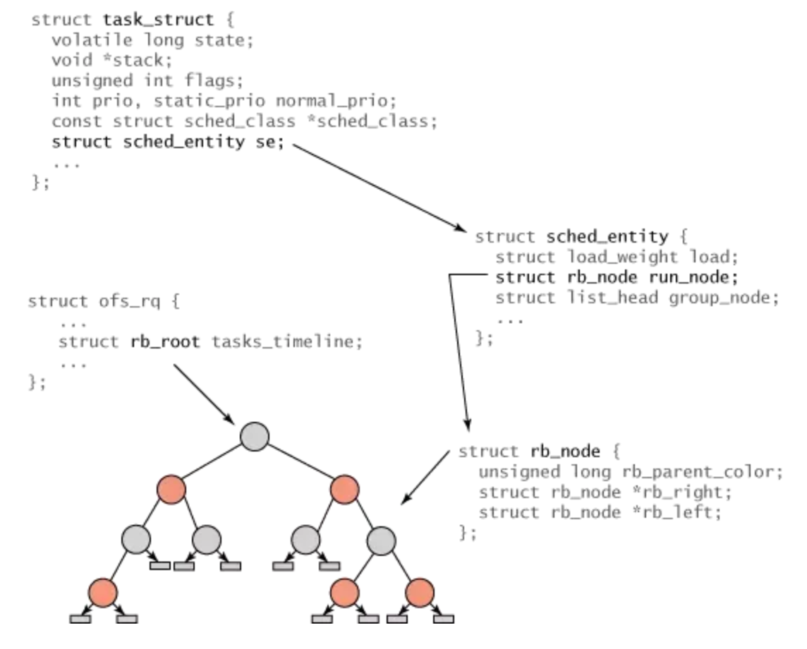

### 时间记账

- 所有的调度器都必须对进程的运行时间做记账。CFS 不再有时间片的概念，维护了每个进程运行的时间记账，因为每个进程只在公平分配给它的处理器时间内运行。
- 虚拟运行时间（vruntime）是在所有可运行基础的总数上计算出一个进程应该运行多久，计算时相应的 nice 值在 CFS 被作为进程获得处理器运行比的权重：越高的 nice（越低优先级）值，获得更低的处理器权重，更低的 nice 值获得更高的处理器使用权重。

```cpp
struct sched_entity {
	struct load_weight	load;		/* for load-balancing */
	struct rb_node		run_node; // 红黑树运行节点
	struct list_head	group_node;
	unsigned int		on_rq; // 表明是否在可运行的队列中

	u64			exec_start;
	u64			sum_exec_runtime;
	u64			vruntime; // 虚拟运行时间，通常是加权的虚拟运行时间（运行时间*nice值）
	u64			prev_sum_exec_runtime;

	u64			nr_migrations;

#ifdef CONFIG_SCHEDSTATS
	struct sched_statistics statistics;
#endif

#ifdef CONFIG_FAIR_GROUP_SCHED
	int			depth;
	struct sched_entity	*parent;
	/* rq on which this entity is (to be) queued: */
	struct cfs_rq		*cfs_rq;
	/* rq "owned" by this entity/group: */
	struct cfs_rq		*my_q;
#endif

#ifdef CONFIG_SMP
	/* Per entity load average tracking */
	struct sched_avg	avg;
#endif
};
```

### 进程选择

进程选择是 CFS 调度算法的最重要的模块，当 CFS 调度器选择下一个要进行调度的进程时，就会选择具有最小 vruntime 的任务。涉及到获取最小值，以及有序数据结构，在各种场景下都很适用的红黑树就发挥了其作用。即用红黑树维护以 vruntime 为排序条件，存储着任务的运行情况。

选择下一任务（获取红黑树最左节点，即最小值）：

```cpp
static struct sched_entity *__pick_next_entity(struct sched_entity *se)
{
	struct rb_node *next = rb_next(&se->run_node); // 获取缓存的最左节点

	if (!next)
		return NULL;

	return rb_entry(next, struct sched_entity, run_node); // 遍历获取最左节点，如果返回NULL则说明红黑树中没有任何节点，那么选择idle任务运行
}
```

向红黑树中加入进程（发生在进程变成 `TASK_RUNNING`，或者通过 `fork` 系统调用第一次创建进程时）：

```cpp
static void
enqueue_entity(struct cfs_rq *cfs_rq, struct sched_entity *se, int flags)
{
	/*
	 * Update the normalized vruntime before updating min_vruntime
	 * through calling update_curr().
	 */
	if (!(flags & ENQUEUE_WAKEUP) || (flags & ENQUEUE_WAKING))
		se->vruntime += cfs_rq->min_vruntime;

	/*
	 * Update run-time statistics of the 'current'.
	 */
	update_curr(cfs_rq);
	enqueue_entity_load_avg(cfs_rq, se);
	account_entity_enqueue(cfs_rq, se);
	update_cfs_shares(cfs_rq);

	if (flags & ENQUEUE_WAKEUP) {
		place_entity(cfs_rq, se, 0);
		enqueue_sleeper(cfs_rq, se); // 把节点加入红黑树
	}

	update_stats_enqueue(cfs_rq, se);
	check_spread(cfs_rq, se);
	if (se != cfs_rq->curr)
		__enqueue_entity(cfs_rq, se); // 将se的红黑树节点插入红黑树并更新
	se->on_rq = 1;

	if (cfs_rq->nr_running == 1) {
		list_add_leaf_cfs_rq(cfs_rq);
		check_enqueue_throttle(cfs_rq);
	}
}

/*
 * Enqueue an entity into the rb-tree:
 */
static void __enqueue_entity(struct cfs_rq *cfs_rq, struct sched_entity *se)
{
	struct rb_node **link = &cfs_rq->tasks_timeline.rb_node;
	struct rb_node *parent = NULL;
	struct sched_entity *entry;
	int leftmost = 1;

	/*
	 * Find the right place in the rbtree:
	 */
	while (*link) {
		parent = *link;
		entry = rb_entry(parent, struct sched_entity, run_node);
		/*
		 * We dont care about collisions. Nodes with
		 * the same key stay together.
		 */
		if (entity_before(se, entry)) { // 查找合适的节点位置
			link = &parent->rb_left;
		} else {
			link = &parent->rb_right;
			leftmost = 0;
		}
	}

	/*
	 * Maintain a cache of leftmost tree entries (it is frequently
	 * used):
	 */
	if (leftmost)
		cfs_rq->rb_leftmost = &se->run_node;

	rb_link_node(&se->run_node, parent, link); // 链接节点
	rb_insert_color(&se->run_node, &cfs_rq->tasks_timeline); // 对红黑树进行旋转和着色调整
}
```

从红黑树中删除进程（发生在进程阻塞，即进程变成不可运行状态或者当进程终止时）：

```cpp
static void
dequeue_entity(struct cfs_rq *cfs_rq, struct sched_entity *se, int flags)
{
	/*
	 * Update run-time statistics of the 'current'.
	 */
	update_curr(cfs_rq);
	dequeue_entity_load_avg(cfs_rq, se);

	update_stats_dequeue(cfs_rq, se);
	if (flags & DEQUEUE_SLEEP) {
#ifdef CONFIG_SCHEDSTATS
		if (entity_is_task(se)) {
			struct task_struct *tsk = task_of(se);

			if (tsk->state & TASK_INTERRUPTIBLE)
				se->statistics.sleep_start = rq_clock(rq_of(cfs_rq));
			if (tsk->state & TASK_UNINTERRUPTIBLE)
				se->statistics.block_start = rq_clock(rq_of(cfs_rq));
		}
#endif
	}

	clear_buddies(cfs_rq, se);

	if (se != cfs_rq->curr)
		__dequeue_entity(cfs_rq, se); // 从红黑树中删除节点
	se->on_rq = 0;
	account_entity_dequeue(cfs_rq, se);

	/*
	 * Normalize the entity after updating the min_vruntime because the
	 * update can refer to the ->curr item and we need to reflect this
	 * movement in our normalized position.
	 */
	if (!(flags & DEQUEUE_SLEEP))
		se->vruntime -= cfs_rq->min_vruntime;

	/* return excess runtime on last dequeue */
	return_cfs_rq_runtime(cfs_rq);

	update_min_vruntime(cfs_rq); // 更新最小虚拟运行时间以备下一次的调度
	update_cfs_shares(cfs_rq);
}

static void __dequeue_entity(struct cfs_rq *cfs_rq, struct sched_entity *se)
{
	if (cfs_rq->rb_leftmost == &se->run_node) {
		struct rb_node *next_node;

		next_node = rb_next(&se->run_node);
		cfs_rq->rb_leftmost = next_node;
	}

	rb_erase(&se->run_node, &cfs_rq->tasks_timeline); // 删除红黑树节点
}
```

### 调度器入口

进程调度器的入口函数为 `schedule()`，总体流程即为选择合适的调度策略选出下一个需要被调度的进程任务，然后进行一次上下文切换，将进程置为运行态。

```cpp
asmlinkage __visible void __sched schedule(void)
{
	struct task_struct *tsk = current; // 获取当前进程

	sched_submit_work(tsk);
	do {
		preempt_disable();
		__schedule(false); // 调度器入口主函数
		sched_preempt_enable_no_resched();
	} while (need_resched()); // 判断是否需要重新调度
}

/*
 * __schedule() is the main scheduler function.
 *
 * The main means of driving the scheduler and thus entering this function are:
 *
 *   1. Explicit blocking: mutex, semaphore, waitqueue, etc.
 *
 *   2. TIF_NEED_RESCHED flag is checked on interrupt and userspace return
 *      paths. For example, see arch/x86/entry_64.S.
 *
 *      To drive preemption between tasks, the scheduler sets the flag in timer
 *      interrupt handler scheduler_tick().
 *
 *   3. Wakeups don't really cause entry into schedule(). They add a
 *      task to the run-queue and that's it.
 *
 *      Now, if the new task added to the run-queue preempts the current
 *      task, then the wakeup sets TIF_NEED_RESCHED and schedule() gets
 *      called on the nearest possible occasion:
 *
 *       - If the kernel is preemptible (CONFIG_PREEMPT=y):
 *
 *         - in syscall or exception context, at the next outmost
 *           preempt_enable(). (this might be as soon as the wake_up()'s
 *           spin_unlock()!)
 *
 *         - in IRQ context, return from interrupt-handler to
 *           preemptible context
 *
 *       - If the kernel is not preemptible (CONFIG_PREEMPT is not set)
 *         then at the next:
 *
 *          - cond_resched() call
 *          - explicit schedule() call
 *          - return from syscall or exception to user-space
 *          - return from interrupt-handler to user-space
 *
 * WARNING: must be called with preemption disabled!
 */
static void __sched notrace __schedule(bool preempt)
{
	struct task_struct *prev, *next;
	unsigned long *switch_count;
	struct rq *rq;
	int cpu;

	cpu = smp_processor_id();
	rq = cpu_rq(cpu); // 获取CPU的可运行任务队列
	rcu_note_context_switch();
	prev = rq->curr;

	/*
	 * do_exit() calls schedule() with preemption disabled as an exception;
	 * however we must fix that up, otherwise the next task will see an
	 * inconsistent (higher) preempt count.
	 *
	 * It also avoids the below schedule_debug() test from complaining
	 * about this.
	 */
	if (unlikely(prev->state == TASK_DEAD))
		preempt_enable_no_resched_notrace();

	schedule_debug(prev);

	if (sched_feat(HRTICK))
		hrtick_clear(rq);

	/*
	 * Make sure that signal_pending_state()->signal_pending() below
	 * can't be reordered with __set_current_state(TASK_INTERRUPTIBLE)
	 * done by the caller to avoid the race with signal_wake_up().
	 */
	smp_mb__before_spinlock();
	raw_spin_lock_irq(&rq->lock);
	lockdep_pin_lock(&rq->lock);

	rq->clock_skip_update <<= 1; /* promote REQ to ACT */

	switch_count = &prev->nivcsw;
	if (!preempt && prev->state) { // 检查进程运行状态
		if (unlikely(signal_pending_state(prev->state, prev))) { // 当前进程没有阻塞，则将当前进程的状态置为可运行状态
			prev->state = TASK_RUNNING;
		} else { // 当前进程是阻塞状态，则将当前进程从进程可运行队列中移除
			deactivate_task(rq, prev, DEQUEUE_SLEEP);
			prev->on_rq = 0;

			/*
			 * If a worker went to sleep, notify and ask workqueue
			 * whether it wants to wake up a task to maintain
			 * concurrency.
			 */
			if (prev->flags & PF_WQ_WORKER) {
				struct task_struct *to_wakeup;

				to_wakeup = wq_worker_sleeping(prev, cpu);
				if (to_wakeup)
					try_to_wake_up_local(to_wakeup);
			}
		}
		switch_count = &prev->nvcsw;
	}

	if (task_on_rq_queued(prev))
		update_rq_clock(rq);

	next = pick_next_task(rq, prev); // 优先级从高到低依次检查每个调度策略类，并返回可运行进程的指针
	clear_tsk_need_resched(prev);
	clear_preempt_need_resched();
	rq->clock_skip_update = 0;

	if (likely(prev != next)) {
		rq->nr_switches++;
		rq->curr = next; // 将运行队列中的curr指针指向next
		++*switch_count;

		trace_sched_switch(preempt, prev, next);
    // 进行一次上下文切换，虚拟内存映射的切换，保留栈信息，相关寄存器等
		rq = context_switch(rq, prev, next); /* unlocks the rq */
		cpu = cpu_of(rq);
	} else {
		lockdep_unpin_lock(&rq->lock);
		raw_spin_unlock_irq(&rq->lock);
	}

	balance_callback(rq);
}
```

### 睡眠和唤醒

休眠（被阻塞）状态的进程处于不可执行的状态。进程休眠的原因有多种多样，但通常来说都是等待某一事件的发生，例如等待 I/O, 等待设备输入等等。内核对于休眠和唤醒的操作如下：

- 休眠：进程首先把自己标记为休眠状态（`TASK_INTERRUPTIBLE`），然后从可执行红黑树中移除该进程，并将进程放入等待队列；
- 唤醒：进程被置为可执行状态（`TASK_RUNNING`），进程从等待队列移入可执行红黑树中。

> 休眠或者阻塞状态有两种：可中断休眠（`TASK_INTERRUPTIBLE`）, 不可中断休眠（`TASK_UNINTERRUPTIBLE`）. 通常进程的休眠，为可中断休眠，即进程进入休眠，等待某一事件发生。一旦事件发生，或者满足条件，内核将会把进程状态置为运行，并将进程从等待队列中移除。

进程进入等待休眠队列：

```cpp
void add_wait_queue(wait_queue_head_t *q, wait_queue_t *wait)
{
	unsigned long flags;

	wait->flags &= ~WQ_FLAG_EXCLUSIVE;
	spin_lock_irqsave(&q->lock, flags);
	__add_wait_queue(q, wait); // 将一个进程添加到等待队列头
	spin_unlock_irqrestore(&q->lock, flags);
}

static inline void __add_wait_queue(wait_queue_head_t *head, wait_queue_t *new)
{
	list_add(&new->task_list, &head->task_list);
}
```

唤醒进程都基于同一个函数 `wake_up()`：

```cpp
#define wake_up(x)			__wake_up(x, TASK_NORMAL, 1, NULL)

/**
 * __wake_up - wake up threads blocked on a waitqueue.
 * @q: the waitqueue
 * @mode: which threads
 * @nr_exclusive: how many wake-one or wake-many threads to wake up
 * @key: is directly passed to the wakeup function
 *
 * It may be assumed that this function implies a write memory barrier before
 * changing the task state if and only if any tasks are woken up.
 */
void __wake_up(wait_queue_head_t *q, unsigned int mode,
			int nr_exclusive, void *key) // q用于选定等待队列，mode指定进程的状态，用于控制唤醒进程的条件，nr_exclusive表示将要唤醒的设置了WQ_FLAG_EXCLUSIVE标志的进程的数据
{
	unsigned long flags;

	spin_lock_irqsave(&q->lock, flags);
	__wake_up_common(q, mode, nr_exclusive, 0, key);
	spin_unlock_irqrestore(&q->lock, flags);
}

/*
 * The core wakeup function. Non-exclusive wakeups (nr_exclusive == 0) just
 * wake everything up. If it's an exclusive wakeup (nr_exclusive == small +ve
 * number) then we wake all the non-exclusive tasks and one exclusive task.
 *
 * There are circumstances in which we can try to wake a task which has already
 * started to run but is not in state TASK_RUNNING. try_to_wake_up() returns
 * zero in this (rare) case, and we handle it by continuing to scan the queue.
 */
static void __wake_up_common(wait_queue_head_t *q, unsigned int mode,
			int nr_exclusive, int wake_flags, void *key)
{
	wait_queue_t *curr, *next;

	list_for_each_entry_safe(curr, next, &q->task_list, task_list) {
		unsigned flags = curr->flags;

		if (curr->func(curr, mode, wake_flags, key) &&
				(flags & WQ_FLAG_EXCLUSIVE) && !--nr_exclusive)
			break;
	}
}
```

#### 唤醒抢占

- 当在 `try_to_wake_up`/`wake_up_process` 和 `wake_up_new_task` 中唤醒进程时，内核使用全局 `check_preempt_curr` 看看是否进程可以抢占当前进程可以抢占当前运行的进程。
- 每个调度器类都因应该实现一个 `check_preempt_curr` 函数，在全局 `check_preempt_curr` 中会调用进程其所属调度器类 `check_preempt_curr` 进行抢占检查，对于完全公平调度器 CFS 处理的进程，则对应由 `check_preempt_wakeup` 函数执行该策略。
- 新唤醒的进程不必一定由完全公平调度器处理，如果新进程是一个实时进程，则会立即请求调度，因为实时进程优先极高，实时进程总会抢占 CFS 进程。

## 阅读《The Linux Scheduler: a Decade of Wasted Cores》文章并作简单摘要

这篇文章主要是研究了 Linux 调度器中的四个性能问题：

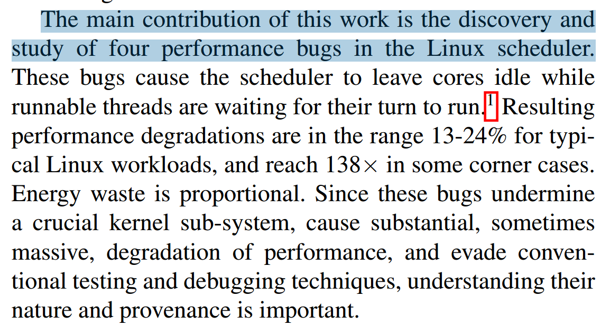

这些问题的起因不同，但是有相同的表现。调度器会在有可运行进程在调度队列中等待的时候，让 CPU 处于空闲状态。也就是明明有任务在队列中，而 CPU 却不会去执行：

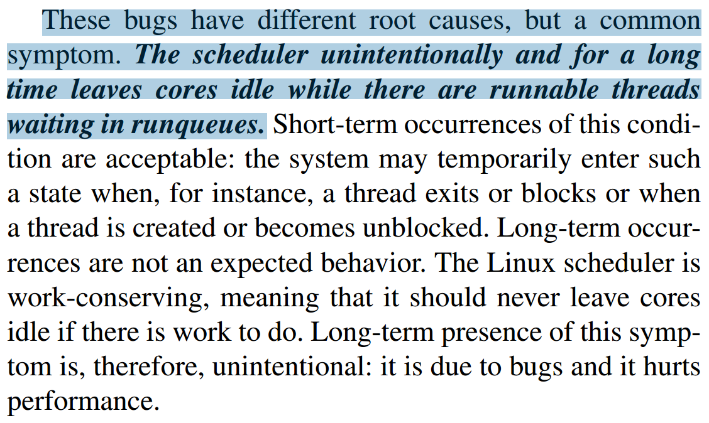

单核 Linux 中的 CFS 相对简单，调度器会定义一个时间片，根据时间片和每个进程所对应的 NICE 值计算进程的 vruntime 值。调度器根据每个进程的 vruntime 值，构造一个红黑树，每次进行调度时，查找到红黑树中的最小 vruntitme 所对应的进程后返回给 CPU：

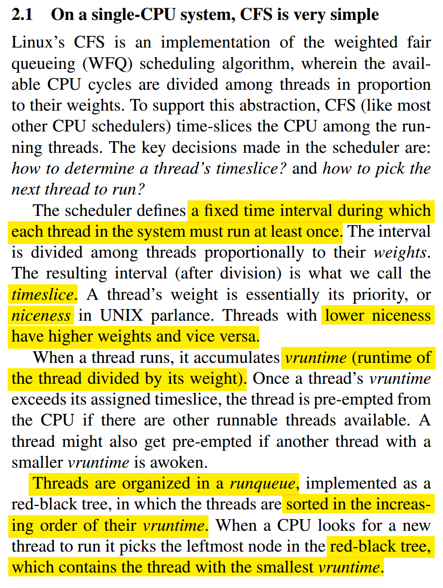

多核 Linux 下更为复杂，使用一个 pre-core 运行队列来切换上下文，同时 CPU 只会选择本地的 pre-core 运行队列：

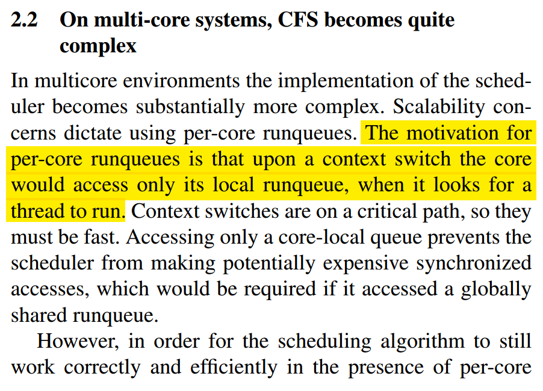

多核下的 CFS 算法通过负载均衡来维持各个 pre-core 队列的平衡。理解负载均衡的关键是 CFS 调度器用来跟踪负载的一种公制：

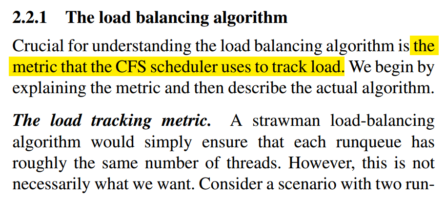

这种公制被称为 load，是线程的权重和 CPU 平均使用率的结合，相应地来说就是如果一个线程的 CPU 使用率比较低，它的 load 值（负载均衡）会降低：

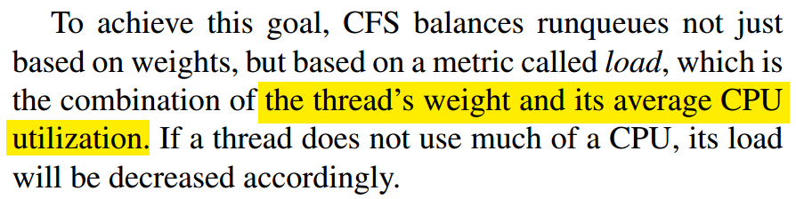

接下来的部分讲述了对负载均衡算法进行优化的方法。最后作者也提到调度器原本只是内核中简单的一个小部分，如今随着计算机性能的提升，随之而来的也会产生很多 BUG。现在的调度器也变成了内核代码中复杂的一个部分，未来也会有更多的优化部分会被补充到新的版本中：

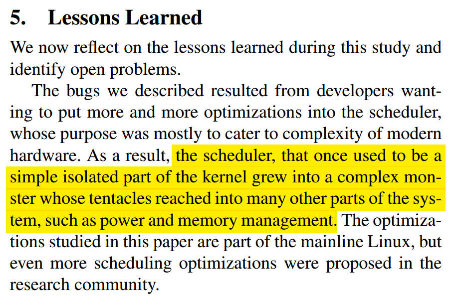

# 参考网站

https://blog.csdn.net/gatieme/article/details/51699889
https://blog.csdn.net/gatieme/article/details/51872831
https://zhuanlan.zhihu.com/p/75879578
https://elixir.bootlin.com/linux/v4.4.31/source/include/linux/sched.h
https://elixir.bootlin.com/linux/v4.4.31/source/kernel/sched/core.c
https://elixir.bootlin.com/linux/v4.4.31/source/kernel/sched/fair.c
https://elixir.bootlin.com/linux/v4.4.31/source/kernel/sched/wait.c
https://elixir.bootlin.com/linux/v4.4.31/source/include/linux/wait.h
https://www.jianshu.com/p/9789624b4c1b
https://www.jianshu.com/p/8a46567dd91d
