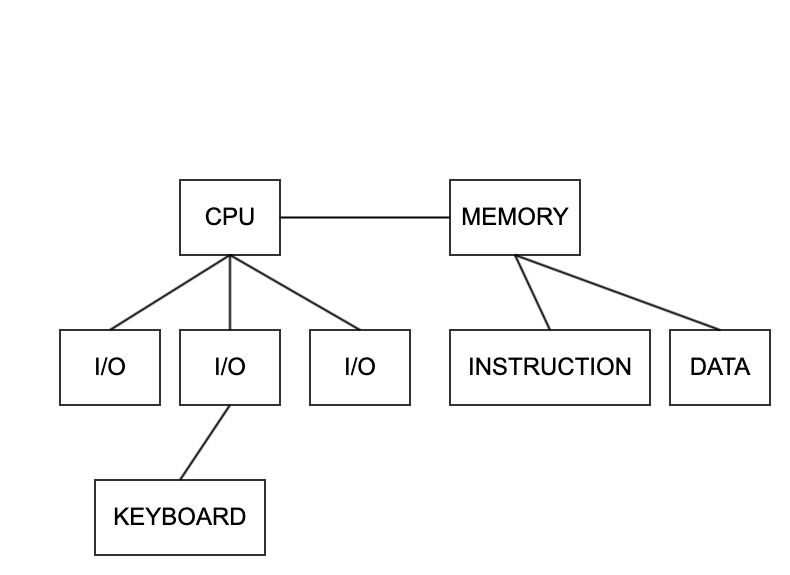
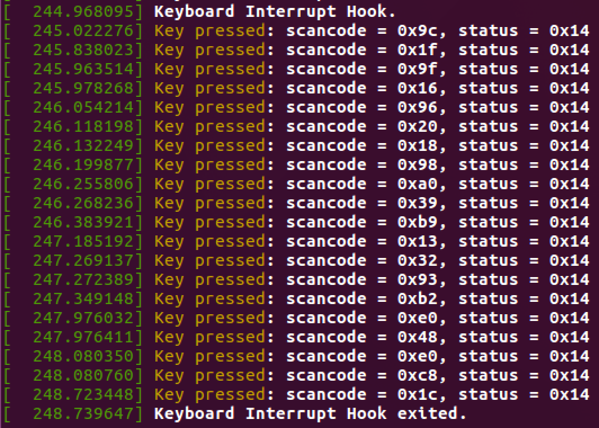
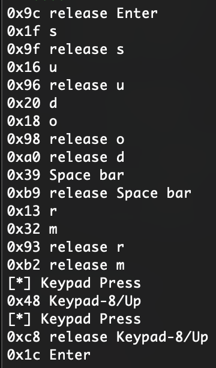
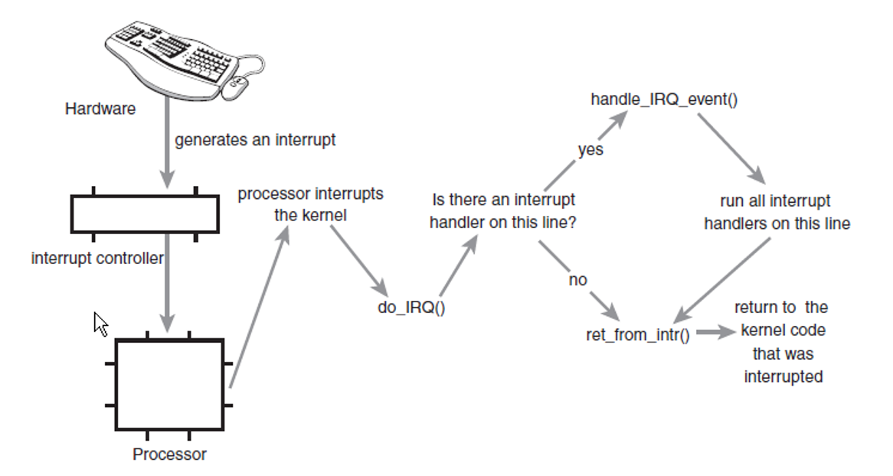

# 中断和中断处理程序



## 中断

处理器和外部设备通信的方式：

- 轮询（Polling）
  - 外设是否准备好
  - 处理器浪费
- 中断（产生异常）
- DMA（直接内存访问）

> 中断和异常
>
> - 中断（Interrupt）
>   - 异步发生
> - 异常（Exception）
>   - 同步发生
>   - 陷阱（Trap）
>   - 软件中断（Software Interrupt）

## 中断处理程序

- Interrupt Handler/Interrupt Service Routine
- 与普通 c 函数区别
  - 运行在中断上下文
  - 要做一些特殊的工作
    - 响应中断事件
    - 处理设备读写

中断处理的要求：

- 尽可能地快（防止一些硬件响应信息的丢失）
- 分成上半部和下半部
  - 上半部：完成必须要做的事
  - 下半部：不需要立即执行或可以推后执行的事

## 注册中断处理程序

与相应的设备关联：

```cpp
static inline int __must_check
request_irq(unsigned int irq, irq_handler_t handler, unsigned long flags,
	    const char *name, void *dev)
{
	return request_threaded_irq(irq, handler, NULL, flags, name, dev);
}
```

中断处理函数：

```cpp
typedef irqreturn_t (*irq_handler_t)(int, void *);
```

相关标志位：

```cpp
#define __IRQF_TIMER		0x00000200
#define IRQF_NO_SUSPEND		0x00004000
#define IRQF_NO_THREAD		0x00010000
#define IRQF_TIMER		(__IRQF_TIMER | IRQF_NO_SUSPEND | IRQF_NO_THREAD)
#define IRQF_SHARED		0x00000080
```

中断处理程序名称：

```bash
$ ls /proc/irq
0  10  12  14  16  18  2   25  27  29  30  32  34  36  38  4   41  43  45  47  49  50  52  54  56  58  7  9
1  11  13  15  17  19  24  26  28  3   31  33  35  37  39  40  42  44  46  48  5   51  53  55  57  6   8  default_smp_affinity

$ cat /proc/interrupts
            CPU0
   0:         28   IO-APIC    2-edge      timer
   1:        305   IO-APIC    1-edge      i8042
   8:          1   IO-APIC    8-edge      rtc0
   9:          0   IO-APIC    9-fasteoi   acpi
  12:       2838   IO-APIC   12-edge      i8042
  14:          0   IO-APIC   14-edge      ata_piix
  15:          0   IO-APIC   15-edge      ata_piix
  16:        760   IO-APIC   16-fasteoi   vmwgfx, snd_ens1371
  17:      16671   IO-APIC   17-fasteoi   ehci_hcd:usb1, ioc0
  18:        201   IO-APIC   18-fasteoi   uhci_hcd:usb2
  19:       3302   IO-APIC   19-fasteoi   ens33
  24:          0   PCI-MSI 344064-edge      PCIe PME, pciehp
  25:          0   PCI-MSI 346112-edge      PCIe PME, pciehp
  26:          0   PCI-MSI 348160-edge      PCIe PME, pciehp
  27:          0   PCI-MSI 350208-edge      PCIe PME, pciehp
  28:          0   PCI-MSI 352256-edge      PCIe PME, pciehp
  29:          0   PCI-MSI 354304-edge      PCIe PME, pciehp
  30:          0   PCI-MSI 356352-edge      PCIe PME, pciehp
  31:          0   PCI-MSI 358400-edge      PCIe PME, pciehp
  32:          0   PCI-MSI 360448-edge      PCIe PME, pciehp
  33:          0   PCI-MSI 362496-edge      PCIe PME, pciehp
  34:          0   PCI-MSI 364544-edge      PCIe PME, pciehp
  35:          0   PCI-MSI 366592-edge      PCIe PME, pciehp
  36:          0   PCI-MSI 368640-edge      PCIe PME, pciehp
  37:          0   PCI-MSI 370688-edge      PCIe PME, pciehp
  38:          0   PCI-MSI 372736-edge      PCIe PME, pciehp
  39:          0   PCI-MSI 374784-edge      PCIe PME, pciehp
  40:          0   PCI-MSI 376832-edge      PCIe PME, pciehp
  41:          0   PCI-MSI 378880-edge      PCIe PME, pciehp
  42:          0   PCI-MSI 380928-edge      PCIe PME, pciehp
  43:          0   PCI-MSI 382976-edge      PCIe PME, pciehp
  44:          0   PCI-MSI 385024-edge      PCIe PME, pciehp
  45:          0   PCI-MSI 387072-edge      PCIe PME, pciehp
  46:          0   PCI-MSI 389120-edge      PCIe PME, pciehp
  47:          0   PCI-MSI 391168-edge      PCIe PME, pciehp
  48:          0   PCI-MSI 393216-edge      PCIe PME, pciehp
  49:          0   PCI-MSI 395264-edge      PCIe PME, pciehp
  50:          0   PCI-MSI 397312-edge      PCIe PME, pciehp
  51:          0   PCI-MSI 399360-edge      PCIe PME, pciehp
  52:          0   PCI-MSI 401408-edge      PCIe PME, pciehp
  53:          0   PCI-MSI 403456-edge      PCIe PME, pciehp
  54:          0   PCI-MSI 405504-edge      PCIe PME, pciehp
  55:          0   PCI-MSI 407552-edge      PCIe PME, pciehp
  56:        158   PCI-MSI 1130496-edge      0000:02:05.0
  57:         85   PCI-MSI 129024-edge      vmw_vmci
  58:          0   PCI-MSI 129025-edge      vmw_vmci
 NMI:          0   Non-maskable interrupts
 LOC:      32178   Local timer interrupts
 SPU:          0   Spurious interrupts
 PMI:          0   Performance monitoring interrupts
 IWI:          0   IRQ work interrupts
 RTR:          0   APIC ICR read retries
 RES:          0   Rescheduling interrupts
 CAL:          0   Function call interrupts
 TLB:          0   TLB shootdowns
 TRM:          0   Thermal event interrupts
 THR:          0   Threshold APIC interrupts
 DFR:          0   Deferred Error APIC interrupts
 MCE:          0   Machine check exceptions
 MCP:          2   Machine check polls
 ERR:          0
 MIS:          0
 PIN:          0   Posted-interrupt notification event
 PIW:          0   Posted-interrupt wakeup event
```

## 编写中断处理函数

函数声明：

```cpp
static irqreturn_t intr_handler(int irq, void *dev);
```

中断处理重入问题（reentry）：

- 嵌套调用
  - 处理中断时同一中断又发生了
- Linux 禁止同一中断再次发生

实时时钟（RTC）中断：

```cpp
	/*
	 * XXX Interrupt pin #7 in Espresso is shared between RTC and
	 * PCI Slot 2 INTA# (and some INTx# in Slot 1).
	 */
	if (request_irq(rtc_irq, rtc_interrupt, IRQF_SHARED, "rtc",
			(void *)&rtc_port)) {
		rtc_has_irq = 0;
		printk(KERN_ERR "rtc: cannot register IRQ %d\n", rtc_irq);
		return -EIO;
	}
```

对应的中断 handler：

```cpp
/*
 *	A very tiny interrupt handler. It runs with interrupts disabled,
 *	but there is possibility of conflicting with the set_rtc_mmss()
 *	call (the rtc irq and the timer irq can easily run at the same
 *	time in two different CPUs). So we need to serialize
 *	accesses to the chip with the rtc_lock spinlock that each
 *	architecture should implement in the timer code.
 *	(See ./arch/XXXX/kernel/time.c for the set_rtc_mmss() function.)
 */

static irqreturn_t rtc_interrupt(int irq, void *dev_id)
{
	/*
	 *	Can be an alarm interrupt, update complete interrupt,
	 *	or a periodic interrupt. We store the status in the
	 *	low byte and the number of interrupts received since
	 *	the last read in the remainder of rtc_irq_data.
	 */

	spin_lock(&rtc_lock);
	rtc_irq_data += 0x100;
	rtc_irq_data &= ~0xff;
	if (is_hpet_enabled()) {
		/*
		 * In this case it is HPET RTC interrupt handler
		 * calling us, with the interrupt information
		 * passed as arg1, instead of irq.
		 */
		rtc_irq_data |= (unsigned long)irq & 0xF0;
	} else {
		rtc_irq_data |= (CMOS_READ(RTC_INTR_FLAGS) & 0xF0);
	}

	if (rtc_status & RTC_TIMER_ON)
		mod_timer(&rtc_irq_timer, jiffies + HZ/rtc_freq + 2*HZ/100);

	spin_unlock(&rtc_lock);

	/* Now do the rest of the actions */
	spin_lock(&rtc_task_lock);
	if (rtc_callback)
		rtc_callback->func(rtc_callback->private_data);
	spin_unlock(&rtc_task_lock);
	wake_up_interruptible(&rtc_wait);

	kill_fasync(&rtc_async_queue, SIGIO, POLL_IN);

	return IRQ_HANDLED;
}
```

编写键盘中断处理模块：

```cpp
#include <linux/module.h>
#include <linux/init.h>
#include <linux/kernel.h>
#include <linux/interrupt.h>
#include <asm/io.h>

MODULE_LICENSE("GPL");
MODULE_AUTHOR("assassinq");
MODULE_DESCRIPTION("hello world module");

irq_handler_t key_handler(int irq, void *dev) {
    int scancode;
    int status;

    scancode = inb(0x60);
    status = inb(0x64);
    printk("Key pressed: scancode = 0x%x, status = 0x%x\n", scancode, status);

    return (irq_handler_t)IRQ_HANDLED;
}

static int __init hello_init(void) {
    int ret;

    ret = request_irq(1, (irq_handler_t)key_handler, IRQF_SHARED, "Key Hook", (void *)key_handler);
    if (ret) {
        printk("Request failed.\n");
        return -EIO;
    }
    printk("Keyboard Interrupt Hook.\n");

    return 0;
}

static void __exit hello_exit(void) {
    free_irq(1, (void *)key_handler);
    printk("Keyboard Interrupt Hook exited.\n");
}

module_init(hello_init);
module_exit(hello_exit);
```

按键捕获的效果如下：



用 Python 写了一个脚本来解析读到的扫描码：

```python
#!/usr/bin/env python
scancodes = [0x9c, 0x1f, 0x9f, 0x16, 0x96, 0x20, 0x18, 0x98, 0xa0, 0x39, 0xb9, 0x13, 0x32, 0x93, 0xb2, 0xe0, 0x48, 0xe0, 0xc8, 0x1c]
mappings = {
	0x00: 'Error', 0x01: 'Esc', 0x02: '1!', 0x03: '2@', 0x04: '3#', 0x05: '4$', 0x06: '5%', 0x07: '6^', 0x08: '7&', 0x09: '8*', 0x0a: '9(', 0x0b: '0)', 0x0c: '-_', 0x0d: '=+', 0x0e: 'Backspace',
	0x0f: 'Tab', 0x10: 'q', 0x11: 'w', 0x12: 'e', 0x13: 'r', 0x14: 't', 0x15: 'y', 0x16: 'u', 0x17: 'i', 0x18: 'o', 0x19: 'p', 0x1a: '[{', 0x1b: ']}', 0x1c: 'Enter',
	0x1d: 'LCtrl', 0x1e: 'a', 0x1f: 's', 0x20: 'd', 0x21: 'f', 0x22: 'g', 0x23: 'h', 0x24: 'j', 0x25: 'k', 0x26: 'l', 0x27: ';:', 0x28: '\'"', 0x29: '`~',
	0x2c: 'z', 0x2d: 'x', 0x2e: 'c', 0x2f: 'v', 0x30: 'b', 0x31: 'n', 0x32: 'm', 0x33: ',<', 0x34: '.>', 0x35: '/?', 0x36: 'RShift', 0x37: 'Keypad-*/PrtScn',
	0x38: 'LAlt', 0x39: 'Space bar', 0x3a: 'CapsLock',
	0x3b: 'F1', 0x3c: 'F2', 0x3d: 'F3', 0x3e: 'F4', 0x3f: 'F5', 0x40: 'F6', 0x41: 'F7', 0x42: 'F8', 0x43: 'F9', 0x44: 'F10',
	0x45: 'NumLock', 0x46: 'ScrollLock',
	0x47: 'Keypad-7/Home', 0x48: 'Keypad-8/Up', 0x49: 'Keypad-9/PgUp', 0x4a: 'Keypad--', 0x4b: 'Keypad-4/Left', 0x4c: 'Keypad-5', 0x4d: 'Keypad-6/Right', 0x4e: 'Keypad-+', 0x4f: 'Keypad-1/End', 0x50: 'Keypad-2/Down', 0x51: 'Keypad-3/PgDn', 0x52: 'Keypad-0/Ins', 0x53: 'Keypad-./Del'
}
for c in scancodes:
	if c == 0xe0:
		print '[*] Keypad Press'
	elif c in mappings.keys():
		print hex(c), mappings[c]
	elif c - 0x80 in mappings.keys():
		print hex(c), 'release', mappings[c - 0x80]
```

查看键盘的输入是`“sudo rm”+上键+回车`：



## 中断上下文

- 从打断当前进程
- 中断处理程序处于中断上下文
- 共享所中断进程的内核栈

## 内核中断处理机制的实现

依赖于体系结构：



```cpp
/*
 * do_IRQ handles all normal device IRQ's (the special
 * SMP cross-CPU interrupts have their own specific
 * handlers).
 */
__visible unsigned int __irq_entry do_IRQ(struct pt_regs *regs)
{
	struct pt_regs *old_regs = set_irq_regs(regs);
	struct irq_desc * desc;
	/* high bit used in ret_from_ code  */
	unsigned vector = ~regs->orig_ax;

	/*
	 * NB: Unlike exception entries, IRQ entries do not reliably
	 * handle context tracking in the low-level entry code.  This is
	 * because syscall entries execute briefly with IRQs on before
	 * updating context tracking state, so we can take an IRQ from
	 * kernel mode with CONTEXT_USER.  The low-level entry code only
	 * updates the context if we came from user mode, so we won't
	 * switch to CONTEXT_KERNEL.  We'll fix that once the syscall
	 * code is cleaned up enough that we can cleanly defer enabling
	 * IRQs.
	 */

	entering_irq();

	/* entering_irq() tells RCU that we're not quiescent.  Check it. */
	RCU_LOCKDEP_WARN(!rcu_is_watching(), "IRQ failed to wake up RCU");

	desc = __this_cpu_read(vector_irq[vector]);

	if (!handle_irq(desc, regs)) {
		ack_APIC_irq();

		if (desc != VECTOR_RETRIGGERED) {
			pr_emerg_ratelimited("%s: %d.%d No irq handler for vector\n",
					     __func__, smp_processor_id(),
					     vector);
		} else {
			__this_cpu_write(vector_irq[vector], VECTOR_UNUSED);
		}
	}

	exiting_irq();

	set_irq_regs(old_regs);
	return 1;
}
```

## 中断控制

禁止和激活中断：

```cpp
#define local_irq_disable() \
	do { raw_local_irq_disable(); trace_hardirqs_off(); } while (0)

#define local_irq_enable() \
	do { trace_hardirqs_on(); raw_local_irq_enable(); } while (0)
```

带保存当前中断状态：

```cpp
#define local_irq_save(flags)				\
	do {						\
		raw_local_irq_save(flags);		\
		trace_hardirqs_off();			\
	} while (0)

#define local_irq_restore(flags) do { raw_local_irq_restore(flags); } while (0)
```

禁止特定的中断：

```cpp
/**
 *	disable_irq - disable an irq and wait for completion
 *	@irq: Interrupt to disable
 *
 *	Disable the selected interrupt line.  Enables and Disables are
 *	nested.
 *	This function waits for any pending IRQ handlers for this interrupt
 *	to complete before returning. If you use this function while
 *	holding a resource the IRQ handler may need you will deadlock.
 *
 *	This function may be called - with care - from IRQ context.
 */
void disable_irq(unsigned int irq)
{
	if (!__disable_irq_nosync(irq))
		synchronize_irq(irq);
}

static int __disable_irq_nosync(unsigned int irq)
{
	unsigned long flags;
	struct irq_desc *desc = irq_get_desc_buslock(irq, &flags, IRQ_GET_DESC_CHECK_GLOBAL);

	if (!desc)
		return -EINVAL;
	__disable_irq(desc);
	irq_put_desc_busunlock(desc, flags);
	return 0;
}

/**
 *	disable_irq_nosync - disable an irq without waiting
 *	@irq: Interrupt to disable
 *
 *	Disable the selected interrupt line.  Disables and Enables are
 *	nested.
 *	Unlike disable_irq(), this function does not ensure existing
 *	instances of the IRQ handler have completed before returning.
 *
 *	This function may be called from IRQ context.
 */
void disable_irq_nosync(unsigned int irq)
{
	__disable_irq_nosync(irq);
}

void __enable_irq(struct irq_desc *desc)
{
	switch (desc->depth) {
	case 0:
 err_out:
		WARN(1, KERN_WARNING "Unbalanced enable for IRQ %d\n",
		     irq_desc_get_irq(desc));
		break;
	case 1: {
		if (desc->istate & IRQS_SUSPENDED)
			goto err_out;
		/* Prevent probing on this irq: */
		irq_settings_set_noprobe(desc);
		irq_enable(desc);
		check_irq_resend(desc);
		/* fall-through */
	}
	default:
		desc->depth--;
	}
}

/**
 *	enable_irq - enable handling of an irq
 *	@irq: Interrupt to enable
 *
 *	Undoes the effect of one call to disable_irq().  If this
 *	matches the last disable, processing of interrupts on this
 *	IRQ line is re-enabled.
 *
 *	This function may be called from IRQ context only when
 *	desc->irq_data.chip->bus_lock and desc->chip->bus_sync_unlock are NULL !
 */
void enable_irq(unsigned int irq)
{
	unsigned long flags;
	struct irq_desc *desc = irq_get_desc_buslock(irq, &flags, IRQ_GET_DESC_CHECK_GLOBAL);

	if (!desc)
		return;
	if (WARN(!desc->irq_data.chip,
		 KERN_ERR "enable_irq before setup/request_irq: irq %u\n", irq))
		goto out;

	__enable_irq(desc);
out:
	irq_put_desc_busunlock(desc, flags);
}

/**
 *	synchronize_irq - wait for pending IRQ handlers (on other CPUs)
 *	@irq: interrupt number to wait for
 *
 *	This function waits for any pending IRQ handlers for this interrupt
 *	to complete before returning. If you use this function while
 *	holding a resource the IRQ handler may need you will deadlock.
 *
 *	This function may be called - with care - from IRQ context.
 */
void synchronize_irq(unsigned int irq)
{
	struct irq_desc *desc = irq_to_desc(irq);

	if (desc) {
		__synchronize_hardirq(desc);
		/*
		 * We made sure that no hardirq handler is
		 * running. Now verify that no threaded handlers are
		 * active.
		 */
		wait_event(desc->wait_for_threads,
			   !atomic_read(&desc->threads_active));
	}
}
E
```

中断系统的状态：

```cpp
/*
 * Are we doing bottom half or hardware interrupt processing?
 * Are we in a softirq context? Interrupt context?
 * in_softirq - Are we currently processing softirq or have bh disabled?
 * in_serving_softirq - Are we currently processing softirq?
 */
#define in_irq()		(hardirq_count())
#define in_softirq()		(softirq_count())
#define in_interrupt()		(irq_count())
#define in_serving_softirq()	(softirq_count() & SOFTIRQ_OFFSET)
```

# 参考网站

https://elixir.bootlin.com/linux/v4.4.31/source/include/linux/interrupt.h
https://elixir.bootlin.com/linux/v4.4.31/source/drivers/char/rtc.c
https://elixir.bootlin.com/linux/v4.4.31/source/include/linux/irqflags.h
https://elixir.bootlin.com/linux/v4.4.31/source/kernel/irq/manage.c
https://elixir.bootlin.com/linux/v4.4.31/source/include/linux/preempt.h
https://www.win.tue.nl/~aeb/linux/kbd/scancodes-1.html
https://en.wikipedia.org/wiki/Scancode
