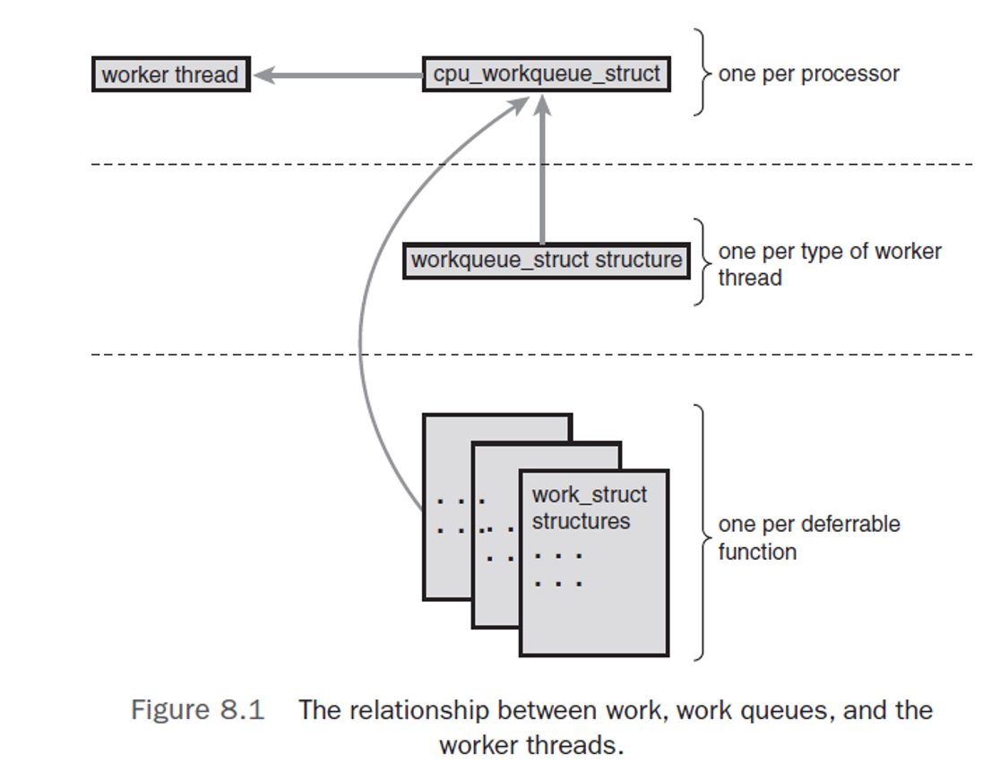

# 下半部和退后执行的工作

中断需要尽快完成的原因：

- 打断现有进程工作
- 屏蔽其他中断
- 操作硬件有时间要求
- 不能被阻塞

中断处理分为两个步骤：

- 上半部（中断处理程序）
  - 快速、异步、简单
  - 对硬件迅速响应，完成有时间要求的操作
- 下半部
  - 其他的、对时间要求不敏感的操作

## 下半部

执行与中断处理程序密切相关但中断处理程序本身不执行的工作。

如何划分上下半部的工作：

- 如果一个任务对时间非常敏感，将其放入中断处理程序中执行；
- 如果一个任务和硬件相关，将其放入中断处理程序中执行；
- 如果一个任务要保证不被其他中断（特别是同级的中断）打断，将其放入中断处理程序中执行；
- 其他所有任务考虑放置在下半部。

为何要用下半部：

- 中断处理程序在运行时会屏蔽当前的中断线；
- 如果一个处理程序是 `SA_INTERRUPT` 类型，它执行时会禁止所有本地中断（把本地中断先全局地屏蔽掉）；
- 缩短中断被屏蔽的时间对系统的响应能力和性能都至关重要，且中断处理程序要与其他程序（甚至其他中断处理程序）异步执行；
- 解决方法就是把一些工作放到后面去做

何时执行下半部（Best Effort）：

- 没有确切时间；
- 一般在系统不太繁忙、系统恢复中断后执行；
- 通常会在中断处理程序一返回就马上运行；
- 下半部执行时允许响应所有的中断。

### 下半部的环境

多种机制：

- BH（Bottom Half）（已淘汰）
  - 32 个 Bottom Half 组成的链表
  - 不允许同时执行
- 任务队列（Task Queue）（已淘汰）
  - 每个队列包含一个等待调用的函数组成链表
  - 不适合要求高的场合，如网络
- 软中断（内核 2.3，Softirqs）
  - 32 个
  - 可同时执行
- Tasklet
  - 基于软中断
  - 不同类型的 Tasklet 可同时执行
  - 相同类型的 Tasklet 不可同时执行
- 工作队列（Work Queue）
  - 基于线程
- 内核定时器
  - 将操作推迟到一个确定的时间段后执行

## 软中断

- 使用较少、Tasklet 中常用。
- 编译期间静态分配，无法动态注册或去除；

在 [`include/linux/interrupt.h`](https://elixir.bootlin.com/linux/v4.4.31/source/include/linux/interrupt.h) 中实现 `softirq_action()`：

```cpp
struct softirq_action
{
	void	(*action)(struct softirq_action *);
};
```

在 [`kernel/softirq.c`](https://elixir.bootlin.com/linux/v4.4.31/source/kernel/softirq.c) 中实现了 32 个软中断（实际用了 6 个）：

```cpp
static struct softirq_action softirq_vec[NR_SOFTIRQS] __cacheline_aligned_in_smp;
```

在 [`kernel/softirq.c`](https://elixir.bootlin.com/linux/v4.4.31/source/kernel/softirq.c) 中实现了 `do_softirq` 来执行软中断：

```cpp
asmlinkage __visible void do_softirq(void)
{
	__u32 pending;
	unsigned long flags;

	if (in_interrupt())
		return;

	local_irq_save(flags);

	pending = local_softirq_pending();

	if (pending)
		do_softirq_own_stack();

	local_irq_restore(flags);
}
```

### 使用软中断

软中断保留给系统中对时间要求最严格以及最重要的下半部使用：

```cpp
enum
{
	HI_SOFTIRQ=0,
	TIMER_SOFTIRQ,
	NET_TX_SOFTIRQ,
	NET_RX_SOFTIRQ,
	BLOCK_SOFTIRQ,
	BLOCK_IOPOLL_SOFTIRQ,
	TASKLET_SOFTIRQ,
	SCHED_SOFTIRQ,
	HRTIMER_SOFTIRQ, /* Unused, but kept as tools rely on the
			    numbering. Sigh! */
	RCU_SOFTIRQ,    /* Preferable RCU should always be the last softirq */

	NR_SOFTIRQS
};
```

|      Tasklet      | Priority |   Softirq Description    |
| :---------------: | :------: | :----------------------: |
|   `HI_SOFTIRQ`    |    0     |  High-priority tasklets  |
|  `TIMER_SOFTIRQ`  |    1     |          Timers          |
| `NET_TX_SOFTIRQ`  |    2     |   Send network packets   |
| `NET_RX_SOFTIRQ`  |    3     | Receive network packets  |
|  `BLOCK_SOFTIRQ`  |    4     |      Block devices       |
| `TASKLET_SOFTIRQ` |    5     | Normal priority tasklets |
|  `SCHED_SOFTIRQ`  |    6     |        Scheduler         |
| `HRTIMER_SOFTIRQ` |    7     |  High-resolution timer   |
|   `RCU_SOFTIRQ`   |    8     |       RCU locking        |

注册处理程序：

```cpp
void open_softirq(int nr, void (*action)(struct softirq_action *))
{
	softirq_vec[nr].action = action;
}
```

触发软中断，通过 `raise_softirq` 将软中断挂起，然后在 `do_softirq` 中轮询查找（使用 `raise_softirq_irqoff` 禁止中断）：

```cpp
/*
 * This function must run with irqs disabled!
 */
inline void raise_softirq_irqoff(unsigned int nr)
{
	__raise_softirq_irqoff(nr);

	/*
	 * If we're in an interrupt or softirq, we're done
	 * (this also catches softirq-disabled code). We will
	 * actually run the softirq once we return from
	 * the irq or softirq.
	 *
	 * Otherwise we wake up ksoftirqd to make sure we
	 * schedule the softirq soon.
	 */
	if (!in_interrupt())
		wakeup_softirqd();
}

void raise_softirq(unsigned int nr)
{
	unsigned long flags;

	local_irq_save(flags);
	raise_softirq_irqoff(nr);
	local_irq_restore(flags);
}

void __raise_softirq_irqoff(unsigned int nr)
{
	trace_softirq_raise(nr);
	or_softirq_pending(1UL << nr);
}
```

## Tasklet

- 基于 Softirq
- 与进程无关
- 一般情况下使用
- 基于两种软中断
  - HI_SOFTIRQ（优先级较高）
  - TASKLET_SOFTIRQ

### Tasklet 结构体

```cpp
struct tasklet_struct
{
	struct tasklet_struct *next;
	unsigned long state;
	atomic_t count;
	void (*func)(unsigned long);
	unsigned long data;
};
```

- state 字段只能在 0、TASKLET_STATE_SCHED 和 TASKLET_STATE_RUN 之间取值。TASKLET_STATE_SCHED 表明 Tasklet 已被定义，正准备运行；TASKLET_STATE_RUN 表明 Tasklet 正在运行。它只在多处理器上才会作为一种优化来使用；
- count 字段是 Tasklet 的引用计数器。如果它不为零则 Tasklet 被禁止，不允许执行；只有当它为 0 时，Tasklet 才被激活，并且被设置为挂起状态时，该 Tasklet 才能执行。

### Tasklet 调度

- `tasklet_vec`：由 `tasklet_schedule()` 调用；
- `tasklet_hi_vec`：由 `tasklet_hi_schedule()` 调用。

#### `tasklet_schedule()` 执行步骤

- 检查 Tasklet 的状态是否为 `TASKLET_STATE_SCHED`。如果是，说明 Tasklet 已经被调度过了，函数返回；
- 保存中断状态，然后禁止本地中断。在我们执行 Tasklet 代码时，这么做能够保证处理器上的数据不会弄乱；
- 把需要调度的 Tasklet 加到每个处理器一个的 `tasklet_vec` 链表上；
- 唤起 `TASKLET_SOFTIRQ` 或 `TASKLET_HI_SOFTIRQ` 软件中断，这样下一次调用 `do_softirq` 时就会执行该 Tasklet；
- 恢复中断到原状态并返回。

两个软中断 `tasklet_action` 和 `tasklet_hi_action` 的执行步骤：

- 由 `do_softirq` 调用；
- 禁止中断，并为当前处理器检索 `tasklet_vec` 或 `tasklet_hi_vec` 链表；
- 允许响应中断；
- 循环遍历获取链表上的每个待处理的 Tasklet；
- 如果是多处理器系统，通过检查 `TASKLET_STATE_RUN` 来判断这个 Tasklet 是否正在其他处理器上运行。如果它正在运行，那么现在就不要执行，跳到下一个待处理的 Tasklet 去；
- 如果当前这个 Tasklet 没有执行，将其状态设置为 `TASKLET_STATE_RUN`，这样别的处理器就不会再去执行它；
- 检查 count 值是否为 0，确保 Tasklet 没有被禁止。如果 Tasklet 被禁止了，则跳到下一个挂起的 Tasklet 去；
- 如果这个 Tasklet 没有在其他地方执行，也被设置为执行状态，并且引用计数为 0，现在就可以执行 Tasklet 的处理程序；
- Tasklet 运行完毕，清除 Tasklet

### 使用 Tasklet

静态声明：

```cpp
#define DECLARE_TASKLET(name, func, data) \
struct tasklet_struct name = { NULL, 0, ATOMIC_INIT(0), func, data }

#define DECLARE_TASKLET_DISABLED(name, func, data) \
struct tasklet_struct name = { NULL, 0, ATOMIC_INIT(1), func, data }
```

动态创建：

```cpp
void tasklet_init(struct tasklet_struct *t,
		  void (*func)(unsigned long), unsigned long data)
{
	t->next = NULL;
	t->state = 0;
	atomic_set(&t->count, 0);
	t->func = func;
	t->data = data;
}
```

> - Tasklet 不能 sleep；
> - 有可能被中断打断，共享数据要加锁。

调度：

```cpp
static inline void tasklet_schedule(struct tasklet_struct *t)
{
	if (!test_and_set_bit(TASKLET_STATE_SCHED, &t->state))
		__tasklet_schedule(t);
}

void __tasklet_schedule(struct tasklet_struct *t)
{
	unsigned long flags;

	local_irq_save(flags);
	t->next = NULL;
	*__this_cpu_read(tasklet_vec.tail) = t;
	__this_cpu_write(tasklet_vec.tail, &(t->next));
	raise_softirq_irqoff(TASKLET_SOFTIRQ);
	local_irq_restore(flags);
}
```

禁止与允许：

```cpp
static inline void tasklet_disable_nosync(struct tasklet_struct *t)
{
	atomic_inc(&t->count);
	smp_mb__after_atomic();
}

static inline void tasklet_disable(struct tasklet_struct *t)
{
	tasklet_disable_nosync(t);
	tasklet_unlock_wait(t);
	smp_mb();
}

static inline void tasklet_enable(struct tasklet_struct *t)
{
	smp_mb__before_atomic();
	atomic_dec(&t->count);
}
```

### 内核线程 `ksoftirqd`

Softirq 和 Tasklet 何时被处理：

- 方案 1：只要有被触发的软中断，本次执行就负责处理
  - 缺点：可能会导致用户进程不会调用
- 方案 2：处理一次，重新触发的软中断留待下次处理
  - 缺点：软中断处理延时大
- 方案 3：每个处理器运行一个内核线程 `ksoftirqd`；空闲时处理软中断。

```cpp
for (;;) {
	if (!softirq_pending(cpu))
		schedule();

	set_current_state(TASK_RUNNING);

	while (softirq_pending(cpu)) {
		do_softirq();
		if (need_resched())
			schedule();
	}

	set_current_state(TASK_INTERRUPTIABLE);
}
```

## BH

- 32 个
- 顺序执行
- 执行过程
  - `mark_bh()`
  - `bh_action`
- 内核 2.3，基于 Tasklet 重新实现
- 内核 2.5，废除

## 工作队列（Work Queue）

- 由一个内核线程执行
- 允许重新调度或睡眠（与 Tasklet 不同）

### 工作队列的实现（工作者线程）

- Worker Thread
- 缺省的工作者线程为 `events/n`
  - 每个处理器一个线程
- `workqueue_struct`

在 [`kernel/workqueue.c`](https://elixir.bootlin.com/linux/v4.4.31/source/kernel/workqueue.c) 中实现：

```cpp
/*
 * The externally visible workqueue.  It relays the issued work items to
 * the appropriate worker_pool through its pool_workqueues.
 */
struct workqueue_struct {
	struct list_head	pwqs;		/* WR: all pwqs of this wq */
	struct list_head	list;		/* PR: list of all workqueues */

	struct mutex		mutex;		/* protects this wq */
	int			work_color;	/* WQ: current work color */
	int			flush_color;	/* WQ: current flush color */
	atomic_t		nr_pwqs_to_flush; /* flush in progress */
	struct wq_flusher	*first_flusher;	/* WQ: first flusher */
	struct list_head	flusher_queue;	/* WQ: flush waiters */
	struct list_head	flusher_overflow; /* WQ: flush overflow list */

	struct list_head	maydays;	/* MD: pwqs requesting rescue */
	struct worker		*rescuer;	/* I: rescue worker */

	int			nr_drainers;	/* WQ: drain in progress */
	int			saved_max_active; /* WQ: saved pwq max_active */

	struct workqueue_attrs	*unbound_attrs;	/* PW: only for unbound wqs */
	struct pool_workqueue	*dfl_pwq;	/* PW: only for unbound wqs */

#ifdef CONFIG_SYSFS
	struct wq_device	*wq_dev;	/* I: for sysfs interface */
#endif
#ifdef CONFIG_LOCKDEP
	struct lockdep_map	lockdep_map;
#endif
	char			name[WQ_NAME_LEN]; /* I: workqueue name */

	/*
	 * Destruction of workqueue_struct is sched-RCU protected to allow
	 * walking the workqueues list without grabbing wq_pool_mutex.
	 * This is used to dump all workqueues from sysrq.
	 */
	struct rcu_head		rcu;

	/* hot fields used during command issue, aligned to cacheline */
	unsigned int		flags ____cacheline_aligned; /* WQ: WQ_* flags */
	struct pool_workqueue __percpu *cpu_pwqs; /* I: per-cpu pwqs */
	struct pool_workqueue __rcu *numa_pwq_tbl[]; /* PWR: unbound pwqs indexed by node */
};
```



### 使用工作队列

静态声明：

```cpp
#define DECLARE_WORK(n, f)						\
	struct work_struct n = __WORK_INITIALIZER(n, f)
```

动态创建：

```cpp
/*
 * initialize all of a work item in one go
 *
 * NOTE! No point in using "atomic_long_set()": using a direct
 * assignment of the work data initializer allows the compiler
 * to generate better code.
 */
#ifdef CONFIG_LOCKDEP
#define __INIT_WORK(_work, _func, _onstack)				\
	do {								\
		static struct lock_class_key __key;			\
									\
		__init_work((_work), _onstack);				\
		(_work)->data = (atomic_long_t) WORK_DATA_INIT();	\
		lockdep_init_map(&(_work)->lockdep_map, #_work, &__key, 0); \
		INIT_LIST_HEAD(&(_work)->entry);			\
		(_work)->func = (_func);				\
	} while (0)
#else
#define __INIT_WORK(_work, _func, _onstack)				\
	do {								\
		__init_work((_work), _onstack);				\
		(_work)->data = (atomic_long_t) WORK_DATA_INIT();	\
		INIT_LIST_HEAD(&(_work)->entry);			\
		(_work)->func = (_func);				\
	} while (0)
#endif

#define INIT_WORK(_work, _func)						\
	__INIT_WORK((_work), (_func), 0)
```

调度：

```cpp
/**
 * schedule_work - put work task in global workqueue
 * @work: job to be done
 *
 * Returns %false if @work was already on the kernel-global workqueue and
 * %true otherwise.
 *
 * This puts a job in the kernel-global workqueue if it was not already
 * queued and leaves it in the same position on the kernel-global
 * workqueue otherwise.
 */
static inline bool schedule_work(struct work_struct *work)
{
	return queue_work(system_wq, work);
}

/**
 * schedule_delayed_work - put work task in global workqueue after delay
 * @dwork: job to be done
 * @delay: number of jiffies to wait or 0 for immediate execution
 *
 * After waiting for a given time this puts a job in the kernel-global
 * workqueue.
 */
static inline bool schedule_delayed_work(struct delayed_work *dwork,
					 unsigned long delay)
{
	return queue_delayed_work(system_wq, dwork, delay);
}
```

删除和取消延时：

```cpp
/**
 * flush_scheduled_work - ensure that any scheduled work has run to completion.
 *
 * Forces execution of the kernel-global workqueue and blocks until its
 * completion.
 *
 * Think twice before calling this function!  It's very easy to get into
 * trouble if you don't take great care.  Either of the following situations
 * will lead to deadlock:
 *
 *	One of the work items currently on the workqueue needs to acquire
 *	a lock held by your code or its caller.
 *
 *	Your code is running in the context of a work routine.
 *
 * They will be detected by lockdep when they occur, but the first might not
 * occur very often.  It depends on what work items are on the workqueue and
 * what locks they need, which you have no control over.
 *
 * In most situations flushing the entire workqueue is overkill; you merely
 * need to know that a particular work item isn't queued and isn't running.
 * In such cases you should use cancel_delayed_work_sync() or
 * cancel_work_sync() instead.
 */
static inline void flush_scheduled_work(void)
{
	flush_workqueue(system_wq);
}

/**
 * cancel_delayed_work - cancel a delayed work
 * @dwork: delayed_work to cancel
 *
 * Kill off a pending delayed_work.
 *
 * Return: %true if @dwork was pending and canceled; %false if it wasn't
 * pending.
 *
 * Note:
 * The work callback function may still be running on return, unless
 * it returns %true and the work doesn't re-arm itself.  Explicitly flush or
 * use cancel_delayed_work_sync() to wait on it.
 *
 * This function is safe to call from any context including IRQ handler.
 */
bool cancel_delayed_work(struct delayed_work *dwork)
{
	unsigned long flags;
	int ret;

	do {
		ret = try_to_grab_pending(&dwork->work, true, &flags);
	} while (unlikely(ret == -EAGAIN));

	if (unlikely(ret < 0))
		return false;

	set_work_pool_and_clear_pending(&dwork->work,
					get_work_pool_id(&dwork->work));
	local_irq_restore(flags);
	return ret;
}
```

### 创建新的工作队列

创建：

```cpp
#define create_workqueue(name)						\
	alloc_workqueue("%s", WQ_MEM_RECLAIM, 1, (name))

/**
 * alloc_workqueue - allocate a workqueue
 * @fmt: printf format for the name of the workqueue
 * @flags: WQ_* flags
 * @max_active: max in-flight work items, 0 for default
 * @args...: args for @fmt
 *
 * Allocate a workqueue with the specified parameters.  For detailed
 * information on WQ_* flags, please refer to Documentation/workqueue.txt.
 *
 * The __lock_name macro dance is to guarantee that single lock_class_key
 * doesn't end up with different namesm, which isn't allowed by lockdep.
 *
 * RETURNS:
 * Pointer to the allocated workqueue on success, %NULL on failure.
 */
#ifdef CONFIG_LOCKDEP
#define alloc_workqueue(fmt, flags, max_active, args...)		\
({									\
	static struct lock_class_key __key;				\
	const char *__lock_name;					\
									\
	__lock_name = #fmt#args;					\
									\
	__alloc_workqueue_key((fmt), (flags), (max_active),		\
			      &__key, __lock_name, ##args);		\
})
#else
#define alloc_workqueue(fmt, flags, max_active, args...)		\
	__alloc_workqueue_key((fmt), (flags), (max_active),		\
			      NULL, NULL, ##args)
#endif
```

调度与 `schedule_work()` 类似：

```cpp
/**
 * queue_work - queue work on a workqueue
 * @wq: workqueue to use
 * @work: work to queue
 *
 * Returns %false if @work was already on a queue, %true otherwise.
 *
 * We queue the work to the CPU on which it was submitted, but if the CPU dies
 * it can be processed by another CPU.
 */
static inline bool queue_work(struct workqueue_struct *wq,
			      struct work_struct *work)
{
	return queue_work_on(WORK_CPU_UNBOUND, wq, work);
}

/**
 * queue_delayed_work - queue work on a workqueue after delay
 * @wq: workqueue to use
 * @dwork: delayable work to queue
 * @delay: number of jiffies to wait before queueing
 *
 * Equivalent to queue_delayed_work_on() but tries to use the local CPU.
 */
static inline bool queue_delayed_work(struct workqueue_struct *wq,
				      struct delayed_work *dwork,
				      unsigned long delay)
{
	return queue_delayed_work_on(WORK_CPU_UNBOUND, wq, dwork, delay);
}
```

## 下半部机制的选择

| Bottom Half |  Context  |       Inherent Serialization        |
| :---------: | :-------: | :---------------------------------: |
|   Softirq   | Interrupt |                None                 |
|   Tasklet   | Interrupt |      Against the same tasklet       |
| Work queues |  Process  | None (scheduled as process context) |

内核中如何禁止下半部？（见 [`include/linux/bottom_half.h`](https://elixir.bootlin.com/linux/v4.4.31/source/include/linux/bottom_half.h)）

```cpp
static inline void local_bh_disable(void)
{
	__local_bh_disable_ip(_THIS_IP_, SOFTIRQ_DISABLE_OFFSET);
}

static inline void local_bh_enable(void)
{
	__local_bh_enable_ip(_THIS_IP_, SOFTIRQ_DISABLE_OFFSET);
}
```

# Experiment

## 使用 Tasklet 作为中断下半部分并将扫描码翻译成 ASCII 码

参考上一章的代码，新增了 Tasklet、自旋锁以及对扫描码的解释：

```cpp
#include <linux/module.h>
#include <linux/init.h>
#include <linux/kernel.h>
#include <linux/interrupt.h>
#include <asm/io.h>

MODULE_LICENSE("GPL");
MODULE_AUTHOR("assassinq");
MODULE_DESCRIPTION("hello world module");

static unsigned char scancode, status;

DEFINE_SPINLOCK(key_lock); // spinlock

char *mappings[0x100];

void key_tasklet_func(unsigned long d) {
    unsigned char code;

    spin_lock(&key_lock);
    code = scancode;
    spin_unlock(&key_lock);

    if (code == 0xe0) {
        ;
    } else if (code & 0x80) { // release
        printk("In tasklet: released \"%s\"\n", mappings[code - 0x80]);
    } else { // press
        printk("In tasklet: pressed \"%s\"\n", mappings[code]);
    }
}

DECLARE_TASKLET(key_tasklet, key_tasklet_func, 0); // 初始化Tasklet
// DECLARE_TASKLET(key_tasklet_hi, key_tasklet_func, 0);

irq_handler_t key_handler(int irq, void *dev) {
    spin_lock(&key_lock);
    status = inb(0x64); // 读取键盘状态
    spin_unlock(&key_lock);

    spin_lock(&key_lock);
    scancode = inb(0x60); // 读取扫描码
    spin_unlock(&key_lock);

    printk("Key interrupt: scancode = 0x%x, status = 0x%x\n", scancode, status); // 输出对应按键的扫描码和状态
    tasklet_schedule(&key_tasklet); // 调度Tasklet
    // tasklet_hi_schedule(&key_tasklet_hi);

    return (irq_handler_t)IRQ_HANDLED;
}

void init_mappings(void) {
    memset(mappings, 0, sizeof(mappings));
    mappings[0x00] = "Error";
	mappings[0x01] = "Esc";
	mappings[0x02] = "1!";
	mappings[0x03] = "2@";
	mappings[0x04] = "3#";
	mappings[0x05] = "4$";
	mappings[0x06] = "5%";
	mappings[0x07] = "6^";
	mappings[0x08] = "7&";
	mappings[0x09] = "8*";
	mappings[0x0a] = "9(";
	mappings[0x0b] = "0)";
	mappings[0x0c] = "-_";
	mappings[0x0d] = "=+";
	mappings[0x0e] = "Backspace";
	mappings[0x0f] = "Tab";
	mappings[0x10] = "q";
	mappings[0x11] = "w";
	mappings[0x12] = "e";
	mappings[0x13] = "r";
	mappings[0x14] = "t";
	mappings[0x15] = "y";
	mappings[0x16] = "u";
	mappings[0x17] = "i";
	mappings[0x18] = "o";
	mappings[0x19] = "p";
	mappings[0x1a] = "[{";
	mappings[0x1b] = "]}";
	mappings[0x1c] = "Enter";
	mappings[0x1d] = "LCtrl";
	mappings[0x1e] = "a";
	mappings[0x1f] = "s";
	mappings[0x20] = "d";
	mappings[0x21] = "f";
	mappings[0x22] = "g";
	mappings[0x23] = "h";
	mappings[0x24] = "j";
	mappings[0x25] = "k";
	mappings[0x26] = "l";
	mappings[0x27] = ";:";
	mappings[0x28] = "'\"";
	mappings[0x29] = "`~";
	mappings[0x2c] = "z";
	mappings[0x2d] = "x";
	mappings[0x2e] = "c";
	mappings[0x2f] = "v";
	mappings[0x30] = "b";
	mappings[0x31] = "n";
	mappings[0x32] = "m";
	mappings[0x33] = ",<";
	mappings[0x34] = ".>";
	mappings[0x35] = "/?";
	mappings[0x36] = "RShift";
	mappings[0x37] = "Keypad-*/PrtScn";
	mappings[0x38] = "LAlt";
	mappings[0x39] = "Space bar";
	mappings[0x3a] = "CapsLock";
	mappings[0x3b] = "F1";
	mappings[0x3c] = "F2";
	mappings[0x3d] = "F3";
	mappings[0x3e] = "F4";
	mappings[0x3f] = "F5";
	mappings[0x40] = "F6";
	mappings[0x41] = "F7";
	mappings[0x42] = "F8";
	mappings[0x43] = "F9";
	mappings[0x44] = "F10";
	mappings[0x45] = "NumLock";
	mappings[0x46] = "ScrollLock";
	mappings[0x47] = "Keypad-7/Home";
	mappings[0x48] = "Keypad-8/Up";
	mappings[0x49] = "Keypad-9/PgUp";
	mappings[0x4a] = "Keypad--";
	mappings[0x4b] = "Keypad-4/Left";
	mappings[0x4c] = "Keypad-5";
	mappings[0x4d] = "Keypad-6/Right";
	mappings[0x4e] = "Keypad-+";
	mappings[0x4f] = "Keypad-1/End";
	mappings[0x50] = "Keypad-2/Down";
	mappings[0x51] = "Keypad-3/PgDn";
	mappings[0x52] = "Keypad-0/Ins";
	mappings[0x53] = "Keypad-./Del";
}

static int __init hello_init(void) {
    int ret;

    init_mappings();
    printk("Keyboard Interrupt Hook.\n");
    ret = request_irq(1, (irq_handler_t)key_handler, IRQF_SHARED, "Key Hook", (void *)key_handler); // 为中断服务例程分配一个硬件中断号
    if (ret) {
        printk("Request failed.\n");
        return -EIO;
    }

    return 0;
}

static void __exit hello_exit(void) {
    free_irq(1, (void *)key_handler); // 释放指定中断号
    printk("Keyboard Interrupt Hook exited.\n");
}

module_init(hello_init);
module_exit(hello_exit);
```

## 使用 Workqueue 作为中断下半部分并将扫描码翻译成 ASCII 码

将 Tasklet 的部分改为了 Work Queue（注释代码中尝试创建自己的队列没有成功）：

```cpp
#include <linux/module.h>
#include <linux/init.h>
#include <linux/kernel.h>
#include <linux/interrupt.h>
#include <asm/io.h>
#include <linux/workqueue.h>

MODULE_LICENSE("GPL");
MODULE_AUTHOR("assassinq");
MODULE_DESCRIPTION("hello world module");

static unsigned char scancode, status;

DEFINE_SPINLOCK(key_lock); // spinlock

char *mappings[0x100];

void key_work_func(struct work_struct *q) {
    unsigned char code;

    spin_lock(&key_lock);
    code = scancode;
    spin_unlock(&key_lock);

    if (code == 0xe0) {
        ;
    } else if (code & 0x80) { // release
        printk("In work: released \"%s\"\n", mappings[code - 0x80]);
    } else { // press
        printk("In work: pressed \"%s\"\n", mappings[code]);
    }
}

DECLARE_WORK(key_work, key_work_func); // 初始化workqueue
// struct workqueue_struct *my_workqueue;
// struct work_struct my_work;

irq_handler_t key_handler(int irq, void *dev) {
    spin_lock(&key_lock);
    status = inb(0x64); // 读取键盘状态
    spin_unlock(&key_lock);

    spin_lock(&key_lock);
    scancode = inb(0x60); // 读取扫描码
    spin_unlock(&key_lock);

    printk("Key interrupt: scancode = 0x%x, status = 0x%x\n", scancode, status); // 输出对应按键的扫描码和状态
    schedule_work(&key_work); // 调度workqueue
    // my_workqueue = create_workqueue("my_workqueue");
    // if (!my_workqueue) {
    //     panic("Create workqueue failed.\n");
    // }
    // INIT_WORK(&my_work, key_work_func);
    // queue_work(my_workqueue, &my_work);

    return (irq_handler_t)IRQ_HANDLED;
}

void init_mappings(void) {
    memset(mappings, 0, sizeof(mappings));
    mappings[0x00] = "Error";
	mappings[0x01] = "Esc";
	mappings[0x02] = "1!";
	mappings[0x03] = "2@";
	mappings[0x04] = "3#";
	mappings[0x05] = "4$";
	mappings[0x06] = "5%";
	mappings[0x07] = "6^";
	mappings[0x08] = "7&";
	mappings[0x09] = "8*";
	mappings[0x0a] = "9(";
	mappings[0x0b] = "0)";
	mappings[0x0c] = "-_";
	mappings[0x0d] = "=+";
	mappings[0x0e] = "Backspace";
	mappings[0x0f] = "Tab";
	mappings[0x10] = "q";
	mappings[0x11] = "w";
	mappings[0x12] = "e";
	mappings[0x13] = "r";
	mappings[0x14] = "t";
	mappings[0x15] = "y";
	mappings[0x16] = "u";
	mappings[0x17] = "i";
	mappings[0x18] = "o";
	mappings[0x19] = "p";
	mappings[0x1a] = "[{";
	mappings[0x1b] = "]}";
	mappings[0x1c] = "Enter";
	mappings[0x1d] = "LCtrl";
	mappings[0x1e] = "a";
	mappings[0x1f] = "s";
	mappings[0x20] = "d";
	mappings[0x21] = "f";
	mappings[0x22] = "g";
	mappings[0x23] = "h";
	mappings[0x24] = "j";
	mappings[0x25] = "k";
	mappings[0x26] = "l";
	mappings[0x27] = ";:";
	mappings[0x28] = "'\"";
	mappings[0x29] = "`~";
	mappings[0x2c] = "z";
	mappings[0x2d] = "x";
	mappings[0x2e] = "c";
	mappings[0x2f] = "v";
	mappings[0x30] = "b";
	mappings[0x31] = "n";
	mappings[0x32] = "m";
	mappings[0x33] = ",<";
	mappings[0x34] = ".>";
	mappings[0x35] = "/?";
	mappings[0x36] = "RShift";
	mappings[0x37] = "Keypad-*/PrtScn";
	mappings[0x38] = "LAlt";
	mappings[0x39] = "Space bar";
	mappings[0x3a] = "CapsLock";
	mappings[0x3b] = "F1";
	mappings[0x3c] = "F2";
	mappings[0x3d] = "F3";
	mappings[0x3e] = "F4";
	mappings[0x3f] = "F5";
	mappings[0x40] = "F6";
	mappings[0x41] = "F7";
	mappings[0x42] = "F8";
	mappings[0x43] = "F9";
	mappings[0x44] = "F10";
	mappings[0x45] = "NumLock";
	mappings[0x46] = "ScrollLock";
	mappings[0x47] = "Keypad-7/Home";
	mappings[0x48] = "Keypad-8/Up";
	mappings[0x49] = "Keypad-9/PgUp";
	mappings[0x4a] = "Keypad--";
	mappings[0x4b] = "Keypad-4/Left";
	mappings[0x4c] = "Keypad-5";
	mappings[0x4d] = "Keypad-6/Right";
	mappings[0x4e] = "Keypad-+";
	mappings[0x4f] = "Keypad-1/End";
	mappings[0x50] = "Keypad-2/Down";
	mappings[0x51] = "Keypad-3/PgDn";
	mappings[0x52] = "Keypad-0/Ins";
	mappings[0x53] = "Keypad-./Del";
}

static int __init hello_init(void) {
    int ret;

    init_mappings();
    printk("Keyboard Interrupt Hook.\n");
    ret = request_irq(1, (irq_handler_t)key_handler, IRQF_SHARED, "Key Hook", (void *)key_handler); // 为中断服务例程分配一个硬件中断号
    if (ret) {
        printk("Request failed.\n");
        return -EIO;
    }

    return 0;
}

static void __exit hello_exit(void) {
    free_irq(1, (void *)key_handler); // 释放指定中断号
    printk("Keyboard Interrupt Hook exited.\n");
}

module_init(hello_init);
module_exit(hello_exit);
```

# 参考网站

https://elixir.bootlin.com/linux/v4.4.31/source/include/linux/interrupt.h
https://elixir.bootlin.com/linux/v4.4.31/source/kernel/softirq.c
https://elixir.bootlin.com/linux/v4.4.31/source/kernel/workqueue.c
https://elixir.bootlin.com/linux/v4.4.31/source/include/linux/bottom_half.h
https://blog.csdn.net/weixin_38227420/article/details/79329499
https://blog.csdn.net/angle_birds/article/details/8448070
