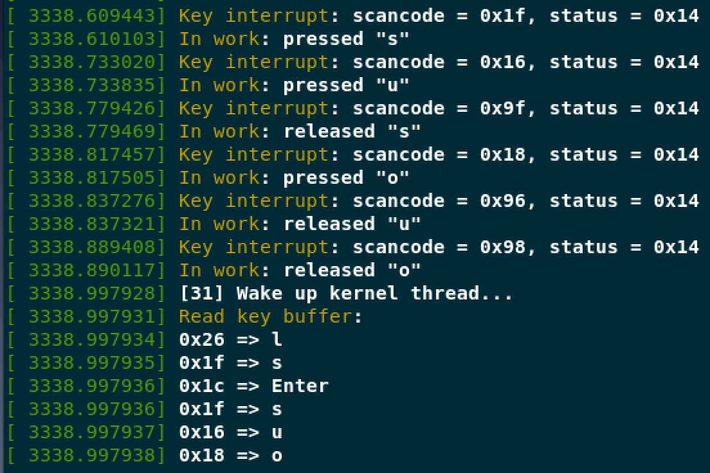

# 内核同步介绍

## 同步

- 共享资源
  - 并发访问控制
  - 多处理器

## 临界区和竞争条件

- 临界区（Critical Regions）
  - 访问和操作共享数据的代码段
  - 原子执行
    - 不被打断
    - 不可分割
- 竞争条件（Race Condition）
  - 无法保证原子操作
- 同步（Synchronization）
  - 避免并发和防止竞争条件

```cpp
int total = get_total_from_account();      /* total funds in account */
int withdrawal = get_withdrawal_amount();  /* amout user asked to withdrawal */

/* check whether the user has enough funds in her account */
if (total < withdrawal) {
	error("You do not have that much money!");
	return -1;
}

/* OK, the user has enough money: deduct the withdrawal amount from her total */
total -= withdrawal;
update_total_funds(total);

/* give the user their money */
spit_out_money(withdrawal);
```

对单个变量（`i`）操作分为三个部分：

1. get the current value of i and copy it into a register.
2. add one tto the value stored in the register.
3. write back to memory the new value of i.

## 加锁 & 锁机制及粒度

- 锁机制
  - 忙等待（中断）
  - 睡眠（非中断）
- 锁
  - 原子操作

## 造成并发执行的原因

1. 中断
2. 软中断和 Tasklet
3. 内核调度（抢占）
4. 睡眠及与用户空间的同步
5. 对称多处理

> 并发时保护的是数据，而非代码

## 死锁

产生条件：一个或多个执行线程，彼此等待对方持有的资源。

## 争用性和扩展性（Lock Contention）

- 扩展性
  - 锁的粒度

# 内核同步方法

## 原子操作（不会被打断）

两类原子操作接口：

- 整数操作
  - `atomic_t`
- 位操作

### 整数操作

结构体：

```cpp
typedef struct {
	int counter;
} atomic_t;

#ifdef CONFIG_64BIT
typedef struct {
	long counter;
} atomic64_t;
#endif
```

使用方法：

```cpp
atomic_t v;
atomic_t u = ATOMIC_INIT(0);
atomic_set(&v, 4); // v = 4
atomic_add(2, &v); // v += 2
atomic_inc(&v); // v++
int atomic_dec_and_test(atomic_t *v); // Test if decreased right
```

### 位操作

```cpp
unsigned long word = 0;

set_bit(0, &word); // set bit zero
set_bit(1, &word); // set bit one
clear_bit(1, &word); // unset bit one
change_bit(0, &word); // change bit zero

// Sett bit and return previous bit
if (test_and_set_bit(0, &word)) {
    ...
}
```

## 自旋锁（Spinlock）

- 最多被一个可执行线程持有
- 如被占用，线程执行忙等待
- 不宜长时间占有

## 读写自旋锁（Read-Write Spinlock）

- 读锁允许多个可执行线程持有
- 写锁只允许一个可执行线程持有
- 如被占用，线程执行忙等待
- 不宜长时间占有

```cpp
DEFINE_RWLOCK(&lock);
#define write_lock(lock)	_raw_write_lock(lock)
#define read_lock(lock)		_raw_read_lock(lock)
#define read_unlock(lock)		_raw_read_unlock(lock)
#define write_unlock(lock)		_raw_write_unlock(lock)
```

## 信号量

- 可睡眠的锁
- 允许多个进程占用

```cpp
struct semaphore {
	raw_spinlock_t		lock;
	unsigned int		count;
	struct list_head	wait_list;
};

static inline void sema_init(struct semaphore *sem, int val)
{
	static struct lock_class_key __key;
	*sem = (struct semaphore) __SEMAPHORE_INITIALIZER(*sem, val);
	lockdep_init_map(&sem->lock.dep_map, "semaphore->lock", &__key, 0);
}

/**
 * down_interruptible - acquire the semaphore unless interrupted
 * @sem: the semaphore to be acquired
 *
 * Attempts to acquire the semaphore.  If no more tasks are allowed to
 * acquire the semaphore, calling this function will put the task to sleep.
 * If the sleep is interrupted by a signal, this function will return -EINTR.
 * If the semaphore is successfully acquired, this function returns 0.
 */
int down_interruptible(struct semaphore *sem)
{
	unsigned long flags;
	int result = 0;

	raw_spin_lock_irqsave(&sem->lock, flags);
	if (likely(sem->count > 0))
		sem->count--;
	else
		result = __down_interruptible(sem);
	raw_spin_unlock_irqrestore(&sem->lock, flags);

	return result;
}
```

## 完成变量（Complection Variable）

如果在内核中一个任务需要发出信号通知另一个任务发生了某个特定事件，利用完成变量是使两个任务得以同步的简单方法。如果一个任务要执行一些工作时，另一个任务就会在完成变量上等待。当这个任务完成工作后，会使用完成变量去唤醒在等待的任务。

## BLK（大内核锁）

```cpp
lock_kernel();
unlock_kernel();
kernel_locked();
```

## 顺序锁（Seqlock）

顺序锁的设计思想是：对某一个共享数据读取的时候不加锁，写的时候加锁。同时为了保证读取的过程中因为写进程修改了共享区的数据，导致读进程读取数据错误。在读取者和写入者之间引入了一个整形变量 Sequence，读取者在读取之前读取 Sequence, 读取之后再次读取此值，如果不相同，则说明本次读取操作过程中数据发生了更新，需要重新读取。而对于写进程在写入数据的时候就需要更新 Sequence 的值。

# 实验部分

在 Workqueue 模块的基础增加一个 `kfifo` 缓冲区用于记录按键，再创建一个内核线程来打印按键值：

```cpp
#include <linux/module.h>
#include <linux/init.h>
#include <linux/kernel.h>
#include <linux/interrupt.h>
#include <asm/io.h>
#include <linux/workqueue.h>
#include <linux/kfifo.h>
#include <linux/slab.h>
#include <linux/kthread.h>
#include <linux/thread_info.h>
#include <linux/delay.h>

MODULE_LICENSE("GPL");
MODULE_AUTHOR("assassinq");
MODULE_DESCRIPTION("hello world module");

char *mappings[0x100]; // 键盘按键扫描码映射
static unsigned char scancode, status;
static struct kfifo key_buf; // 初始化队列
static int buf_size = 20; // 队列大小
struct task_struct *thread = NULL; // 初始化线程
DEFINE_MUTEX(buf_lock); // 初始化互斥锁
DEFINE_SPINLOCK(key_lock); // 初始化自旋锁

void key_work_func(struct work_struct *q) { // 工作队列函数，读取并翻译扫描码
    unsigned char code, t;

    spin_lock(&key_lock);
    code = scancode;
    spin_unlock(&key_lock);

    if (code == 0xe0) {
        ;
    } else if (code & 0x80) { // release
        printk("In work: released \"%s\"\n", mappings[code - 0x80]);
    } else { // press
        printk("In work: pressed \"%s\"\n", mappings[code]);
		mutex_lock(&buf_lock);
		if (kfifo_is_full(&key_buf)) {
			kfifo_out(&key_buf, &t, sizeof(t)); // 如果队列满，则将一个成员出队列
		}
		kfifo_in(&key_buf, (void *)&code, sizeof(code)); // 将扫描码入队列
		mutex_unlock(&buf_lock);
    }
}

DECLARE_WORK(key_work, key_work_func); // 初始化Workqueue

irq_handler_t key_handler(int irq, void *dev) {
    spin_lock(&key_lock);
    status = inb(0x64); // 读取键盘状态
    spin_unlock(&key_lock);

    spin_lock(&key_lock);
    scancode = inb(0x60); // 读取扫描码
    spin_unlock(&key_lock);

    printk("Key interrupt: scancode = 0x%x, status = 0x%x\n", scancode, status); // 输出对应按键的扫描码和状态
    schedule_work(&key_work); // 调度Workqueue

    return (irq_handler_t)IRQ_HANDLED;
}

int read_func(void *data) {
	int i = 0;
	unsigned char code;

	while (!kthread_should_stop()) {
		printk("[%d] Wake up kernel thread...\n", i++);
		printk("Read key buffer: ");
		mutex_lock(&buf_lock); // 为数据的操作上互斥锁
		while(!kfifo_is_empty(&key_buf)) {
			kfifo_out(&key_buf, &code, sizeof(code)); // 如果队列满，则将一个元素出队列
			if (!(code & 0x80) || (code != 0xe0)) {
				printk("0x%x => %s", code, mappings[code]); // 输出出队列的扫描码和对应的按键
			}
		}
		mutex_unlock(&buf_lock);
		printk("\n");
		ssleep(1);
	}
	return 0;
}

void init_mappings(void) {
    memset(mappings, 0, sizeof(mappings));
    mappings[0x00] = "Error";
	mappings[0x01] = "Esc";
	mappings[0x02] = "1!";
	mappings[0x03] = "2@";
	mappings[0x04] = "3#";
	mappings[0x05] = "4$";
	mappings[0x06] = "5%";
	mappings[0x07] = "6^";
	mappings[0x08] = "7&";
	mappings[0x09] = "8*";
	mappings[0x0a] = "9(";
	mappings[0x0b] = "0)";
	mappings[0x0c] = "-_";
	mappings[0x0d] = "=+";
	mappings[0x0e] = "Backspace";
	mappings[0x0f] = "Tab";
	mappings[0x10] = "q";
	mappings[0x11] = "w";
	mappings[0x12] = "e";
	mappings[0x13] = "r";
	mappings[0x14] = "t";
	mappings[0x15] = "y";
	mappings[0x16] = "u";
	mappings[0x17] = "i";
	mappings[0x18] = "o";
	mappings[0x19] = "p";
	mappings[0x1a] = "[{";
	mappings[0x1b] = "]}";
	mappings[0x1c] = "Enter";
	mappings[0x1d] = "LCtrl";
	mappings[0x1e] = "a";
	mappings[0x1f] = "s";
	mappings[0x20] = "d";
	mappings[0x21] = "f";
	mappings[0x22] = "g";
	mappings[0x23] = "h";
	mappings[0x24] = "j";
	mappings[0x25] = "k";
	mappings[0x26] = "l";
	mappings[0x27] = ";:";
	mappings[0x28] = "'\"";
	mappings[0x29] = "`~";
	mappings[0x2c] = "z";
	mappings[0x2d] = "x";
	mappings[0x2e] = "c";
	mappings[0x2f] = "v";
	mappings[0x30] = "b";
	mappings[0x31] = "n";
	mappings[0x32] = "m";
	mappings[0x33] = ",<";
	mappings[0x34] = ".>";
	mappings[0x35] = "/?";
	mappings[0x36] = "RShift";
	mappings[0x37] = "Keypad-*/PrtScn";
	mappings[0x38] = "LAlt";
	mappings[0x39] = "Space bar";
	mappings[0x3a] = "CapsLock";
	mappings[0x3b] = "F1";
	mappings[0x3c] = "F2";
	mappings[0x3d] = "F3";
	mappings[0x3e] = "F4";
	mappings[0x3f] = "F5";
	mappings[0x40] = "F6";
	mappings[0x41] = "F7";
	mappings[0x42] = "F8";
	mappings[0x43] = "F9";
	mappings[0x44] = "F10";
	mappings[0x45] = "NumLock";
	mappings[0x46] = "ScrollLock";
	mappings[0x47] = "Keypad-7/Home";
	mappings[0x48] = "Keypad-8/Up";
	mappings[0x49] = "Keypad-9/PgUp";
	mappings[0x4a] = "Keypad--";
	mappings[0x4b] = "Keypad-4/Left";
	mappings[0x4c] = "Keypad-5";
	mappings[0x4d] = "Keypad-6/Right";
	mappings[0x4e] = "Keypad-+";
	mappings[0x4f] = "Keypad-1/End";
	mappings[0x50] = "Keypad-2/Down";
	mappings[0x51] = "Keypad-3/PgDn";
	mappings[0x52] = "Keypad-0/Ins";
	mappings[0x53] = "Keypad-./Del";
}

static int __init hello_init(void) {
    int ret;

    init_mappings(); // 初始化映射表
    printk("Keyboard Interrupt Hook.\n");
    ret = request_irq(1, (irq_handler_t)key_handler, IRQF_SHARED, "Key Hook", (void *)key_handler); // 为中断服务例程分配一个硬件中断号
    if (ret) {
        printk("Request failed.\n");
        return -EIO;
    }

	ret = kfifo_alloc(&key_buf, buf_size, GFP_ATOMIC); // 创建FIFO队列
	if (ret) {
		printk("Allocate memory failed.\n");
		return -1;
	}
	thread = kthread_run(read_func, 0, "read_thread"); // 在线程中运行read_func函数
    return 0;
}

static void __exit hello_exit(void) {
	kthread_stop(thread);
    free_irq(1, (void *)key_handler); // 释放指定中断号
	kfifo_free(&key_buf);
    printk("Keyboard Interrupt Hook exited.\n");
}

module_init(hello_init);
module_exit(hello_exit);
```

运行效果：



# 参考网站

https://elixir.bootlin.com/linux/v4.4.31/source/include/linux/types.h
https://elixir.bootlin.com/linux/v4.4.31/source/include/linux/rwlock.h
https://elixir.bootlin.com/linux/v4.4.31/source/include/linux/semaphore.h
https://elixir.bootlin.com/linux/v4.4.31/source/kernel/locking/semaphore.c
