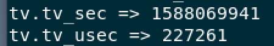
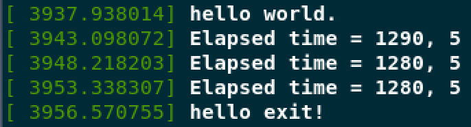

# 定时器和时间管理

## 时间管理

- 事件驱动
- 时间驱动
  - 大量函数基于时间驱动
    - 周期执行的函数
    - 屏幕刷新、调度程序中的运行队列平衡调整
    - 推后执行的磁盘 I/O（需要等待一段时间再执行）
- 相对时间、绝对时间
- 系统定时器
  - 周期性事件
- 动态定时器
  - 推后执行

## 内核中的时间概念

### 系统定时器

- 硬件实现
- 数字时钟或处理器频率
- 以某种频率自动触发
  - 频率可以编程预定
  - 节拍率
  - 产生时钟中断

> 始终中断对于管理操作系统尤为重要，大量内核函数的生命周期都离不开流逝的时间的控制。下面给出一些利用时间中断周期执行的工作：
>
> - 更新系统运行时间；
> - 更新实际时间；
> - 在 SMP 系统上，均衡调度程序中个处理器上的运行队列。如果队列负载不均衡的话，尽量使它们均衡；
> - 检查当前进程是否用尽了自己的时间片；
> - 检查当前进程是否用尽了自己的时间片。如果用尽，就重新进行调度；
> - 运行超时的动态定时器；
> - 更新资源消耗和处理器时间的统计值。

### 节拍

- 节拍（Tick），两次始终中断的间隔时间
- 利用节拍可以计算
  - Wall Time（实际时间）
  - 系统运行时间（相对时间）
- 内核提供了一组 API 函数来获得实际日期和时间
- 通过计算两次运行时间的差可获得时间间隔

## 节拍率（HZ）

- 系统定时器频率（节拍率）静态定义
  - HZ
  - 启动时按 HZ 值对硬件进行设定
  - 与体系结构有关，值可能不一样
  - `asm/param.h`
  - x86 下 HZ 为 100（即每秒中断 100 次）

### 理想的 HZ 值

- i386 体系中 HZ 起始为 100
- 在 2.5 开发版中提高到 1000
- HZ 越高
  - 中断越频繁
  - 时钟解析度高（Resolution）
  - 时钟准确度高（Accuracy）

### 高 HZ 值的优势

- 内核定时器能够以更高的频度和更高的准确度运行；
- 依赖定时值执行的系统调用，比如 `poll()` 和 `select()`，能够以更高的精度运行；
- 对诸如资源消耗和系统运行时间等的测量会有更精细的解析度；
- 提高进程抢占的准确度；
- 更高的准确率也使进程抢占更准确，同时还会加快调度响应时间。

### 高 HZ 值的劣势

节拍率越高，意味着时钟中断频率越高，也就意味着系统负担越重。因为处理器必须花时间来执行时钟中断处理程序。

> 无节拍的 OS？
> 如果在编译内核时设置了 `CONFIG_HZ` 配置选项，系统就根据这个选项动态调度时钟中断，并不是每隔固定的时间间隔触发时钟中断，而是按需动态调度和重新设置。

## Jiffies（瞬间）

- 全局变量
- 记录自系统启动以来产生的节拍的总数
- 启动时 Jiffies 设为 0
- 一秒内增加的 Jiffies 数为 HZ
- 系统运行时间 Jiffies/HZ（秒）
- `linux/jiffies.h`

Jiffies（`unsigned long`）与秒的转换：`seconds * HZ == jiffies / HZ`

### Jiffies 的回绕

- Jiffies 的最大值为 $2^{32-1}$
- 溢出后其值会从 0 开始
- 使用时必须考虑回绕

```cpp
/*
 *	These inlines deal with timer wrapping correctly. You are
 *	strongly encouraged to use them
 *	1. Because people otherwise forget
 *	2. Because if the timer wrap changes in future you won't have to
 *	   alter your driver code.
 *
 * time_after(a,b) returns true if the time a is after time b.
 *
 * Do this with "<0" and ">=0" to only test the sign of the result. A
 * good compiler would generate better code (and a really good compiler
 * wouldn't care). Gcc is currently neither.
 */
#define time_after(a,b)		\
	(typecheck(unsigned long, a) && \
	 typecheck(unsigned long, b) && \
	 ((long)((b) - (a)) < 0))
#define time_before(a,b)	time_after(b,a)

#define time_after_eq(a,b)	\
	(typecheck(unsigned long, a) && \
	 typecheck(unsigned long, b) && \
	 ((long)((a) - (b)) >= 0))
#define time_before_eq(a,b)	time_after_eq(b,a)
```

### 用户空间和 HZ

- 2.6 内核以前，改变 HZ 值会给用户空间带来问题，因为用户空间依赖于传统的 HZ 定义（节拍数/秒）；
- 改为 `USER_HZ`
  - 利用 `jiffies_to_clock_t()` 将 HZ 表示的节拍计数转换成 `USER_HZ` 表示的节拍计数。

## 硬时钟和定时器

### 实时时钟

- RTC（Real Time Clock）
- 持久存放系统时间
- 断电后继续工作
- PC 体系中 RTC 和 CMOS 集成在一起，通过同一个电池供电
- 系统启动时，内核通过 RTC 来初始化 clock 时间，该时间存放在 xtime 变量中

### 系统定时器

- 不同体系实现不同
- 提供周期性触发中断机制
- x86 采用可编程中断时钟（PIT）
- 内核启动时初始化 PIT，使其以 `HZ/秒` 的频率产生时钟中断（中断 0）
- x86 还包括 APIC 时钟和时间戳计数（TSC）

## 时钟中断处理程序

- 依赖于特定体系结构
- 分为
  - 体系结构相关部分
  - 体系结构无关部分

### 体系结构相关部分

- 获得 `xtime_lock` 锁，以便对访问 `jiffies_64` 和墙上时间 `xtime` 进行保护；
- 需要时应答或重新设置系统时钟；
- 周期性地使用墙上时间更新实时时钟；
- 调用体系结构无关的时钟例程：`tick_periodic()`。

### 体系结构无关部分

- 给 `jiffies_64` 变量增加 1（访问）；
- 更新资源消耗的统计值，比如当前进程所消耗的系统时间和用户时间；
- 执行已经到期的动态定时器；
- 更新墙上时间，该时间存放在 `xtime` 变量中；
- 计算平均负载值。

```cpp
/*
 * Periodic tick
 */
static void tick_periodic(int cpu)
{
	if (tick_do_timer_cpu == cpu) {
		write_seqlock(&jiffies_lock);

		/* Keep track of the next tick event */
		tick_next_period = ktime_add(tick_next_period, tick_period);

		do_timer(1);
		write_sequnlock(&jiffies_lock);
		update_wall_time();
	}

	update_process_times(user_mode(get_irq_regs()));
	profile_tick(CPU_PROFILING);
}
```

修改 `jiffies_64`：

```cpp
/*
 * Must hold jiffies_lock
 */
void do_timer(unsigned long ticks)
{
	jiffies_64 += ticks;
	calc_global_load(ticks);
}
```

统计进程运行时间：

```cpp
/*
 * Called from the timer interrupt handler to charge one tick to the current
 * process.  user_tick is 1 if the tick is user time, 0 for system.
 */
void update_process_times(int user_tick)
{
	struct task_struct *p = current;

	/* Note: this timer irq context must be accounted for as well. */
	account_process_tick(p, user_tick);
	run_local_timers();
	rcu_check_callbacks(user_tick);
#ifdef CONFIG_IRQ_WORK
	if (in_irq())
		irq_work_tick();
#endif
	scheduler_tick();
	run_posix_cpu_timers(p);
}
```

更新进程时间：

```cpp
/*
 * Account a single tick of cpu time.
 * @p: the process that the cpu time gets accounted to
 * @user_tick: indicates if the tick is a user or a system tick
 */
void account_process_tick(struct task_struct *p, int user_tick)
{
	cputime_t one_jiffy_scaled = cputime_to_scaled(cputime_one_jiffy);
	struct rq *rq = this_rq();

	if (vtime_accounting_enabled())
		return;

	if (sched_clock_irqtime) {
		irqtime_account_process_tick(p, user_tick, rq, 1);
		return;
	}

	if (steal_account_process_tick())
		return;

	if (user_tick)
		account_user_time(p, cputime_one_jiffy, one_jiffy_scaled);
	else if ((p != rq->idle) || (irq_count() != HARDIRQ_OFFSET))
		account_system_time(p, HARDIRQ_OFFSET, cputime_one_jiffy,
				    one_jiffy_scaled);
	else
		account_idle_time(cputime_one_jiffy);
}
```

## 时钟中断处理程序

内核对进程进行时间计数时，是根据中断发生时处理器所处的模式进行分类统计的，把上一个节拍全部算给了进程。但事实上进程在上一个节拍期间可能多次进入和退出内核模式。而且在上一个节拍期间，该进程也不一定是唯一一个运行进程。

## 实际时间

当前时间（墙上时间）：

```cpp
struct timespec {
	__kernel_time_t	tv_sec;			/* seconds */
	long		tv_nsec;		/* nanoseconds */
};
```

读写 `xtime` 需要使用 `xtime_lock` 锁（Seqlock）：

```cpp
write_seqlock(&xtime_lock);
...
write_sequnlock(&xtime_lock);

unsigned long seq;
do {
	unsigned long lost;
	seq = read_seqbegin(&(xtime_lock));

	usec = timer->get_offset();
	lost = jiffies - wall_jiffies;
	if (lost)
		usec += lost * (1000000 / HZ);
	sec = xtime.tv_sec;
	usec += (xtime.tv_nsec / 1000);
} while (read_seqretry(&xtime_lock, seq));
```

用户空间通过 `gettimeofday()` 获取时间：

```cpp
int gettimeofday(struct timeval *tv, struct timezone *tz)
	__attribute__((weak, alias("__vdso_gettimeofday")));
```

测试使用 `gettimeofday()`：

```cpp
#include <stdio.h>
#include <sys/time.h>
#include <unistd.h>

int main() {
    struct timeval tv; // 时间
    struct timezone tz; // 时区
    gettimeofday(&tv, &tz);
    printf("tv.tv_sec => %d\n", tv.tv_sec); // 输出当前时间秒数
    printf("tv.tv_usec => %d\n", tv.tv_usec); // 输出当前时间微秒数
    return 0;
}
```

运行效果：



## 定时器

- 动态定时器或内核定时器
- 用于在指定时间点执行任务
- 使用
  - 初始化时设置超时时间，指定超时发生后执行的函数，然后激活定时器；
  - 定时器是一次性的，在超时后自动撤销；
  - 可不断地创建和撤销，运行次数也不受限制。

### 使用定时器

定时器结构：

```cpp
struct timer_list {
	/*
	 * All fields that change during normal runtime grouped to the
	 * same cacheline
	 */
	struct hlist_node	entry;
	unsigned long		expires;
	void			(*function)(unsigned long);
	unsigned long		data;
	u32			flags;
	int			slack;

#ifdef CONFIG_TIMER_STATS
	int			start_pid;
	void			*start_site;
	char			start_comm[16];
#endif
#ifdef CONFIG_LOCKDEP
	struct lockdep_map	lockdep_map;
#endif
};
```

### 定时器竞争条件

定时器与当前执行代码是异步的，因此就有可能存在潜在的竞争条件.

```cpp
#include <linux/module.h>
#include <linux/init.h>
#include <linux/kernel.h>
#include <linux/timer.h>
#include <linux/jiffies.h>

MODULE_LICENSE("GPL");
MODULE_AUTHOR("assassinq");
MODULE_DESCRIPTION("hello world module");

static struct timer_list my_timer; // 创建定时器
static unsigned long start_jiffies; // 用于存储当前jiffies

void my_timer_func(struct timer_list *t) {
	unsigned long elapsed_time = jiffies - start_jiffies;
	start_jiffies = jiffies;
	my_timer.expires = start_jiffies + (5 * HZ); // 设置为当前jiffies加上5秒
	timer_setup(&my_timer, my_timer_func, 0); // 绑定定时器和函数
	add_timer(&my_timer); //
	printk("Elapsed time = %ld, %d\n", elapsed_time, elapsed_time / HZ);
}

static int __init hello_init(void) {
	printk(KERN_WARNING "hello world.\n");
	start_jiffies = jiffies;
	my_timer.expires = start_jiffies + (5 * HZ);
	timer_setup(&my_timer, my_timer_func, 0);
	add_timer(&my_timer);
	return 0;
}

static void __exit hello_exit(void) {
	del_timer(&my_timer); // 删除定时器
	printk(KERN_WARNING "hello exit!\n");
}

module_init(hello_init);
module_exit(hello_exit);
```

运行效果：



### 实现定时器

定时器作为软中断在下半部上下文中执行。时钟中断处理程序会执行 `update_process_times()` 函数，该函数随机调用 `run_local_timers()` 函数。

## 延迟执行

内核代码（尤其是驱动程序）除了使用定时器或下半部机制以外，还需要其他方法来推迟执行任务。

### 忙等待

忙等待实现起来很简单，再循环中不断旋转直到希望的时钟节拍数耗尽，比如：

```cpp
unsigned long timeout = jiffies + 10;
while (time_before(jiffies, timeout))
	;
```

### 短延时

```cpp
void udelay(unsigned long usecs);
void ndelay(unsigned long nsecs);
void mdelay(unsigned long msecs);
```

### `schedule_timeout`（必须用于进程上下文，且不能用锁）

让需要延迟执行的任务睡眠到指定的延时时间耗尽后再重新运行。但不能保证睡眠时间正好等于指定的延时时间，只能尽量使睡眠时间接近指定的延迟时间。当指定的时间到期后，内核唤醒被延迟的任务并将其重新放回运行队列：

```cpp
set_current_state(TASK_INTERRUPTIABLE);
schedule_timeout(s * HZ);
```

# 参考网站

https://elixir.bootlin.com/linux/v4.4.31/source/include/linux/jiffies.h
https://elixir.bootlin.com/linux/v4.4.31/source/kernel/time/timekeeping.c
https://elixir.bootlin.com/linux/v4.4.31/source/kernel/sched/cputime.c
https://elixir.bootlin.com/linux/v4.4.31/source/kernel/time/tick-common.c
https://elixir.bootlin.com/linux/v4.4.31/source/kernel/time/timer.c
https://elixir.bootlin.com/linux/v4.4.31/source/include/uapi/linux/time.h
https://elixir.bootlin.com/linux/v4.4.31/source/include/linux/timer.h
