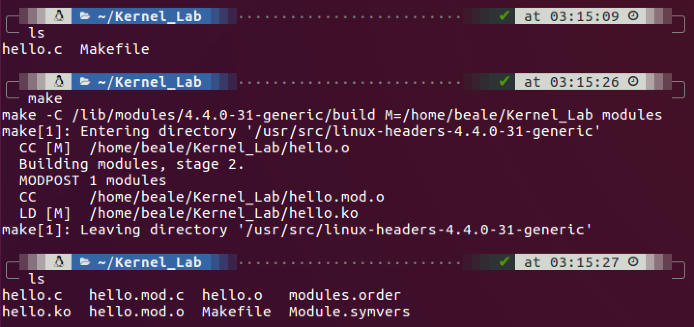
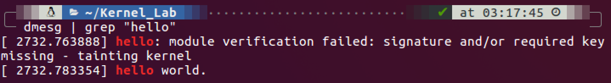
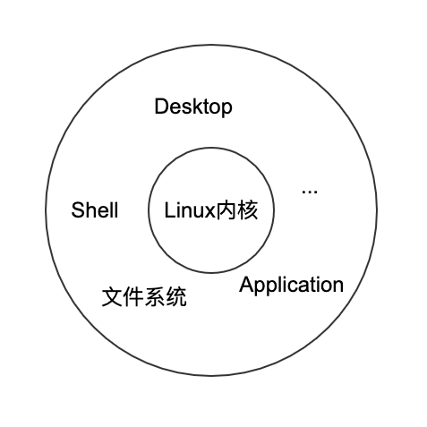

# Linux 内核源码配置

官方网站：[kernel.org](https://www.kernel.org/)

- stable：稳定版
- longterm：长期维护版

源码在线阅读：[lxr.linux.no](http://lxr.linux.no/)、[bootlin](https://elixir.bootlin.com/linux/latest/source)

查看 Linux 内核版本：

```bash
uname -r
```

为什么要搭建内核开发环境？

- 对内核进行裁剪（删除过多的功能）
- 为内核增加特性（增加新驱动、升级驱动）

安装 m-a 和必须的软件：

```bash
sudo apt-get install module-assistant build-essential
```

安装内核源码：

```bash
sudo apt-get install linux-source-`uname -r`
```

安装相应的头文件：

```bash
sudo apt-get install linux-headers-`uname -r`
```

> 交叉编译：编译不同平台上的系统
>
> 1. 配置交叉编译对应的工具链
> 2. 头文件需要指向目标机器

# 编译 Linux 内核模块

> 环境：Ubuntu 64 位 16.04.1

模块中包含入口函数、出口函数。

```cpp
#include <linux/module.h> // 所有模块都需要的头文件
#include <linux/init.h>   // init&exit相关宏
#include <linux/kernel.h> // kernel中常见函数，如printk

MODULE_LICENSE("GPL"); // 声明开源许可证（GPL、BSD等等）
MODULE_AUTHOR("baoli"); // 声明作者
MODULE_DESCRIPTION("hello world module"); // 声明模块功能

static int __init hello_init(void)
{
      printk(KERN_WARNING "hello world.\n"); // 输出指定字符串
      return 0;
}
static void __exit hello_exit(void)
{
      printk(KERN_WARNING "hello exit!\n");
}

module_init(hello_init); // 设置入口函数
module_exit(hello_exit); // 设置出口函数
```

对应 Makefile：

```makefile
ifneq ($(KERNELRELEASE),)
obj-m :=hello.o
else
KDIR :=/lib/modules/$(shell uname -r)/build
all:
	make -C $(KDIR) M=$(PWD) modules
clean:
	rm -f *.ko *.o *.mod.o *.mod.c *.symvers *.order
endif
```



> - ko 文件：内核模块文件
>
> - so 文件：共享链接库文件

查看当前系统是否成功安装模块（加载模块命令：`insmod`）：

```bash
sudo insmod hello.ko
```

查询模块：

```bash
sudo lsmod | grep hello
```


卸载模块：

```bash
sudo rmmod hello
```

查看 printk 消息：

```bash
dmesg
```



# Linux 简介

> Linux 在狭义上指一个内核。Linux 是一种自由和开放源码的类 UNIX 操作系统。该操作系统的内核由林纳斯·托瓦兹在 1991 年 10 月 5 日首次发布，在加上用户空间的应用程序之后，成为 Linux 操作系统。Linux 也是自由软件和开放源代码软件发展中最著名的例子。

Linux 系统发行版（Debian、Ubuntu、CentOS、红旗等）：



> GNU（GNU is Not Unix）是一个自由的操作系统，其内容软件完全以 GPL 方式发布。这个操作系统是 GNU 计划的主要目标，名称来自 GNU's Not Unix!的递归缩写，因为 GNU 的设计类似 Unix，但它不包含具著作权的 Unix 代码。GNU 的创始人，理查德·马修·斯托曼，将 GNU 视为“达成社会目的技术方法”。

## Unix 简介

1. Unix 很简洁。仅提供几百个系统调用并且有一个非常明确的设计目的（KISS principle：Keep It Stupid and Simple）；
2. Unix 中万物皆文件，这种抽象使得对数据和对设备（键盘、鼠标等）的操作是通过一套相同的系统调用界面进行（读写操作：`open()`、`write()`、`ioctl()`、`close()`）；
3. Unix 的内核和相关系统工具易于开发人员接受（开源）；
4. Unix 进程创建非常迅速，并且有一个非常独特的 `fork()` 系统调用；
5. Unix 提供了一套非常简单又稳定的进程间通信元语（管道、信号、套接字、共享内存等），可以保证独立的简单程序方便地组合在一起，从而完成复杂的任务。

## Linux 和 Unix 的区别

1. Linux 借鉴了 Unix 的许多设计并实现了 Unix 的 API，但没有直接使用 Unix 的源代码；
2. Linux 是一个非商业化的产品；
3. Linux 是自由公开的软件；
4. Linux 系统的基础是内核、C 库、编译器、工具集和系统的基本工具，如登录程序和 Shell；
5. Linux 系统也支持现代的 X WINDOWS 系统，这样就可以使用完整的图形用户桌面环境如 GNOME。

# 操作系统和内核简介

- **操作系统**：是指在整个系统中负责完成最基本功能和系统管理的那些部分。这些部分应该包括内核、设备驱动程序、启动引导程序、命令行 shell 或其它种类的用户界面、基本的文件管理工具和系统工具。
- **系统**：系统包括了操作系统和所有运行在它之上的应用程序。
- 用户界面是操作系统的外在表现，内核是操作系统的内在核心。系统其它部分必须依靠内核这部分软件提供的服务。如管理硬件设备，分配资源等。
- **内核（超级管理者或操作系统核心）**：通常一个内核有负责响应中断的**中断服务程序**，负责管理多个进程从而分享处理器时间的**调度程序**，负责管理进程地址空间的**内存管理程序**和网络、进程间通信等**系统服务程序**共同组成。
- 内核独立于普通应用程序，它一般处于系统态，拥有受保护的内存空间和访问硬件设备的所有权利。这种系统态和被保护起来的内存空间，统称为**内核空间**。相对应用程序在**用户空间**执行。

## 应用程序、内核和硬件的关系

**应用程序**通过**系统调用**和**内核通信**来运行。应用程序通常调用库函数——如 C 库函数——再由库函数通过系统调用界面让内核代其完成各种不同任务。

## 内核活动的范围

- 运行于内核空间，处于进程上下文，代表某个特定的进程执行。
- 运行于内核空间，处于中断上下文与任何进程无关，处理每个特定的中断。
- 运行于用户空间，执行用户进程。

# Linux 内核和传统 Unix 内核的比较

Linux 内核并没有完全与 Unix 决别，但又不基于某个特定的 Unix。

# Linux 内核版本

Linux 通过命名机制来区分稳定的和处于开发中的内核。

```txt
 主版本号         第一个发行版
   2    .   5   .    1
         次版本号，
         反映内核
         是否为稳
         定版。偶
         数就是稳
         定版
```

# 内核开发的特点

- 内核编程时不能访问 C 库。
  - `printf()`、`scanf()` 等库函数不能使用。
  - 使用 `printk()` 等替代。
- 内核编程时必须使用 GNU C。
  - 可以内联汇编。
  - 分支声明。
- 内核编程时缺乏像用户空间那样的内存保护机制。
  - 越界访问内存、内核中内存不分页。
- 内核编程时浮点数很难使用。
- 内核只有一个很小的定长堆栈。
  - 32 位机的内核栈是 8KB，64 位机的内核栈是 16KB。
  - 不开过大的静态数组、尽量不用递归等。
- 由于内核支持异步中断、抢占和 SMP，因此必须时刻注意同步和并发。
  - 容易产生竞争条件，因为内核的许多特性都要求能够并发地访问共享数据
- 要考虑可移植性的重要性。

# 编译内核

## 编译配置

1. `yes`：编译进内核
2. `no`：不编译进内核（嵌入式系统）
3. `module`：编译成模块

命令行配置：

```bash
make config
```

基于 ncurse 库的图形界面配置工具：

```bash
make menuconfig
```

基于 X11 的图形工具：

```bash
make xconfig
```

配置完后，配置项会被存放在内核代码树根目录下的 `.config` 文件中。

## 编译

编译命令：

```bash
make
```

# 参考网站

https://blog.csdn.net/mylxiaoyi/article/details/2112071
https://blog.csdn.net/u012247418/article/details/83684214
