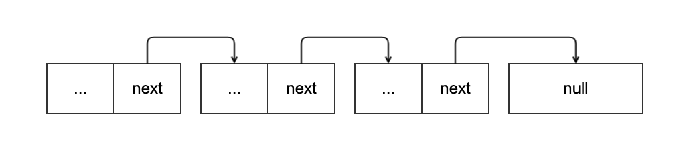
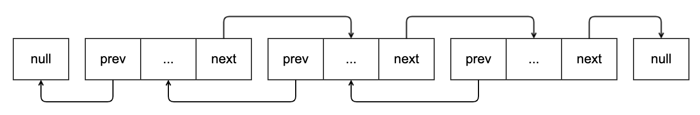
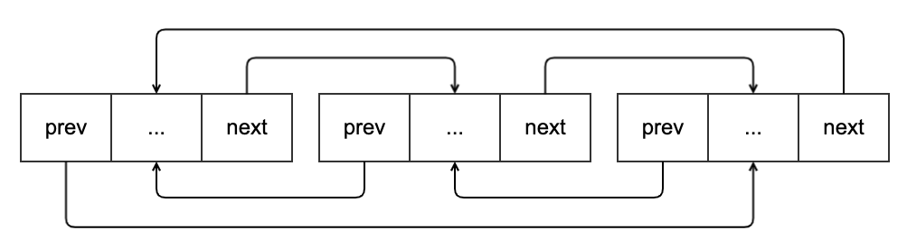
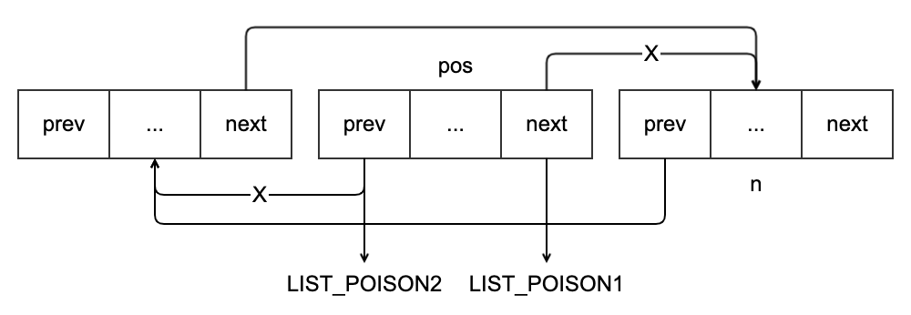
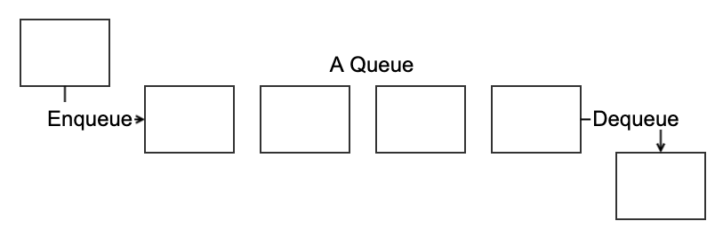
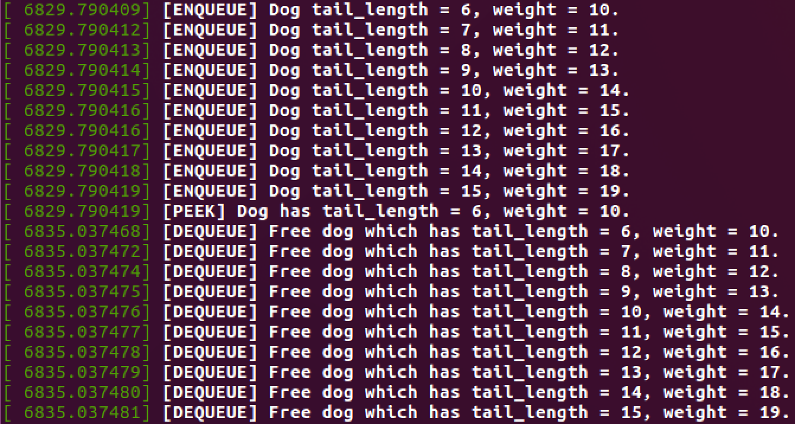
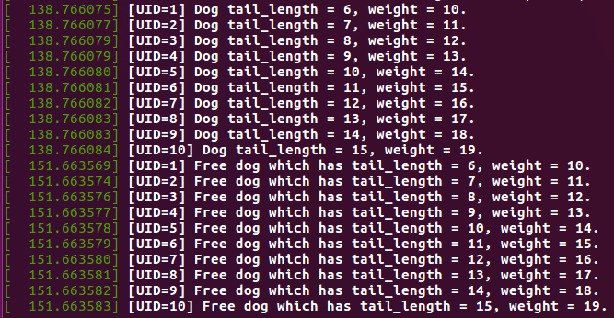
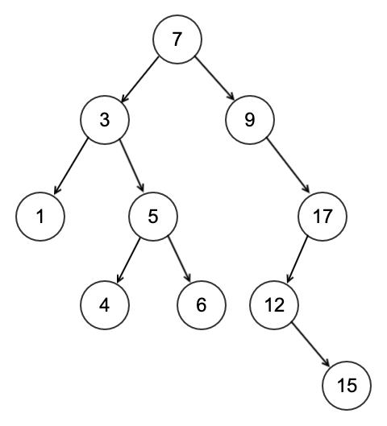
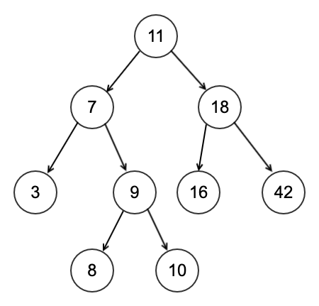
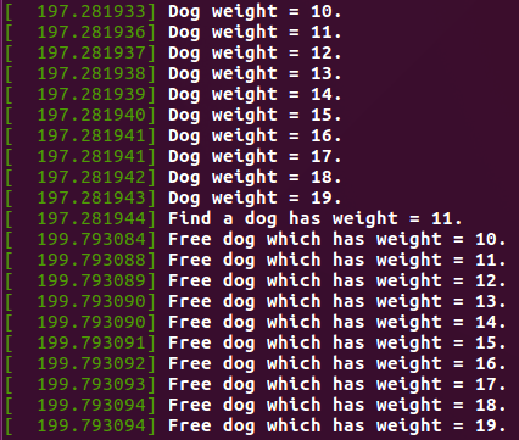

# 数据结构复习

## 线性表

数组、链表、栈、FIFO 队列

- 优点：元素遍历快、便于存储、方便数据的删减
- 缺点：查找不方便（$O(n)$、$O(\log_n)$）

## 树

例：进程父子关系、磁盘目录结构

- 优点：便于存储层次结构的关系、查找快速（二叉搜索树）

## 映射（`key->value`）

哈希表、字典

- 优点：数据存储和查找的时间大大降低（在没有冲突的情况下）

## 图

例：标签式目录结构

- 优点：搜索最短路径

# 内核数据结构

> **环境：Ubuntu 16.04.1**
>
> ```
> $ uname -a
> Linux ubuntu 4.4.0-31-generic #50-Ubuntu SMP Wed Jul 13 00:07:12 UTC 2016 x86_64 x86_64 x86_64 GNU/Linux
> ```

- 链表：遍历数据
- 队列：进程调度（生产-消费模式）
- IDR：UID 映射
- rbtree：快速查找
- 其他：基树 Trie、位图

## 链表

链表和数组的区别：

- 数组
  - 静态分配
  - 复杂度和数组大小有关（$O(n)$）
    - 插入、删除取决于下标，访问快
- 链表
  - 动态分配（可以改变大小）
  - 复杂度和链表大小有关（$O(\frac{n}{2})$）

单链表：

- 优点：存储量减少了一半（相比于双链表）
- 缺点：只能从前往后搜索

```cpp
struct list_element {
    void *data; // 存储的数据
    struct list_element *next; // 指向下一个元素
}
```



双链表：

- 优点：从任意节点开始可以遍历整个链表

```cpp
struct list_element {
    void *data; // 存储的数据
    struct list_element *next; // 指向下一个元素
    struct list_element *prev; // 指向上一个元素
}
```



环状链表（单向）：


环状链表（双向）：



### 内核中的链表

链表头：

```cpp
struct list_head {
	struct list_head *next, *prev;
};
```

嵌入到数据结构中：

```cpp
struct fox {
	unsigned long tail_length;
	unsigned long weight;
	bool is_fantastic;
	struct list_head list;
};
```

通过 list 访问父结构成员：

```cpp
/**
 * container_of - cast a member of a structure out to the containing structure
 * @ptr:	the pointer to the member.
 * @type:	the type of the container struct this is embedded in.
 * @member:	the name of the member within the struct.
 *
 */
#define container_of(ptr, type, member) ({			\
	const typeof( ((type *)0)->member ) *__mptr = (ptr);	\
	(type *)( (char *)__mptr - offsetof(type,member) );})
```

`include/linux/list.h` 中定义的宏：

```cpp
/**
 * list_entry - get the struct for this entry
 * @ptr:	the &struct list_head pointer.
 * @type:	the type of the struct this is embedded in.
 * @member:	the name of the list_head within the struct.
 */
#define list_entry(ptr, type, member) \
	container_of(ptr, type, member)

/**
 * list_first_entry - get the first element from a list
 * @ptr:	the list head to take the element from.
 * @type:	the type of the struct this is embedded in.
 * @member:	the name of the list_head within the struct.
 *
 * Note, that list is expected to be not empty.
 */
#define list_first_entry(ptr, type, member) \
	list_entry((ptr)->next, type, member)

/**
 * list_last_entry - get the last element from a list
 * @ptr:	the list head to take the element from.
 * @type:	the type of the struct this is embedded in.
 * @member:	the name of the list_head within the struct.
 *
 * Note, that list is expected to be not empty.
 */
#define list_last_entry(ptr, type, member) \
	list_entry((ptr)->prev, type, member)
```

声明列表：

```cpp
static inline void INIT_LIST_HEAD(struct list_head *list)
{
	list->next = list;
	list->prev = list;
}
```

动态方式创建：

```cpp
struct fox *red_fox;
red_fox = kmalloc(sizeof(*red_fox), GFP_KERNEL);
// kmalloc：物理内存分配
// vmalloc：虚拟内存分配
red_fox->tail_length = 40;
red_fox->weight = 6;
red_fox->is_fantasic = false;
INIT_LIST_HEAD(&red_fox->list);
```

静态方式声明：

```cpp
struct fox red_fox = {
    .tail_length = 40,
    .weight = 6,
    .list = INIT_LIST_HEAD(&red_fox->list),
};
```

在队头插入元素：

```cpp
/*
 * Insert a new entry between two known consecutive entries.
 *
 * This is only for internal list manipulation where we know
 * the prev/next entries already!
 */
#ifndef CONFIG_DEBUG_LIST
static inline void __list_add(struct list_head *new,
			      struct list_head *prev,
			      struct list_head *next)
{
	next->prev = new;
	new->next = next;
	new->prev = prev;
	prev->next = new;
}
#else
extern void __list_add(struct list_head *new,
			      struct list_head *prev,
			      struct list_head *next);
#endif

/**
 * list_add - add a new entry
 * @new: new entry to be added
 * @head: list head to add it after
 *
 * Insert a new entry after the specified head.
 * This is good for implementing stacks.
 */
static inline void list_add(struct list_head *new, struct list_head *head)
{
	__list_add(new, head, head->next);
}
```

在队尾插入元素：

```cpp
/**
 * list_add_tail - add a new entry
 * @new: new entry to be added
 * @head: list head to add it before
 *
 * Insert a new entry before the specified head.
 * This is useful for implementing queues.
 */
static inline void list_add_tail(struct list_head *new, struct list_head *head)
{
	__list_add(new, head->prev, head);
}
```

删除元素：

```cpp
/*
 * These are non-NULL pointers that will result in page faults
 * under normal circumstances, used to verify that nobody uses
 * non-initialized list entries.
 */
#define LIST_POISON1  ((void *) 0x100 + POISON_POINTER_DELTA)
#define LIST_POISON2  ((void *) 0x200 + POISON_POINTER_DELTA)

/*
 * Delete a list entry by making the prev/next entries
 * point to each other.
 *
 * This is only for internal list manipulation where we know
 * the prev/next entries already!
 */
static inline void __list_del(struct list_head * prev, struct list_head * next)
{
	next->prev = prev;
	WRITE_ONCE(prev->next, next);
}

/**
 * list_del - deletes entry from list.
 * @entry: the element to delete from the list.
 * Note: list_empty() on entry does not return true after this, the entry is
 * in an undefined state.
 */
#ifndef CONFIG_DEBUG_LIST
static inline void __list_del_entry(struct list_head *entry)
{
	__list_del(entry->prev, entry->next);
}

static inline void list_del(struct list_head *entry)
{
	__list_del(entry->prev, entry->next);
	entry->next = LIST_POISON1;
	entry->prev = LIST_POISON2;
}
#else
extern void __list_del_entry(struct list_head *entry);
extern void list_del(struct list_head *entry);
#endif
```

移动链表元素到另一个链表的头部：

```cpp
/**
 * list_move - delete from one list and add as another's head
 * @list: the entry to move
 * @head: the head that will precede our entry
 */
static inline void list_move(struct list_head *list, struct list_head *head)
{
	__list_del_entry(list);
	list_add(list, head);
}
```

移动链表元素到另一个链表的尾部：

```cpp
/**
 * list_move_tail - delete from one list and add as another's tail
 * @list: the entry to move
 * @head: the head that will follow our entry
 */
static inline void list_move_tail(struct list_head *list,
				  struct list_head *head)
{
	__list_del_entry(list);
	list_add_tail(list, head);
}
```

判断链表是否为空：

```cpp
/**
 * list_empty - tests whether a list is empty
 * @head: the list to test.
 */
static inline int list_empty(const struct list_head *head)
{
	return head->next == head;
}
```

分割链表：

```cpp
static inline void __list_splice(const struct list_head *list,
				 struct list_head *prev,
				 struct list_head *next)
{
	struct list_head *first = list->next;
	struct list_head *last = list->prev;

	first->prev = prev;
	prev->next = first;

	last->next = next;
	next->prev = last;
}

/**
 * list_splice - join two lists, this is designed for stacks
 * @list: the new list to add.
 * @head: the place to add it in the first list.
 */
static inline void list_splice(const struct list_head *list,
				struct list_head *head)
{
	if (!list_empty(list))
		__list_splice(list, head, head->next);
}
```

遍历链表：

```cpp
/**
 * list_for_each	-	iterate over a list
 * @pos:	the &struct list_head to use as a loop cursor.
 * @head:	the head for your list.
 */
#define list_for_each(pos, head) \
	for (pos = (head)->next; pos != (head); pos = pos->next)
```

直接根据提供的结构体来迭代链表：

```cpp
/**
 * list_for_each_entry	-	iterate over list of given type
 * @pos:	the type * to use as a loop cursor.
 * @head:	the head for your list.
 * @member:	the name of the list_head within the struct.
 */
#define list_for_each_entry(pos, head, member)				\
	for (pos = list_first_entry(head, typeof(*pos), member);	\
	     &pos->member != (head);					\
	     pos = list_next_entry(pos, member))
```

反向遍历链表：

```cpp
/**
 * list_for_each_entry_reverse - iterate backwards over list of given type.
 * @pos:	the type * to use as a loop cursor.
 * @head:	the head for your list.
 * @member:	the name of the list_head within the struct.
 */
#define list_for_each_entry_reverse(pos, head, member)			\
	for (pos = list_last_entry(head, typeof(*pos), member);		\
	     &pos->member != (head); 					\
	     pos = list_prev_entry(pos, member))
```

遍历链表时删除：

```cpp
/**
 * list_for_each_entry_safe - iterate over list of given type safe against removal of list entry
 * @pos:	the type * to use as a loop cursor.
 * @n:		another type * to use as temporary storage
 * @head:	the head for your list.
 * @member:	the name of the list_head within the struct.
 */
#define list_for_each_entry_safe(pos, n, head, member)			\
	for (pos = list_first_entry(head, typeof(*pos), member),	\
		n = list_next_entry(pos, member);			\
	     &pos->member != (head); 					\
	     pos = n, n = list_next_entry(n, member))
```

如果使用 `list_for_each` 或者是 `list_for_each_entry`，删除了相应节点之后，再遍历下一个节点时执行 `pos = pos->next` 会指向被删除了的节点的 next 指针，导致遍历到未知的地方，会产生系统恐慌：



### 内核链表应用

```cpp
#include <linux/module.h>
#include <linux/init.h>
#include <linux/kernel.h>
#include <linux/slab.h>

MODULE_LICENSE("GPL");
MODULE_AUTHOR("assassinq");
MODULE_DESCRIPTION("kernel list test module");

struct dog { // 创建dog结构体
	int tail_length;
	int weight;
	struct list_head list; // 将list_head嵌入到自建数据结构中
};

struct list_head dog_list; // 创建链表头

static int __init hello_init(void) {
	int i;
	struct dog *f; // 自建数据结构临时变量
	struct list_head *p; // 链表头临时变量

	printk("Here is a kernel list test.\n");
	INIT_LIST_HEAD(&dog_list); // 初始化链表头，将prev和next都指向自己

	for (i = 0; i < 10; i++) {
		f = (struct dog *) kmalloc(sizeof(*f), GFP_KERNEL); // 正常分配dog结构体对应的内存
		f->tail_length = i + 6;
		f->weight = i + 10;
		INIT_LIST_HEAD(&f->list); // 初始化dog结构体中的链表头

		list_add_tail(&f->list, &dog_list); // 将dog结构体的链表头添加到链表的尾部，并构成一个环形的双向链表
	}

	printk("Visit list with list_for_each().\n");
	list_for_each(p, &dog_list) { // 遍历链表，获取p节点
		f = list_entry(p, struct dog, list); // 获取p节点所对应的dog结构体，list指dog结构体中的链表头list项
		printk("Dog tail_length = %d, weight = %d.\n", f->tail_length, f->weight);
	}

	printk("Visit list with list_for_each_entry().\n");
	list_for_each_entry(f, &dog_list, list) { // 遍历链表，获取链表中节点所对应的dog结构体，list指dog结构体中的链表头list项
		printk("Dog tail_length = %d, weight = %d.\n", f->tail_length, f->weight);
	}
	return 0;
}

static void __exit hello_exit(void) {
	struct dog *f;
	struct list_head *p, *next;

	printk("Free all the dogs.\n");
	list_for_each_safe(p, next, &dog_list) { // 遍历链表，相比list_for_each多了一个存储next指针的缓存n，以防在删除节点后的pos的next指针指向其他地方
		f = list_entry(p, struct dog, list); // 获取p节点对应的dog结构体
		printk("Delete dog which has tail_length = %d, weight = %d.\n", f->tail_length, f->weight);
		list_del(p); // 在链表中删除对应的节点
		kfree(f); // 释放对应dog结构体的内存空间
	}
}

module_init(hello_init);
module_exit(hello_exit);
```

运行效果：


## 队列

先进先出队列（先来先服务）：



### 内核中的队列

动态创建队列：

```cpp
/**
 * kfifo_alloc - dynamically allocates a new fifo buffer
 * @fifo: pointer to the fifo
 * @size: the number of elements in the fifo, this must be a power of 2
 * @gfp_mask: get_free_pages mask, passed to kmalloc()
 *
 * This macro dynamically allocates a new fifo buffer.
 *
 * The numer of elements will be rounded-up to a power of 2.
 * The fifo will be release with kfifo_free().
 * Return 0 if no error, otherwise an error code.
 */
#define kfifo_alloc(fifo, size, gfp_mask) \
__kfifo_int_must_check_helper( \
({ \
	typeof((fifo) + 1) __tmp = (fifo); \
	struct __kfifo *__kfifo = &__tmp->kfifo; \
	__is_kfifo_ptr(__tmp) ? \
	__kfifo_alloc(__kfifo, size, sizeof(*__tmp->type), gfp_mask) : \
	-EINVAL; \
}) \
)
```

分配内存：

```cpp
/**
 * kfifo_init - initialize a fifo using a preallocated buffer
 * @fifo: the fifo to assign the buffer
 * @buffer: the preallocated buffer to be used
 * @size: the size of the internal buffer, this have to be a power of 2
 *
 * This macro initialize a fifo using a preallocated buffer.
 *
 * The numer of elements will be rounded-up to a power of 2.
 * Return 0 if no error, otherwise an error code.
 */
#define kfifo_init(fifo, buffer, size) \
({ \
	typeof((fifo) + 1) __tmp = (fifo); \
	struct __kfifo *__kfifo = &__tmp->kfifo; \
	__is_kfifo_ptr(__tmp) ? \
	__kfifo_init(__kfifo, buffer, size, sizeof(*__tmp->type)) : \
	-EINVAL; \
})
```

静态声明：

```cpp
/**
 * DECLARE_KFIFO - macro to declare a fifo object
 * @fifo: name of the declared fifo
 * @type: type of the fifo elements
 * @size: the number of elements in the fifo, this must be a power of 2
 */
#define DECLARE_KFIFO(fifo, type, size)	STRUCT_KFIFO(type, size) fifo

/**
 * INIT_KFIFO - Initialize a fifo declared by DECLARE_KFIFO
 * @fifo: name of the declared fifo datatype
 */
#define INIT_KFIFO(fifo) \
(void)({ \
	typeof(&(fifo)) __tmp = &(fifo); \
	struct __kfifo *__kfifo = &__tmp->kfifo; \
	__kfifo->in = 0; \
	__kfifo->out = 0; \
	__kfifo->mask = __is_kfifo_ptr(__tmp) ? 0 : ARRAY_SIZE(__tmp->buf) - 1;\
	__kfifo->esize = sizeof(*__tmp->buf); \
	__kfifo->data = __is_kfifo_ptr(__tmp) ?  NULL : __tmp->buf; \
})
```

入队：

```cpp
/**
 * kfifo_in - put data into the fifo
 * @fifo: address of the fifo to be used
 * @buf: the data to be added
 * @n: number of elements to be added
 *
 * This macro copies the given buffer into the fifo and returns the
 * number of copied elements.
 *
 * Note that with only one concurrent reader and one concurrent
 * writer, you don't need extra locking to use these macro.
 */
#define	kfifo_in(fifo, buf, n) \
({ \
	typeof((fifo) + 1) __tmp = (fifo); \
	typeof(__tmp->ptr_const) __buf = (buf); \
	unsigned long __n = (n); \
	const size_t __recsize = sizeof(*__tmp->rectype); \
	struct __kfifo *__kfifo = &__tmp->kfifo; \
	(__recsize) ?\
	__kfifo_in_r(__kfifo, __buf, __n, __recsize) : \
	__kfifo_in(__kfifo, __buf, __n); \
})
```

出队：

```cpp
/**
 * kfifo_out - get data from the fifo
 * @fifo: address of the fifo to be used
 * @buf: pointer to the storage buffer
 * @n: max. number of elements to get
 *
 * This macro get some data from the fifo and return the numbers of elements
 * copied.
 *
 * Note that with only one concurrent reader and one concurrent
 * writer, you don't need extra locking to use these macro.
 */
#define	kfifo_out(fifo, buf, n) \
__kfifo_uint_must_check_helper( \
({ \
	typeof((fifo) + 1) __tmp = (fifo); \
	typeof(__tmp->ptr) __buf = (buf); \
	unsigned long __n = (n); \
	const size_t __recsize = sizeof(*__tmp->rectype); \
	struct __kfifo *__kfifo = &__tmp->kfifo; \
	(__recsize) ?\
	__kfifo_out_r(__kfifo, __buf, __n, __recsize) : \
	__kfifo_out(__kfifo, __buf, __n); \
}) \
)
```

查看队列元素：

```cpp
/**
 * kfifo_out_peek - gets some data from the fifo
 * @fifo: address of the fifo to be used
 * @buf: pointer to the storage buffer
 * @n: max. number of elements to get
 *
 * This macro get the data from the fifo and return the numbers of elements
 * copied. The data is not removed from the fifo.
 *
 * Note that with only one concurrent reader and one concurrent
 * writer, you don't need extra locking to use these macro.
 */
#define	kfifo_out_peek(fifo, buf, n) \
__kfifo_uint_must_check_helper( \
({ \
	typeof((fifo) + 1) __tmp = (fifo); \
	typeof(__tmp->ptr) __buf = (buf); \
	unsigned long __n = (n); \
	const size_t __recsize = sizeof(*__tmp->rectype); \
	struct __kfifo *__kfifo = &__tmp->kfifo; \
	(__recsize) ? \
	__kfifo_out_peek_r(__kfifo, __buf, __n, __recsize) : \
	__kfifo_out_peek(__kfifo, __buf, __n); \
}) \
)
```

判断队列满：

```cpp
/**
 * kfifo_is_full - returns true if the fifo is full
 * @fifo: address of the fifo to be used
 */
#define	kfifo_is_full(fifo) \
({ \
	typeof((fifo) + 1) __tmpq = (fifo); \
	kfifo_len(__tmpq) > __tmpq->kfifo.mask; \
})
```

判断队列空：

```cpp
/**
 * kfifo_is_empty - returns true if the fifo is empty
 * @fifo: address of the fifo to be used
 */
#define	kfifo_is_empty(fifo) \
({ \
	typeof((fifo) + 1) __tmpq = (fifo); \
	__tmpq->kfifo.in == __tmpq->kfifo.out; \
})
```

### 内核队列应用

```cpp
#include <linux/module.h>
#include <linux/init.h>
#include <linux/kernel.h>
#include <linux/slab.h>
#include <linux/kfifo.h>

MODULE_LICENSE("GPL");
MODULE_AUTHOR("assassinq");
MODULE_DESCRIPTION("kernel queue test module");

struct dog { // 创建dog结构体
	int tail_length;
	int weight;
};

struct kfifo fifo; // 创建队列

static int __init hello_init(void) {
	int i;
	int ret;
	struct dog *f;

	kfifo_alloc(&fifo, PAGE_SIZE, GFP_KERNEL); // 初始化队列
	if (ret) {
		return ret;
	}
	for (i = 0; i < 10; i++) {
		f = (struct dog *) kmalloc(sizeof(*f), GFP_KERNEL); // 正常分配dog结构体对应的内存
		f->tail_length = i + 6;
		f->weight = i + 10;
		kfifo_in(&fifo, &f, sizeof(*f)); // 将dog结构体入队列
		printk("[ENQUEUE] Dog tail_length = %d, weight = %d.\n", f->tail_length, f->weight);
	}

	ret = kfifo_out_peek(&fifo, &f, sizeof(*f)); // 查看指定位置的dog结构体
	if (ret != sizeof(*f)) {
		return -EINVAL;
	}
	printk("[PEEK] Dog has tail_length = %d, weight = %d.\n", f->tail_length, f->weight);
	return 0;
}

static void __exit hello_exit(void) {
	int ret;
	struct dog *f;

	while (kfifo_avail(&fifo)) { // 判断队列是否还有元素可取
		ret = kfifo_out(&fifo, &f, sizeof(*f)); // 将一个dog结构体出队列
		if (ret != sizeof(*f)) {
			return -EINVAL;
		}

		printk("[DEQUEUE] Free dog which has tail_length = %d, weight = %d.\n", f->tail_length, f->weight);
		kfree(f); // 释放出队列的dog结构体内存
	}
}

module_init(hello_init);
module_exit(hello_exit);
```

运行效果：



## 映射

- Hash（$O(1)$）
- 平衡二叉搜索树（$O(\log_n)$）

### 内核中的 IDR

Linux 的 map 实现：

- UID
  - 映射一个唯一的标识符（UID）到一个指针
- IDR 数据结构映射
  - 用于映射用户空间的 UID
    - 关联到内核对应的数据
    - 譬如用户空间的一个数据结构 inotify_node
  - 不是通用的 map

初始化 IDR，分配 UID：

```cpp
/**
 * idr_init - initialize idr handle
 * @idp:	idr handle
 *
 * This function is use to set up the handle (@idp) that you will pass
 * to the rest of the functions.
 */
void idr_init(struct idr *idp)
{
	memset(idp, 0, sizeof(struct idr));
	spin_lock_init(&idp->lock);
}
```

创建 IDR 映射：

```cpp
/**
 * idr_alloc - allocate new idr entry
 * @idr: the (initialized) idr
 * @ptr: pointer to be associated with the new id
 * @start: the minimum id (inclusive)
 * @end: the maximum id (exclusive, <= 0 for max)
 * @gfp_mask: memory allocation flags
 *
 * Allocate an id in [start, end) and associate it with @ptr.  If no ID is
 * available in the specified range, returns -ENOSPC.  On memory allocation
 * failure, returns -ENOMEM.
 *
 * Note that @end is treated as max when <= 0.  This is to always allow
 * using @start + N as @end as long as N is inside integer range.
 *
 * The user is responsible for exclusively synchronizing all operations
 * which may modify @idr.  However, read-only accesses such as idr_find()
 * or iteration can be performed under RCU read lock provided the user
 * destroys @ptr in RCU-safe way after removal from idr.
 */
int idr_alloc(struct idr *idr, void *ptr, int start, int end, gfp_t gfp_mask)
{
	int max = end > 0 ? end - 1 : INT_MAX;	/* inclusive upper limit */
	struct idr_layer *pa[MAX_IDR_LEVEL + 1];
	int id;

	might_sleep_if(gfpflags_allow_blocking(gfp_mask));

	/* sanity checks */
	if (WARN_ON_ONCE(start < 0))
		return -EINVAL;
	if (unlikely(max < start))
		return -ENOSPC;

	/* allocate id */
	id = idr_get_empty_slot(idr, start, pa, gfp_mask, NULL);
	if (unlikely(id < 0))
		return id;
	if (unlikely(id > max))
		return -ENOSPC;

	idr_fill_slot(idr, ptr, id, pa);
	return id;
}
```

循环 IDR 中的元素：

```cpp
/**
 * idr_for_each - iterate through all stored pointers
 * @idp: idr handle
 * @fn: function to be called for each pointer
 * @data: data passed back to callback function
 *
 * Iterate over the pointers registered with the given idr.  The
 * callback function will be called for each pointer currently
 * registered, passing the id, the pointer and the data pointer passed
 * to this function.  It is not safe to modify the idr tree while in
 * the callback, so functions such as idr_get_new and idr_remove are
 * not allowed.
 *
 * We check the return of @fn each time. If it returns anything other
 * than %0, we break out and return that value.
 *
 * The caller must serialize idr_for_each() vs idr_get_new() and idr_remove().
 */
int idr_for_each(struct idr *idp,
		 int (*fn)(int id, void *p, void *data), void *data)
{
	int n, id, max, error = 0;
	struct idr_layer *p;
	struct idr_layer *pa[MAX_IDR_LEVEL + 1];
	struct idr_layer **paa = &pa[0];

	n = idp->layers * IDR_BITS;
	*paa = rcu_dereference_raw(idp->top);
	max = idr_max(idp->layers);

	id = 0;
	while (id >= 0 && id <= max) {
		p = *paa;
		while (n > 0 && p) {
			n -= IDR_BITS;
			p = rcu_dereference_raw(p->ary[(id >> n) & IDR_MASK]);
			*++paa = p;
		}

		if (p) {
			error = fn(id, (void *)p, data);
			if (error)
				break;
		}

		id += 1 << n;
		while (n < fls(id)) {
			n += IDR_BITS;
			--paa;
		}
	}

	return error;
}
```

删除 UID：

```cpp
/**
 * idr_remove - remove the given id and free its slot
 * @idp: idr handle
 * @id: unique key
 */
void idr_remove(struct idr *idp, int id)
{
	struct idr_layer *p;
	struct idr_layer *to_free;

	if (id < 0)
		return;

	if (id > idr_max(idp->layers)) {
		idr_remove_warning(id);
		return;
	}

	sub_remove(idp, (idp->layers - 1) * IDR_BITS, id);
	if (idp->top && idp->top->count == 1 && (idp->layers > 1) &&
	    idp->top->ary[0]) {
		/*
		 * Single child at leftmost slot: we can shrink the tree.
		 * This level is not needed anymore since when layers are
		 * inserted, they are inserted at the top of the existing
		 * tree.
		 */
		to_free = idp->top;
		p = idp->top->ary[0];
		rcu_assign_pointer(idp->top, p);
		--idp->layers;
		to_free->count = 0;
		bitmap_clear(to_free->bitmap, 0, IDR_SIZE);
		free_layer(idp, to_free);
	}
}
```

删除 IDR 结构体：

```cpp
/**
 * idr_destroy - release all cached layers within an idr tree
 * @idp: idr handle
 *
 * Free all id mappings and all idp_layers.  After this function, @idp is
 * completely unused and can be freed / recycled.  The caller is
 * responsible for ensuring that no one else accesses @idp during or after
 * idr_destroy().
 *
 * A typical clean-up sequence for objects stored in an idr tree will use
 * idr_for_each() to free all objects, if necessary, then idr_destroy() to
 * free up the id mappings and cached idr_layers.
 */
void idr_destroy(struct idr *idp)
{
	__idr_remove_all(idp);

	while (idp->id_free_cnt) {
		struct idr_layer *p = get_from_free_list(idp);
		kmem_cache_free(idr_layer_cache, p);
	}
}
```

### 内核 IDR 应用

```cpp
#include <linux/module.h>
#include <linux/init.h>
#include <linux/kernel.h>
#include <linux/slab.h>
#include <linux/idr.h>

MODULE_LICENSE("GPL");
MODULE_AUTHOR("assassinq");
MODULE_DESCRIPTION("kernel idr test module");

#define LOWER_LIMIT 1
#define UPPER_LIMIT 20

struct dog { // 创建dog结构体
	int tail_length;
	int weight;
};

struct idr idp; // 创建idr结构体

static int print_dog(int id, void *p, void *data) // 输出dog信息的函数
{
    struct dog *f = p;
	printk("[UID=%d] Dog tail_length = %d, weight = %d.\n", id, f->tail_length, f->weight);
    return 0;
}

static int __init hello_init(void) {
	int ret;
	int i;
	struct dog *f;

	idr_init(&idp); // 初始化idr结构体

	for (i = 0; i < 10; i++) {
		f = (struct dog *) kmalloc(sizeof(*f), GFP_KERNEL); // 正常分配dog结构体对应的内存
		f->tail_length = i + 6;
		f->weight = i + 10;

		idr_alloc(&idp, f, LOWER_LIMIT, UPPER_LIMIT, GFP_KERNEL); // 新创建一个idr映射，并自动分配uid
	}

	idr_for_each(&idp, print_dog, NULL); // 遍历idr中的元素，并输出dog信息
	return 0;
}

static int remove_dog(int id, void *p, void *data) { // 删除dog结构体函数
    struct dog *f = p;
	printk("[UID=%d] Free dog which has tail_length = %d, weight = %d.\n", id, f->tail_length, f->weight);
	kfree(f); // 释放dog结构体内存
    return 0;
}

static void __exit hello_exit(void) {
	int i;
	idr_for_each(&idp, remove_dog, NULL); // 遍历idr中的元素，并删除各个元素中dog结构体所对应的内存
	idr_destroy(&idp); // 删除idr结构体
}

module_init(hello_init);
module_exit(hello_exit);
```

运行效果：



## 二叉树

二叉搜索树（BST）:



自平衡二叉搜索树（树的深度$\log n$）：



红黑树：

- 半平衡
- 特点
  - 所有的节点只能是红色或黑色
  - 叶子节点为黑色
  - 所有非叶子节点都有两个子节点
  - 如果一个节点是红色，其子节点是黑色
  - 在一个节点到其叶子节点的路径中，如果总是包含同样数目的黑色节点，则该路径相比其他路径是最短的

### 内核中的红黑树

初始化：

```cpp
struct rb_node {
	unsigned long  __rb_parent_color;
	struct rb_node *rb_right;
	struct rb_node *rb_left;
} __attribute__((aligned(sizeof(long))));
    /* The alignment might seem pointless, but allegedly CRIS needs it */

struct rb_root {
	struct rb_node *rb_node;
};

#define RB_ROOT	(struct rb_root) { NULL, }
```

获取红黑树节点对应的结构体：

```cpp
#define	rb_entry(ptr, type, member) container_of(ptr, type, member)
```

遍历红黑树使用的函数：

```cpp
/*
 * This function returns the first node (in sort order) of the tree.
 */
struct rb_node *rb_first(const struct rb_root *root)
{
	struct rb_node	*n;

	n = root->rb_node;
	if (!n)
		return NULL;
	while (n->rb_left)
		n = n->rb_left;
	return n;
}

struct rb_node *rb_last(const struct rb_root *root)
{
	struct rb_node	*n;

	n = root->rb_node;
	if (!n)
		return NULL;
	while (n->rb_right)
		n = n->rb_right;
	return n;
}

struct rb_node *rb_next(const struct rb_node *node)
{
	struct rb_node *parent;

	if (RB_EMPTY_NODE(node))
		return NULL;

	/*
	 * If we have a right-hand child, go down and then left as far
	 * as we can.
	 */
	if (node->rb_right) {
		node = node->rb_right;
		while (node->rb_left)
			node=node->rb_left;
		return (struct rb_node *)node;
	}

	/*
	 * No right-hand children. Everything down and left is smaller than us,
	 * so any 'next' node must be in the general direction of our parent.
	 * Go up the tree; any time the ancestor is a right-hand child of its
	 * parent, keep going up. First time it's a left-hand child of its
	 * parent, said parent is our 'next' node.
	 */
	while ((parent = rb_parent(node)) && node == parent->rb_right)
		node = parent;

	return parent;
}

struct rb_node *rb_prev(const struct rb_node *node)
{
	struct rb_node *parent;

	if (RB_EMPTY_NODE(node))
		return NULL;

	/*
	 * If we have a left-hand child, go down and then right as far
	 * as we can.
	 */
	if (node->rb_left) {
		node = node->rb_left;
		while (node->rb_right)
			node=node->rb_right;
		return (struct rb_node *)node;
	}

	/*
	 * No left-hand children. Go up till we find an ancestor which
	 * is a right-hand child of its parent.
	 */
	while ((parent = rb_parent(node)) && node == parent->rb_left)
		node = parent;

	return parent;
}
```

删除节点：

```cpp
void rb_erase(struct rb_node *node, struct rb_root *root)
{
	struct rb_node *rebalance;
	rebalance = __rb_erase_augmented(node, root, &dummy_callbacks);
	if (rebalance)
		____rb_erase_color(rebalance, root, dummy_rotate);
}
```

替换节点：

```cpp
void rb_replace_node(struct rb_node *victim, struct rb_node *new,
		     struct rb_root *root)
{
	struct rb_node *parent = rb_parent(victim);

	/* Set the surrounding nodes to point to the replacement */
	__rb_change_child(victim, new, parent, root);
	if (victim->rb_left)
		rb_set_parent(victim->rb_left, new);
	if (victim->rb_right)
		rb_set_parent(victim->rb_right, new);

	/* Copy the pointers/colour from the victim to the replacement */
	*new = *victim;
}
```

初始化节点：

```cpp
static inline void rb_link_node(struct rb_node *node, struct rb_node *parent,
				struct rb_node **rb_link)
{
	node->__rb_parent_color = (unsigned long)parent;
	node->rb_left = node->rb_right = NULL;

	*rb_link = node;
}
```

插入节点：

```cpp
void rb_insert_color(struct rb_node *node, struct rb_root *root)
{
	__rb_insert(node, root, dummy_rotate);
}
```

### 内核红黑树应用

```cpp
#include <linux/module.h>
#include <linux/init.h>
#include <linux/kernel.h>
#include <linux/slab.h>
#include <linux/rbtree.h>

MODULE_LICENSE("GPL");
MODULE_AUTHOR("assassinq");
MODULE_DESCRIPTION("kernel rbtree test module");

struct dog { // 创建dog结构体
	int weight;
	struct rb_node node; // 内嵌rb_node结构体
};

struct rb_root root = RB_ROOT; // 初始化红黑树

int insert_node(struct rb_root *root, struct dog *p) // 插入红黑树节点
{
    struct rb_node **link = &(root->rb_node), *parent = NULL;
    while (*link) { // 如果link下有儿子
        struct dog *f = rb_entry(*link, struct dog, node); // 获取节点对应的dog结构体
        int result = p->weight - f->weight;
        parent = *link;
        if (result < 0) // 如果小于该节点，往左子树走
            link = &((*link)->rb_left);
        else if (result > 0) // 如果大于该节点，往右子树走
            link = &((*link)->rb_right);
        else // 如果相等报错
            return false;
    }
    rb_link_node(&p->node, parent, link); // 初始化节点
    rb_insert_color(&p->node, root); // 插入节点
    return true;
}

struct dog *search_node(struct rb_root *root, int weight) // 搜索红黑树节点
{
    struct rb_node *node = root->rb_node;
    while (node) {
        struct dog *f = rb_entry(node, struct dog, node); // 获取节点对应的dog结构体
		int result = weight - f->weight;
        if (result < 0) // 如果小于该节点，往左子树搜索
            node = node->rb_left;
        else if (result > 0) // 如果大于该节点，往右子树搜索
            node = node->rb_right;
        else // 如果相等直接返回对应的dog结构体
            return f;
    }
    return NULL;
}

static int __init hello_init(void) {
	int i;
	struct dog *f;
	struct rb_node *pnode;

	for (i = 0; i < 10; i++) {
		f = (struct dog *) kmalloc(sizeof(*f), GFP_KERNEL); // 正常分配dog结构体对应的内存
		f->weight = i + 10;
		insert_node(&root, f); // 插入节点
	}

	for (pnode = rb_first(&root); pnode; pnode = rb_next(pnode)) { // 中序遍历红黑树
		printk("Dog weight = %d.\n", rb_entry(pnode, struct dog, node)->weight);
	}

	f = search_node(&root, 11); // 搜索指定的节点
	printk("Find a dog has weight = %d.\n", f->weight);
	return 0;
}

static void __exit hello_exit(void) {
	int i;
	struct dog *f;

	for(i = 0; i < 10; i++) {
		f = search_node(&root, i + 10); // 搜索指定的节点
		if (f) {
			rb_erase(&f->node, &root); // 删除节点
			printk("Free dog which has weight = %d.\n", f->weight);
			kfree(f); // 释放dog结构体内存
		}
	}
}

module_init(hello_init);
module_exit(hello_exit);
```

运行效果：



# 参考网站

https://elixir.bootlin.com/linux/v4.4.31/source/include/linux/types.h
https://elixir.bootlin.com/linux/v4.4.31/source/include/linux/kernel.h
https://elixir.bootlin.com/linux/v4.4.31/source/include/linux/list.h
https://elixir.bootlin.com/linux/v4.4.31/source/include/linux/poison.h
https://blog.csdn.net/ibless/article/details/81951333
https://elixir.bootlin.com/linux/v4.4.31/source/include/linux/kfifo.h
https://blog.csdn.net/lamdoc/article/details/7662426
https://elixir.bootlin.com/linux/v4.4.31/source/include/linux/idr.h
https://elixir.bootlin.com/linux/v4.4.31/source/lib/idr.c
https://www.cnblogs.com/wang_yb/archive/2013/04/16/3023892.html
https://elixir.bootlin.com/linux/v4.4.31/source/include/linux/rbtree.h
https://elixir.bootlin.com/linux/v4.4.31/source/lib/rbtree.c
https://zhuanlan.zhihu.com/p/31805309
https://www.cnblogs.com/jimbo17/p/8298163.html
